> [!info] 必要なセクションを選択して使用してください！

# 概要

**Agent の応答速度（Latency）を構成要素ごとに分解し、ボトルネックを特定した**。
対象は主に以下の 4 つの Agent：

- Goal Agent
- Plan Agent
- Delegator Agent
- ConstructionKnowledgeAgent（＋ SiteKnowledgeAgent）

Langfuse トレース（[Sample1](https://us.cloud.langfuse.com/project/cm9sdhfkd0062ad08ijc9tvcm/traces/0199179ff8d6d4bdb6841484344b2178?display=preview&observation=4cc2ab5226484773)・[Sample2](https://us.cloud.langfuse.com/project/cm9sdhfkd0062ad08ijc9tvcm/traces/019917925f3f298f82bbf6f9dfa92fa5?observation=d1982179ba0f90d1&timestamp=2025-09-05T01:51:32.671Z)）をもとに、ツール呼び出しや LLM モデルごとの処理時間を分析。

# 調査結果

## 1. **LLM 呼び出し回数が多い**

- Goal Agent／Plan Agent では **ツール呼び出しのフローが固定的** であるにもかかわらず、
  Agent SDK の仕様により **毎回「次にどのツールを呼ぶか」を LLM が判断**している。
- そのため、LLM 呼び出しが多くなり、応答全体の Latency 増大につながっている。

例：

- Goal Agent で Responses API が複数回（6〜7 秒 × 3 回）
- Plan Agent で o3 モデルを 3 回呼び出し（計 27〜36 秒）

---

## 2. **Plan Agent の model「o3」は思考時間が長い**

- Plan Agent では `o3` モデル使用時に 1 回あたり 10〜13 秒以上の推論時間。
  これは `gpt-4.1` と比べて約 1.5〜2 倍遅い。
- 各 Responses API 呼び出しで 8〜13 秒程度の遅延。

---

## 3. **ベクトル検索（retrieve_with_bedrock）の多重呼び出し**

- ConstructionKnowledgeAgent／SiteKnowledgeAgent にて
  `retrieve_with_bedrock` が **1 リクエストで 3〜4 回実行**。
- 各呼び出しに 3〜5 秒かかり、合計で 15〜20 秒以上の遅延を生んでいる。

---

## 4. **Delegator Agent 全体での総 Latency**

- Delegator Agent が各下位 Agent（Goal, Plan, Knowledge 等）を順次呼び出すため、
  全体で **1 分半〜3 分半超** の総 Latency に。
- 特に KnowledgeAgent 部分が長時間化（1〜2 分超）。

---

## サンプルの集計サマリー

| Agent               | 主な処理            | 所要時間       | 主な遅延要因                       |
| ------------------- | ------------------- | -------------- | ---------------------------------- |
| **Goal Agent**      | gpt-4.1 呼び出し ×3 | 約 20〜27s     | 毎回 LLM 経由でフロー決定          |
| **Plan Agent**      | o3 呼び出し ×3      | 約 27〜36s     | モデル思考時間が長い               |
| **Delegator Agent** | 下位 Agent 統括     | 約 1.5〜3.5 分 | 各 Agent 直列実行                  |
| **Knowledge Agent** | ベクトル検索 ×3〜4  | 約 45〜120s    | retrieve_with_bedrock 多重呼び出し |

# 今後の方針・改善策

| 対応項目                                | 方針                                                                                                                                                                                                                    | 工数     |
| ----------------------------------- | --------------------------------------------------------------------------------------------------------------------------------------------------------------------------------------------------------------------- | ------ |
| **1. Agent SDK から LangGrpah に移行する** | Agent SDK の仕様により次のツール呼び出しの決定を LLM 経由で判定しているため、ルールベースでツールを呼ぶワークフローの部分は不要な LLM 呼び出しが行われていることになっている。LangGrpah に移行することでルールベースで tool 呼び出しが可能になり、不要な LLM の呼び出しがなくなることが期待される。                                                | 24-40h |
| **2. モデル選定の見直し**                    | 現在、利用している LLM のモデルは gpt-4.1、gpt-o3 であるが、ベストなモデルを選択しているとは言えない。代替案として GPT-5 mini、Gemini 2.5、grok などがあるので、OpenRouter を使用して複数モデルの比較テストを実施する。                                                                              | 16-24h |
| **3. ベクトル検索回数の最適化**                 | Site Knowledge Agent、Tenant Knowledge Agent がベクトル検索する際に `retrieve_with_bedrock` が平均で 3〜4 回実行されているため検索時間が長くなっている。ベクトル検索の呼び出し回数を並列処理にして、検索回数を 1 回に制限する。                                                                 | 16-24h |
| **4. Knowledge Agent の並列化の検討**      | 各 Knowledge Agent は他の Knowledge Agent を独立しているので直列処理から並列処理にする。                                                                                                                                                         | 16-24h |
| **5. Agent のワークフローを見直し**            | ユーザーの入力内容に関わらず、Goal Agent → Plan Agent → Delegator Agent…のように複数のエージェントが実行されるようになっている。Site Knowledge Agent、Tenant Knowledge Agent などが不要なケースでは Goal Agent で直接レスポンスを返すことで、ユーザーの待ち時間を短縮できる。Agent のユースケースに応じてワークフローを最適化する。 | 8-16h  |

---

## タスクの依存関係

```mermaid
graph TD;
    F[OpenRouter セットアップ・モデル比較検証];
    A[Agent SDK から LangGraph へ移行];
    B[選択したモデルの適用];
    F --> B;
    A --> B;
    A --> C[ベクトル検索回数の最適化];
    A --> D[Knowledge Agent の並列化検討];
    A --> E[Agent ワークフロー見直し];
    C -- バッティングする可能性あり--> D;
    D -- バッティングする可能性あり--> C;
```

