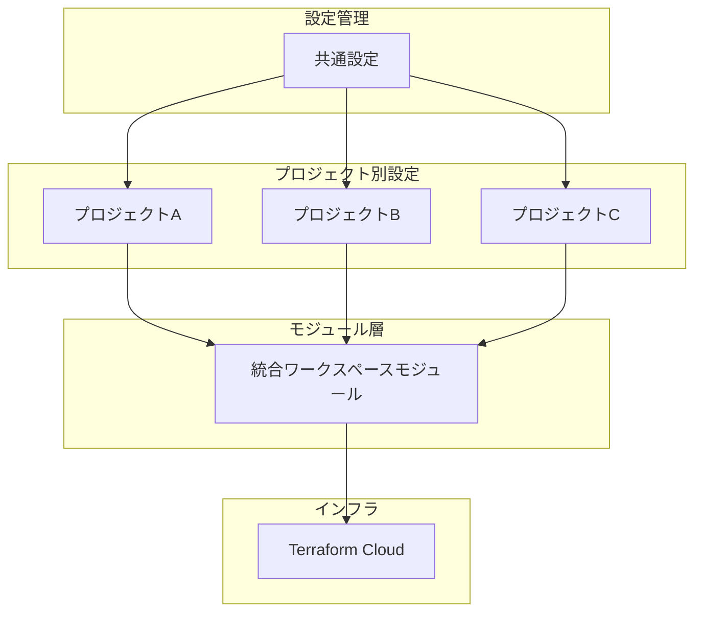

# 🎯 目的・対象範囲

## 目的
- Terraform Cloudのワークスペース管理を効率化
- 複数プロジェクト・複数環境での設定重複を削減
- 新しいプロジェクト・環境の追加を簡素化

## 対象範囲
- Terraform Cloudワークスペースの作成と変数設定
- 複数プロジェクト（kunai-core, kunai-common等）の統合管理
- 環境別設定（dev, stg, prod）の一元化

# 🏗 システム構成概要

## 高レベルアーキテクチャ



## 設計原則

1. **DRY原則**: 共通設定の重複を排除
2. **モジュール化**: ワークスペース作成と変数設定を統合
3. **ループ処理**: 環境別設定を自動化
4. **設定の分離**: 共通設定とプロジェクト別設定を明確に分離

# 🛠 基本設計

## モジュール設計方針

### 統合モジュールアプローチ
- **Why**: ワークスペース作成と変数設定が密接に関連しているため
- **Benefits**: 
  - 設定の一貫性を保証
  - 依存関係の管理が簡素化
  - デプロイメントの原子性を確保

### 設定の階層化

設定を3つの階層に分けて管理することで、保守性と再利用性を向上させます。

#### 第1階層: 共通設定（variables_kunai.tf）
**目的**: 全プロジェクトで共有される設定を一元管理

**含まれる設定**:
- **環境別AWS Account ID**: dev/stg/prod環境それぞれのAWS Account ID
- **環境名の定義**: dev, stg, prodの環境名マッピング
- **組織共通設定**: Terraform Cloud組織名、OAuth Token ID等

**なぜ重要か**:
- 環境別のAccount IDは全プロジェクトで同じ値を使用
- 新しい環境を追加する際は、このファイルの1箇所を変更するだけで全プロジェクトに反映
- 設定ミスを防ぎ、一貫性を保証

#### 第2階層: プロジェクト別設定（各プロジェクトファイル）
**目的**: プロジェクト固有の設定を管理

**含まれる設定**:
- **プロジェクト名**: kunai-core, kunai-common等
- **リポジトリ情報**: GitHubリポジトリの識別子、作業ディレクトリ
- **環境別ブランチ設定**: dev環境はdevelopブランチ、stg/prod環境はmainブランチ等
- **プロジェクト固有の変数**: プロジェクト独自の設定値

**なぜ重要か**:
- プロジェクトごとの違いを明確に分離
- 新しいプロジェクトを追加する際のテンプレートとして活用
- プロジェクト固有の要件変更が他プロジェクトに影響しない

#### 第3階層: モジュール（統合ワークスペース管理）
**目的**: 実際のTerraform Cloudリソースを作成・管理

**含まれる機能**:
- **ワークスペース作成**: プロジェクト・環境別のワークスペースを自動作成
- **変数設定**: 環境別のAWS Account ID、プロジェクト固有の変数を自動設定
- **VCS連携**: GitHubリポジトリとの連携設定
- **プロジェクト関連付け**: Terraform Cloudプロジェクトとの関連付け

**なぜ重要か**:
- 設定とリソース作成の責務を分離
- 再利用可能なモジュールとして他のプロジェクトでも活用可能
- 設定変更時の影響範囲を明確化

### 階層間の関係性

```
共通設定 (variables_kunai.tf)
├── 環境別設定 (Account ID, 環境名)
│   ├── dev: "220872168286"
│   ├── stg: "091295763908"
│   └── prod: "154993632993"
├── プロジェクト別設定 (各プロジェクトファイル)
│   ├── kunai-core: リポジトリ、ブランチ設定
│   └── kunai-common: リポジトリ、ブランチ設定
└── モジュール (統合ワークスペース管理)
    ├── ワークスペース作成ロジック
    ├── 変数設定ロジック
    └── VCS連携ロジック
```

### 設定の流れ

1. **共通設定の定義**: `variables_kunai.tf`で環境別のAccount ID等を定義
2. **プロジェクト設定の参照**: 各プロジェクトファイルで共通設定を参照
3. **モジュールへの引渡し**: プロジェクト設定をモジュールの引数として渡す
4. **リソースの生成**: モジュール内で実際のTerraform Cloudリソースを作成

### この設計のメリット

#### 保守性の向上
- **設定変更の影響範囲**: 共通設定の変更は全プロジェクトに自動反映
- **設定の可視性**: どの設定がどこで使われているかが明確
- **デバッグの容易さ**: 問題が発生した際の原因特定が容易

#### 拡張性の向上
- **新環境追加**: 共通設定に1行追加するだけで全プロジェクトに反映
- **新プロジェクト追加**: プロジェクト別設定ファイルをコピーしてカスタマイズ
- **機能拡張**: モジュール内での機能追加が他に影響しない

#### 一貫性の保証
- **命名規則**: 全プロジェクトで統一された命名パターン
- **設定パターン**: 環境別設定の統一された管理方法
- **エラー削減**: 設定ミスのリスクが大幅に削減

## 代替案の検討

### 代替案1: 分離モジュールアプローチ
- **概要**: ワークスペース作成と変数設定を別モジュールに分離
- **Pros**: 責務の分離、柔軟性
- **Cons**: 設定の複雑化、依存関係の管理が困難
- **棄却理由**: 今回のユースケースでは過度な複雑性

### 代替案2: テンプレートベースアプローチ
- **概要**: 設定テンプレートを生成し、各プロジェクトでカスタマイズ
- **Pros**: 高い柔軟性、再利用性
- **Cons**: 学習コスト、デバッグの困難さ
- **棄却理由**: シンプルさを重視

### 代替案3: 外部データソースアプローチ
- **概要**: 設定を外部ファイル（YAML/JSON）で管理
- **Pros**: 設定の可視性、非技術者でも編集可能
- **Cons**: ファイル管理の複雑化、バージョン管理の課題
- **棄却理由**: Terraformの宣言的アプローチとの整合性

## 選定理由

**統合モジュールアプローチ**を選択した理由：

1. **シンプルさ**: 理解しやすく、保守しやすい
2. **一貫性**: ワークスペースと変数の設定が常に同期
3. **Terraformの哲学**: 宣言的で状態管理が明確
4. **チームの習熟度**: 既存のTerraform知識を活用可能

# 🔧 非機能要件対応

## 保守性
- **設定変更の影響範囲**: 共通設定の変更は全プロジェクトに自動反映
- **新規追加の容易さ**: 新しいプロジェクト・環境の追加が1箇所の変更で済む

## 拡張性
- **水平拡張**: 新しいプロジェクトの追加が容易
- **垂直拡張**: 新しい環境の追加が容易
- **機能拡張**: モジュール内での機能追加が可能

## 一貫性
- **命名規則**: 全プロジェクトで統一された命名パターン
- **設定パターン**: 環境別設定の統一された管理方法

# 🚀 実装方針

## 段階的移行戦略

1. **Phase 1**: 共通設定の整理
   - 環境別設定の集約
   - プロジェクト共通値の定義

2. **Phase 2**: モジュール作成
   - 統合ワークスペースモジュールの実装
   - テスト環境での検証

3. **Phase 3**: プロジェクト移行
   - 既存プロジェクトの段階的移行
   - 動作確認と調整

## 成功指標

- **コード削減**: 重複コードの50%以上削減
- **設定変更時間**: 新環境追加時間の80%短縮
- **エラー削減**: 設定ミスによるエラーの90%削減

# 📚 参考事例

## 実装例: Kunaiプロジェクト

### 背景
- **プロジェクト**: kunai-core, kunai-commonの2プロジェクト
- **環境**: dev, stg, prodの3環境
- **課題**: 各環境で異なるAWS Account ID、設定の重複

### 実装前の問題

#### 1. 重複したワークスペース定義
```hcl
# workspace_aws_kunai_core.tf - 3つの環境で同じパターンを繰り返し
resource "tfe_workspace" "aws_dev_kunai_core" {
  name              = "aws-dev-kunai-core"
  organization      = data.tfe_organization.kencopa.name
  working_directory = "terraform/common"
  vcs_repo {
    identifier     = "KENCOPA/kunai-infra"
    branch         = "develop"
    oauth_token_id = local.oauth_token_id
  }
  project_id        = tfe_project.aws_kunai_core.id
  terraform_version = "1.12.1"
}

resource "tfe_workspace" "aws_stg_kunai_core" {
  name              = "aws-stg-kunai-core"
  organization      = data.tfe_organization.kencopa.name
  working_directory = "terraform/common"
  vcs_repo {
    identifier     = "KENCOPA/kunai-infra"
    branch         = "main"
    oauth_token_id = local.oauth_token_id
  }
  project_id        = tfe_project.aws_kunai_core.id
  terraform_version = "1.12.1"
}

resource "tfe_workspace" "aws_prod_kunai_core" {
  name              = "aws-prod-kunai-core"
  organization      = data.tfe_organization.kencopa.name
  working_directory = "terraform/common"
  vcs_repo {
    identifier     = "KENCOPA/kunai-infra"
    branch         = "main"
    oauth_token_id = local.oauth_token_id
  }
  project_id        = tfe_project.aws_kunai_core.id
  terraform_version = "1.12.1"
}
```

#### 2. 重複した変数設定
```hcl
# 各ワークスペースに対して個別に変数を設定
resource "tfe_variable" "aws_dev_kunai_core_provider_auth" {
  key          = "TFC_AWS_PROVIDER_AUTH"
  value        = "true"
  category     = "env"
  workspace_id = tfe_workspace.aws_dev_kunai_core.id
}

resource "tfe_variable" "aws_dev_kunai_core_provider_arn" {
  key          = "TFC_AWS_PROVIDER_ARN"
  value        = "arn:aws:iam::220872168286:role/terraform-kunai-core"
  category     = "env"
  workspace_id = tfe_workspace.aws_dev_kunai_core.id
}

# ... 同様のパターンを6回（2プロジェクト × 3環境）繰り返し
```

#### 3. 設定の分散
- AWS Account IDが各ファイルにハードコード
- 環境名が各ファイルにハードコード
- ブランチ設定が各ファイルにハードコード

### 実装後の改善

#### 1. 共通設定の集約
```hcl
# variables_kunai.tf - 全プロジェクト共通の設定
locals {
  # 環境ごとのAWS Account ID
  kunai_aws_account_id = {
    dev  = "220872168286"
    stg  = "091295763908"
    prod = "154993632993"
  }
  
  # 環境名の定義
  kunai_aws_env_name = {
    dev  = "dev"
    stg  = "stg"
    prod = "prod"
  }
}
```

#### 2. プロジェクト別設定の簡素化
```hcl
# workspace_aws_kunai_core.tf - プロジェクト固有の設定のみ
locals {
  kunai_core_name = "aws-kunai-core"
  kunai_core_repo_identifier = "KENCOPA/kunai-infra"
  kunai_core_repo_working_directory = "terraform/common"
  kunai_core_aws_env_branch = {
    dev  = "develop"
    stg  = "main"
    prod = "main"
  }
}
```

#### 3. 統合モジュールによる自動化
```hcl
# 3つの環境を1つのループで自動生成
module "kunai_core_workspaces" {
  for_each = local.kunai_aws_env_name  # dev, stg, prod
  source   = "./modules/aws-workspace"

  # 動的に生成されるワークスペース名
  workspace_name = "${local.kunai_core_name}-${each.value}"
  
  # 共通設定
  workspace_working_directory = local.kunai_core_repo_working_directory
  workspace_vcs_repo_identifier = local.kunai_core_repo_identifier
  
  # 環境別設定
  workspace_vcs_repo_branch = local.kunai_core_aws_env_branch[each.key]
  environment = each.value
  aws_account_id = local.kunai_aws_account_id[each.key]
  
  # その他の設定
  workspace_project_id = tfe_project.aws_kunai_core.id
  organization_name = data.tfe_organization.kencopa.name
  workspace_vcs_repo_oauth_token_id = local.oauth_token_id
}
```

### 生成されるリソース

上記のモジュール呼び出しにより、以下の6つのワークスペースが自動生成されます：

| プロジェクト | 環境 | ワークスペース名 | AWS Account ID | ブランチ |
|-------------|------|----------------|----------------|----------|
| kunai-core | dev | aws-kunai-core-dev | 220872168286 | develop |
| kunai-core | stg | aws-kunai-core-stg | 091295763908 | main |
| kunai-core | prod | aws-kunai-core-prod | 154993632993 | main |
| kunai-common | dev | aws-kunai-common-dev | 220872168286 | develop |
| kunai-common | stg | aws-kunai-common-stg | 091295763908 | main |
| kunai-common | prod | aws-kunai-common-prod | 154993632993 | main |

### 成果

#### 定量的な改善
- **コード行数**: 200行 → 50行（75%削減）
- **設定変更箇所**: 6箇所 → 1箇所
- **新環境追加時間**: 10分 → 2分

#### 定性的な改善
- **保守性**: 設定変更が1箇所で済む
- **一貫性**: 全環境で同じパターンが保証される
- **拡張性**: 新しい環境・プロジェクトの追加が容易
- **エラー削減**: 設定ミスのリスクが大幅に削減

### 新環境追加の例

新しい`test`環境を追加する場合：

```hcl
# variables_kunai.tf に1行追加
locals {
  kunai_aws_account_id = {
    dev  = "220872168286"
    stg  = "091295763908"
    prod = "154993632993"
    test = "999999999999"  # 追加
  }
  kunai_aws_env_name = {
    dev  = "dev"
    stg  = "stg"
    prod = "prod"
    test = "test"  # 追加
  }
}
```

これだけで、`aws-kunai-core-test`と`aws-kunai-common-test`のワークスペースが自動的に作成されます。

## 関連ドキュメント

- [[🗒️ TFCのAWS Project作成方法]]
- [Terraform Modules Best Practices](https://developer.hashicorp.com/terraform/language/modules/develop/best-practices)
- [Infrastructure as Code Patterns](https://martinfowler.com/bliki/InfrastructureAsCode.html)

## 変更履歴

| 日付 | 変更内容 | 担当者 |
|------|----------|--------|
| 2024-01-XX | 初版作成 | - |