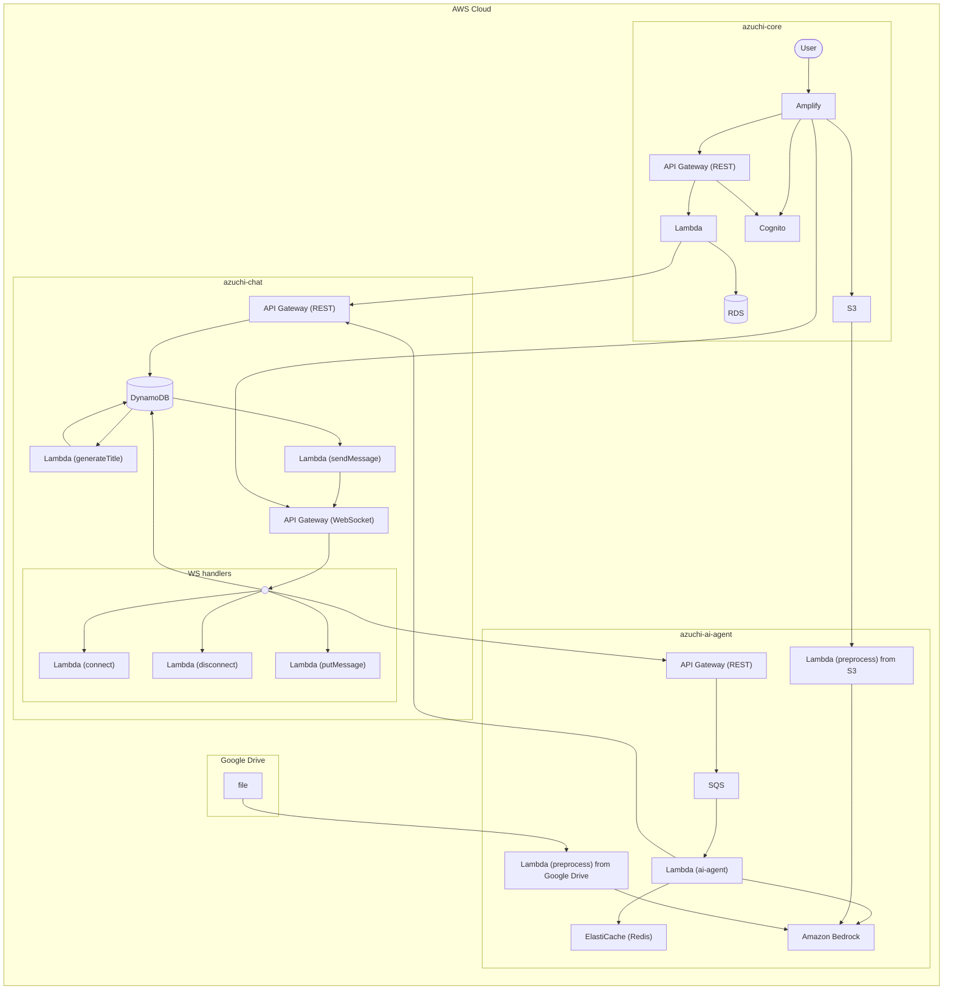

```mermaid
flowchart LR
  subgraph AWS["AWS Cloud"]

    subgraph CORE["azuchi-core"]
      user([User])
      amplify[Amplify]
      apiRestCore["API Gateway (REST)"]
      lambdaCore[Lambda]
      rds[(RDS)]
      cognito[Cognito]

      user --> amplify
      amplify --> apiRestCore
      apiRestCore --> lambdaCore
      lambdaCore --> rds
      amplify --> cognito
      apiRestCore --> cognito
      amplify --> S3
    end

    subgraph AIA["azuchi-ai-agent"]
      direction LR
      apiRestAI["API Gateway (REST)"]
      sqs[SQS]
      lambdaAgent["Lambda (ai-agent)"]
      lambdaPreFromS3["Lambda (preprocess) from S3"]
      lambdaPreFromDrive["Lambda (preprocess) from Google Drive"]
      bedrock[Amazon Bedrock]
      elasticache["ElastiCache (Redis)"]

      apiRestAI --> sqs
      sqs --> lambdaAgent
      lambdaAgent --> elasticache
      lambdaAgent --> bedrock
      lambdaPreFromS3 --> bedrock
      lambdaPreFromDrive --> bedrock


    end

    subgraph CHAT["azuchi-chat"]
      apiWS["API Gateway (WebSocket)"]

      subgraph WSHANDLERS["WS handlers"]
        wsHub(( ))
        lambdaConnect["Lambda (connect)"]
        lambdaDisconnect["Lambda (disconnect)"]
        lambdaPut["Lambda (putMessage)"]
        wsHub --> lambdaConnect
        wsHub --> lambdaDisconnect
        wsHub --> lambdaPut
      end

      apiRestChat["API Gateway (REST)"]
      ddb[(DynamoDB)]
      lambdaGenTitle["Lambda (generateTitle)"]
      lambdaSend["Lambda (sendMessage)"]

      apiRestChat --> ddb
      lambdaGenTitle --> ddb
      ddb --> lambdaGenTitle
      ddb --> lambdaSend
      lambdaSend --> apiWS
    end

    subgraph Drive["Google Drive"]
      file["file"]
    end

    amplify --> apiWS
    lambdaCore --> apiRestChat
    lambdaAgent --> apiRestChat
    S3 --> lambdaPreFromS3

    apiWS --> wsHub
    wsHub --> apiRestAI
    wsHub --> ddb

    file --> lambdaPreFromDrive
  end

```
