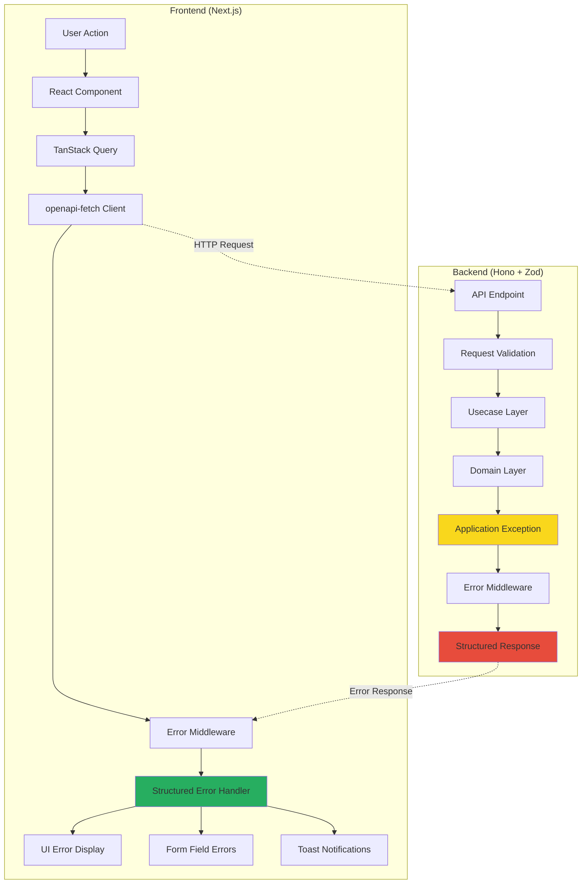
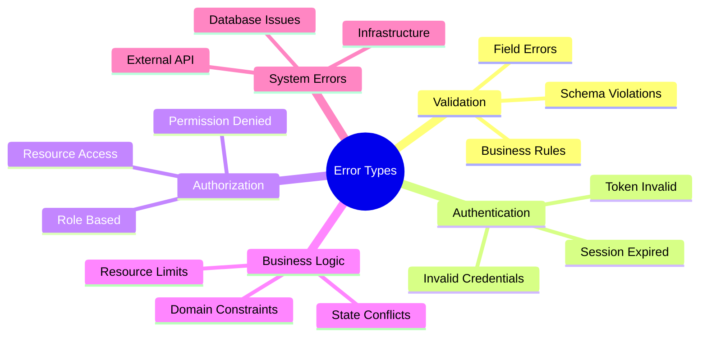
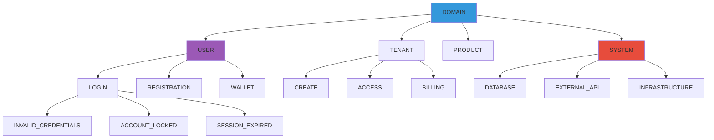
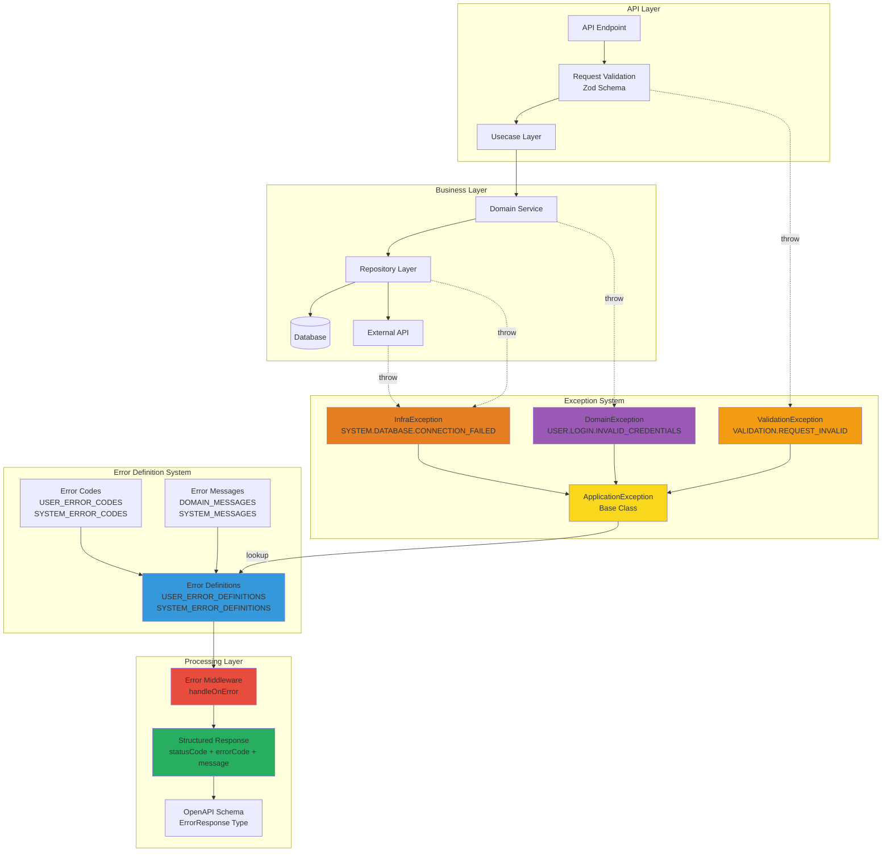

> [!info] 必要なセクションを選択して使用してください！

# 🎯 目的・対象範囲

## 目的
FE/BE分離アプリケーションにおいて、統一されたエラーハンドリング機能を実装し、開発者体験とユーザー体験の両方を向上させる。

## 対象範囲
- **kunai-core-backend**: 階層型エラーコード体系、統一エラーレスポンス、メッセージ管理
- **kunai-core-frontend**: 構造化エラーハンドリング、フォーム統合、ユーザー体験向上
- **OpenAPI統合**: 自動生成される型定義とエラースキーマの統合

## 解決する課題
- エラー情報の一貫性不足（技術的詳細がユーザーに表示される）
- エラーハンドリングコードの重複と保守性の低さ
- フロントエンドでのエラー種別判定の困難さ
- 障害切り分けとトラブルシューティングの複雑さ

---

# 🔄 全体アーキテクチャ概要

## システム全体のエラーハンドリングフロー

本システムにおけるエラーハンドリングは、FrontendとBackendが緊密に連携することで実現される。従来の単純なHTTPステータスコードのみに依存したエラー処理とは異なり、構造化されたエラー情報を活用してユーザー体験の向上を図る。

Backend側では、Honoフレームワークの上でZodによるバリデーション機能を活用し、リクエスト段階から適切なエラー検出を行う。ドメインロジック実行時には`ApplicationException`クラスを使用して構造化されたエラー情報を生成し、これをError Middlewareが統一されたレスポンス形式に変換する。この際、技術的な詳細情報は隠蔽し、ユーザーに適したメッセージのみを提供する。

Frontend側では、openapi-fetchクライアントを通じてAPIとの通信を行い、エラーレスポンスをError Middlewareで受信する。Structured Error Handlerがエラーの種類を判定し、バリデーションエラーはフォームフィールドへ、システムエラーはトースト通知へと、適切なUI要素にエラー情報を振り分ける。この仕組みにより、開発者は複雑なエラー分岐処理を記述する必要がなく、一貫性のあるエラー表示が実現される。


## エラー分類とハンドリング戦略

エラーハンドリング戦略は、エラーの性質に応じて5つの主要カテゴリに分類される。この分類により、各エラータイプに最適化されたユーザー体験を提供できる。

Validationエラーは主に入力値に関する問題を扱う。フィールドレベルのエラー、スキーマ違反、ビジネスルール違反などが含まれ、ユーザーが直接修正可能な内容である。これらのエラーは即座にフォーム上に表示され、リアルタイム検証により早期発見が図られる。

Authentication及びAuthorizationエラーは、アクセス権限に関わる問題である。認証情報の誤り、セッション期限切れ、権限不足などが該当し、多くの場合はユーザーによる再認証や管理者への連絡が必要となる。システムは適切な説明と共に、解決方法を明確に提示する。

Business Logicエラーは、アプリケーション特有のビジネスルールに違反した場合に発生する。在庫不足、重複登録、状態遷移の制約違反などがこれに当たる。ユーザーに対してはビジネス的な観点から理解しやすい説明を提供し、代替的な操作方法を案内する。

System Errorsは、データベース接続エラー、外部API障害、インフラストラクチャの問題など、技術的な要因によるものである。これらは通常ユーザーが直接解決できないため、技術的詳細を隠蔽した一般的なメッセージを表示し、バックグラウンドでシステム管理者に通知される。



## エラーコード階層構造

階層型エラーコード体系は、`DOMAIN.SUBDOMAIN.ACTION.ERROR_TYPE`の形式を採用している。この構造により、エラーの発生箇所と詳細な原因を一意に特定できる。

最上位のDOMAINレベルでは、USER、TENANT、PRODUCT、SYSTEMといった主要な機能領域を区別している。各ドメインの下にはより具体的なSUBDOMAINが配置され、例えばUSERドメインにはLOGIN、REGISTRATION、WALLETなどのサブドメインが含まれる。

さらに詳細なレベルでは、具体的なエラー種別が定義される。例えば、`USER.LOGIN.INVALID_CREDENTIALS`は、ユーザードメインのログイン機能において認証情報が無効であることを示している。この階層構造により、Frontend側では効率的なパターンマッチングが可能となり、保守性の高いエラーハンドリングコードを記述できる。

SYSTEMドメインには、DATABASE、EXTERNAL_API、INFRASTRUCTUREなどの技術的なエラーが分類される。これらのエラーは主にシステム運用者向けの情報であり、エンドユーザーには抽象化されたメッセージが提供される。




# 📋 現状分析

## Backend現状分析 (kunai-core-backend)

### 技術スタック
- **フレームワーク**: Hono + TypeScript
- **バリデーション**: Zod + OpenAPI統合
- **Exception体系**: ApplicationException基底クラス
- **ロガー**: Winston（構造化ログ）
- **OpenAPI**: hono/zod-openapi

### 現在のディレクトリ構成
```
src/
├─ shared/
│  ├─ exceptions/                  # 既存のException体系
│  │  ├─ ApplicationException.ts   # 基底クラス
│  │  ├─ DomainException.ts       # ドメイン層Exception
│  │  ├─ UsecaseException.ts      # ユースケース層Exception
│  │  ├─ RouteException.ts        # ルート層Exception
│  │  └─ InfrastructureException.ts # インフラ層Exception
│  ├─ schemas/                     # Zodスキーマ定義
│  ├─ types/                       # 型定義
│  └─ utils/                       # ユーティリティ
├─ middlewares/                    # Honoミドルウェア
│  ├─ handleOnErrorMiddleware.ts   # 既存エラーハンドリング
│  └─ ...
├─ routes/                         # APIルート定義
└─ domains/                        # ドメイン固有実装
```

### 現在のエラーハンドリング
```typescript
// 既存のApplicationException
export class ApplicationException extends Error implements IApplicationException {
  public readonly statusCode: ErrorStatusCode;
  public readonly meta: {
    message: ErrorMessage | (string & {});
    data?: Record<string, unknown>;
    cause?: unknown;
  };

  public constructor(
    statusCode: ErrorStatusCode,
    meta: {
      message: ErrorMessage | (string & {});
      data?: Record<string, unknown>;
      cause?: unknown;
    }
  ) {
    super(meta.message);
    this.statusCode = statusCode;
    this.meta = meta;
  }

  public toHTTPException(): HTTPException {
    return new HTTPException(this.statusCode, {
      message: this.meta.message,
      cause: this,
    });
  }
}
```

## Frontend現状分析 (kunai-core-frontend)

### 技術スタック詳細
- **Next.js 14.2.5** (App Router) + React 18
- **TanStack Query v5.59.0** (状態管理・データフェッチング)
- **React Hook Form v7.60.0 + Zod v3.25.76** (フォーム・バリデーション)
- **openapi-fetch + openapi-typescript** (型安全なAPI通信)
- **shadcn/ui (Radix UI基盤)** (UIコンポーネント)
- **Tailwind CSS** (スタイリング)
- **react-error-boundary v4.1.2** (導入済み、未使用)

### 現在のディレクトリ構成
```
src/
├── app/                          # Next.js App Router (ルーティング専用)
│   ├── (dashboard)/             # ダッシュボードレイアウト
│   ├── login/                   # 認証ページ
│   ├── layout.tsx              # ルートレイアウト
│   └── providers.tsx           # プロバイダー統合
├── page-components/             # ページレベルコンポーネント実体
│   ├── dashboard/
│   ├── login/
│   └── sites/
├── components/                  # ドメイン機能コンポーネント
│   ├── sites/                  # サイト関連コンポーネント
│   ├── users/                  # ユーザー関連コンポーネント
│   └── ui/                     # 基本UIコンポーネント
├── services/                    # API通信・外部サービス連携
│   ├── shared/
│   │   ├── clients/            # HTTPクライアント
│   │   │   └── httpClient/
│   │   │       ├── core/       # CoreAPI専用クライアント
│   │   │       ├── ai/         # AI API専用クライアント
│   │   │       └── middlewares/ # リクエスト/レスポンス処理
│   │   └── exceptions/         # エラー関連
│   │       └── fetchError.ts   # 現在の基本エラークラス
│   └── http/                   # API別の型定義・フック
│       ├── sites/
│       ├── users/
│       └── auth/
└── shared/                      # 共通ライブラリ・設定
    ├── components/             # 共通UIコンポーネント
    ├── hooks/                  # 共通フック
    ├── utils/                  # ユーティリティ
    └── types/                  # 型定義
```

### Container/Presentation パターン詳細
各ドメインコンポーネントは統一的なパターンで実装されている：

```
components/sites/site-create-form/
├── index.tsx                    # Container: ビジネスロジック、状態管理
├── presentation.tsx             # Presentation: UI描画のみ
├── hooks/
│   └── use-site-create-form.ts # フォーム固有ロジック
└── types.ts                    # コンポーネント固有型定義
```

### HTTPクライアント階層構造詳細
```
src/services/shared/clients/httpClient/
├── core/
│   └── httpClient.ts           # createClient<CoreApiSchema>
├── ai/
│   └── httpClient.ts           # createClient<AiApiSchema>
├── middlewares/
│   ├── commonRequestMiddleware.ts      # 共通リクエスト処理
│   ├── tenantContextMiddleware.ts      # テナント情報付与
│   └── index.ts               # ミドルウェア統合
├── types/                      # HTTP関連型定義
└── index.ts                   # 統合エクスポート
```

### 現在のミドルウェア実装詳細
```typescript
// middlewares/commonRequestMiddleware.ts
export const commonRequestMiddleware: Middleware = {
  onRequest: ({ schemaPath, request }) => {
    // Content-Type設定、認証ヘッダー等
    request.headers.set('Content-Type', 'application/json');
    // その他共通ヘッダー処理
    return request;
  },
  onResponse: ({ response }) => {
    // 現在はシンプルなエラー判定のみ
    if (response.status >= 400) {
      throw new FetchError(`fetch error: ${response.url}`, response);
    }
    return response;
  },
};

// middlewares/tenantContextMiddleware.ts
export const tenantContextMiddleware: Middleware = {
  onRequest: ({ request }) => {
    // テナントID等のコンテキスト情報を追加
    const tenantId = getCurrentTenantId();
    if (tenantId) {
      request.headers.set('X-Tenant-ID', tenantId);
    }
    return request;
  },
};
```

### 現在のエラーハンドリング実装
```typescript
// services/shared/exceptions/fetchError.ts
export class FetchError extends Error {
  public readonly response: Response;
  
  constructor(message: string, response: Response) {
    super(message);
    this.name = 'FetchError';
    this.response = response;
  }
}

// 現在の使用パターン（各コンポーネントで個別実装）
const { mutate: createSite, isPending } = usePostCreateSiteMutation();
const { showSuccessToast, showErrorToast } = useToast();

const handleSubmit = async (data: CreateSiteData) => {
  try {
    await createSite(data);
    showSuccessToast({
      title: "成功",
      description: "工事現場を作成しました",
    });
  } catch (error) {
    // エラー詳細が取得できない
    showErrorToast({
      title: "失敗", 
      description: "時間をおいて再試行してください"
    });
  }
};
```

### 現在の課題詳細分析
1. **エラー情報の欠損**
   - FetchErrorがResponse情報しか保持せず、構造化された内容が取得できない
   - エラーの種別（認証、バリデーション、システム等）が判定不可能

2. **エラーハンドリングの個別実装**
   - 各コンポーネントで try-catch + Toast表示の重複コード
   - エラー種別による適切な処理分岐ができない

3. **フォームバリデーション統合不足**
   - サーバー側バリデーションエラーがフォームフィールドに反映されない
   - クライアント側とサーバー側のバリデーション結果が分離している

4. **エラー監視・ログ機能の不足**
   - エラー発生時の詳細情報（requestId等）が追跡できない
   - 構造化されたエラーログが収集できない


# 🗄️ Backend実装詳細 (kunai-core-backend)

## 設計概要

新しいBackendエラーハンドリングシステムは、現状の課題を解決するため、以下の3つの主要コンポーネントから構成される統一的なアーキテクチャを採用している：

1. **階層型エラーコード体系**: `DOMAIN.SUBDOMAIN.ACTION.ERROR_TYPE`形式による体系的なエラー分類
2. **統一エラーレスポンス仕様**: 全APIで一貫したエラーレスポンス形式の提供
3. **エラー定義統合システム**: エラーコード、メッセージ、メタデータの一元管理

これにより、開発者は複雑なエラー処理を意識することなく、適切なエラー情報をFrontendに提供でき、ユーザーは一貫性のあるエラー体験を得ることができる。

### Backendエラーハンドリングアーキテクチャイメージ



### 各コンポーネントの役割

- **ApplicationException**: ドメイン層・インフラ層でのエラー発生時に階層型エラーコードを持つ例外を生成
- **Error Definitions**: エラーコードとメッセージ、メタデータ（ステータスコード、カテゴリ等）を統合管理
- **Error Middleware**: 例外をキャッチして統一されたエラーレスポンス形式に変換
- **Structured Error Response**: Frontend側での型安全なエラーハンドリングを可能にする構造化レスポンス

## 階層型エラーコード体系

階層型エラーコード体系は、従来のHTTPステータスコードだけでは実現できない詳細なエラー分類を可能にする設計である。現状では、400 Bad Requestや500 Internal Server Errorといった汎用的なステータスコードのみでエラー情報を伝達しているため、Frontend側での適切なエラーハンドリングが困難となっていた。

**目的・役割**:
- ドメイン・機能別の詳細なエラー種別定義による、適切なユーザー体験の提供
- Frontend側でのエラーカテゴリ判定とUI制御の効率化
- 運用時のエラー分析とトラブルシューティングの高速化

**現状の課題と新システムでの解決方法**:
- **課題**: HTTPステータスコードでは「400 Bad Request」として一括されるエラーでも、実際は認証失敗、バリデーション失敗、ビジネスルール違反など多様な原因が存在
- **解決**: `DOMAIN.SUBDOMAIN.ACTION.ERROR_TYPE`形式による階層構造で、エラーの発生箇所と詳細な原因を一意に特定

**主要な機能・特徴**:
- 4階層構造による体系的なエラー分類（例：`USER.LOGIN.INVALID_CREDENTIALS`）
- ドメイン知識に基づくエラーグループ化（USER、TENANT、PRODUCT、SYSTEM等）
- エラーコード拡張時の命名規則統一による保守性確保

**他のコンポーネントとの関係**:
- **エラーメッセージ管理システム**: 各エラーコードに対応するユーザーメッセージの提供
- **Frontend Structured Error Handler**: エラーコードベースの条件分岐によるUI制御
- **OpenAPI統合**: エラーコードのenum定義による型安全性確保

現状の単純なHTTPステータスコードでは区別できない詳細なエラー種別を、階層的な命名規則により体系化する。これにより、Frontend側での適切なエラーハンドリングと、運用時のエラー分析が可能となる。

### エラーコード構造
```
DOMAIN.[SUBDOMAIN].ACTION.ERROR_TYPE
例: USER.LOGIN.INVALID_CREDENTIALS
```

### 拡張ディレクトリ構成
```
src/shared/errors/
├── types.ts                      # エラー型定義
├── codes/                        # エラーコード定義
│   ├── domains/
│   │   ├── userErrors.ts        # ユーザー関連エラーコード
│   │   ├── tenantErrors.ts      # テナント関連エラーコード
│   │   ├── productErrors.ts     # プロダクト関連エラーコード
│   │   └── siteErrors.ts        # サイト関連エラーコード
│   ├── system/
│   │   ├── databaseErrors.ts    # データベース関連エラーコード
│   │   ├── externalApiErrors.ts # 外部API関連エラーコード
│   │   └── infrastructureErrors.ts # インフラ関連エラーコード
│   └── validation/
│       └── commonValidationErrors.ts # 共通バリデーションエラー
├── messages/                     # エラーメッセージ管理
│   ├── domainErrorMessages.ts   # ドメイン系メッセージ (USER, TENANT, SITE等)
│   ├── systemErrorMessages.ts   # システム系メッセージ (DATABASE, EXTERNAL_API等)
│   └── validationErrorMessages.ts # バリデーション系メッセージ
├── definitions/                  # エラー定義統合
│   ├── userDefinitions.ts
│   ├── tenantDefinitions.ts
│   ├── systemDefinitions.ts
│   └── index.ts
└── utils.ts                      # エラー処理ユーティリティ
```

### ファイル分割方針

#### エラーコード分割方針
エラーコードは**ドメイン・技術領域別**に分割する：
- **domains/**: ビジネスドメイン固有のエラーコード（USER, TENANT, SITE, PRODUCT等）
- **system/**: システム・インフラ関連のエラーコード（DATABASE, EXTERNAL_API, INFRASTRUCTURE等）
- **validation/**: 汎用的なバリデーション関連のエラーコード

#### エラーメッセージ分割方針
エラーメッセージは**責務・管理単位別**に分割する：
- **domainErrorMessages.ts**: ドメイン系メッセージ（全ドメインを1ファイルで管理）
- **systemErrorMessages.ts**: システム系メッセージ（全システムエラーを1ファイルで管理）
- **validationErrorMessages.ts**: バリデーション系メッセージ（全バリデーションエラーを1ファイルで管理）

**分割理由**：
- エラーコード：ドメイン知識とファイル数の適切な分散
- エラーメッセージ：メッセージ統一性の管理とファイル数の最小化

### エラーコード定義例
```typescript
// src/shared/errors/codes/domains/userErrors.ts
export const USER_ERROR_CODES = {
  LOGIN: {
    INVALID_CREDENTIALS: 'USER.LOGIN.INVALID_CREDENTIALS',
    ACCOUNT_LOCKED: 'USER.LOGIN.ACCOUNT_LOCKED',
    SESSION_EXPIRED: 'USER.LOGIN.SESSION_EXPIRED',
    TWO_FACTOR_REQUIRED: 'USER.LOGIN.TWO_FACTOR_REQUIRED',
  },
  REGISTRATION: {
    EMAIL_DUPLICATE: 'USER.REGISTRATION.EMAIL_DUPLICATE',
    INVALID_EMAIL_FORMAT: 'USER.REGISTRATION.INVALID_EMAIL_FORMAT',
    PASSWORD_TOO_WEAK: 'USER.REGISTRATION.PASSWORD_TOO_WEAK',
  },
  PROFILE: {
    UPDATE_PERMISSION_DENIED: 'USER.PROFILE.UPDATE_PERMISSION_DENIED',
    INVALID_AVATAR_FORMAT: 'USER.PROFILE.INVALID_AVATAR_FORMAT',
  },
  WALLET: {
    INSUFFICIENT_BALANCE: 'USER.WALLET.INSUFFICIENT_BALANCE',
    INVALID_AMOUNT: 'USER.WALLET.INVALID_AMOUNT',
    TRANSACTION_LIMIT_EXCEEDED: 'USER.WALLET.TRANSACTION_LIMIT_EXCEEDED',
  },
} as const;

export type UserErrorCode = 
  | typeof USER_ERROR_CODES.LOGIN[keyof typeof USER_ERROR_CODES.LOGIN]
  | typeof USER_ERROR_CODES.REGISTRATION[keyof typeof USER_ERROR_CODES.REGISTRATION]
  | typeof USER_ERROR_CODES.PROFILE[keyof typeof USER_ERROR_CODES.PROFILE]
  | typeof USER_ERROR_CODES.WALLET[keyof typeof USER_ERROR_CODES.WALLET];
```

```typescript
// src/shared/errors/codes/system/databaseErrors.ts
export const DATABASE_ERROR_CODES = {
  CONNECTION: {
    FAILED: 'SYSTEM.DATABASE.CONNECTION_FAILED',
    TIMEOUT: 'SYSTEM.DATABASE.CONNECTION_TIMEOUT',
    POOL_EXHAUSTED: 'SYSTEM.DATABASE.POOL_EXHAUSTED',
  },
  QUERY: {
    TIMEOUT: 'SYSTEM.DATABASE.QUERY_TIMEOUT',
    SYNTAX_ERROR: 'SYSTEM.DATABASE.SYNTAX_ERROR',
    CONSTRAINT_VIOLATION: 'SYSTEM.DATABASE.CONSTRAINT_VIOLATION',
  },
  TRANSACTION: {
    DEADLOCK: 'SYSTEM.DATABASE.TRANSACTION_DEADLOCK',
    ROLLBACK_FAILED: 'SYSTEM.DATABASE.ROLLBACK_FAILED',
  },
} as const;
```

## エラーメッセージ管理システム

エラーメッセージ管理システムは、階層型エラーコード体系と連動して、ユーザーフレンドリーなメッセージを一元管理する仕組みである。現状では、各開発者が個別にエラーメッセージを記述しているため、表現の統一性がなく、類似のエラーで異なるメッセージが表示される問題があった。

新しいシステムでは、以下の特徴により統一性とメンテナンス性を向上させる：

**目的・役割**:
- エラーメッセージの一元管理による表現の統一化
- ビジネス要件の変更に対する迅速なメッセージ更新
- 多様なエラーコードに対する効率的なメッセージ再利用

**現状の課題と解決方法**:
- **課題**: 開発者ごとに異なるメッセージ表現、重複管理によるメンテナンス困難
- **解決**: 責務別ファイル分割による管理範囲の明確化、共通メッセージの戦略的再利用

**主要な機能**:
- ドメイン・システム・バリデーション別のメッセージ分類管理
- 技術的に異なる原因でも同一ユーザーメッセージの提供機能
- エラーコード定義との型安全な連携

**他のコンポーネントとの関係**:
- **階層型エラーコード体系**: エラーコードに対応するメッセージの提供
- **エラー定義統合システム**: 定義ファイル内でのメッセージ参照と統合
- **ApplicationException**: 実行時のメッセージ解決と適用現状では各開発者が個別にエラーメッセージを記述しているが、新しいシステムでは統一されたメッセージ管理により、一貫性のあるユーザー体験を提供する。

このシステムの特徴は、異なるエラーコードが同じユーザーメッセージを共有できる点にある。例えば、データベース接続エラーや外部API障害など、技術的には異なる原因でも「一時的にサービスをご利用いただけません」という共通メッセージでユーザーに適切な情報を提供できる。

### ファイル分割方針

メッセージ管理は責務と管理単位に基づいて3つのファイルに分割される：

- **domainErrorMessages.ts**: ビジネスドメイン関連（USER、TENANT、PRODUCT等）
- **systemErrorMessages.ts**: システム・技術関連（DATABASE、EXTERNAL_API、INFRASTRUCTURE）  
- **validationErrorMessages.ts**: 入力値検証関連（REQUEST、FORMAT、CONSTRAINT）

この分割により、各チームが担当領域のメッセージを独立して管理でき、メッセージ変更時の影響範囲も明確になる。

### 現実的なメッセージ再利用パターン

異なるエラーコードで同じユーザーメッセージを使用するケースが存在する：

```typescript
// src/shared/errors/messages/systemErrorMessages.ts
export const SYSTEM_MESSAGES = {
  DATABASE: {
    CONNECTION_FAILED: 'システムエラーが発生しました。しばらく時間をおいてから再度お試しください',
    QUERY_TIMEOUT: 'システムエラーが発生しました。しばらく時間をおいてから再度お試しください',
    TRANSACTION_FAILED: 'システムエラーが発生しました。しばらく時間をおいてから再度お試しください',
  },
  EXTERNAL_API: {
    TIMEOUT: 'システムエラーが発生しました。しばらく時間をおいてから再度お試しください',
    CONNECTION_FAILED: 'システムエラーが発生しました。しばらく時間をおいてから再度お試しください',
  },
  INFRASTRUCTURE: {
    RATE_LIMIT: 'リクエストが集中しています。しばらく時間をおいてから再度お試しください',
    MAINTENANCE: 'システムメンテナンス中です',
  },
} as const;

// src/shared/errors/messages/domainErrorMessages.ts
export const DOMAIN_MESSAGES = {
  // ユーザー系エラー - 固定メッセージ
  USER: {
    LOGIN: {
      INVALID_CREDENTIALS: 'メールアドレスまたはパスワードが正しくありません',
      SESSION_EXPIRED: 'セッションが期限切れです。再度ログインしてください',
      ACCOUNT_LOCKED: 'アカウントがロックされています',
    },
    REGISTRATION: {
      EMAIL_DUPLICATE: 'このメールアドレスは既に使用されています',
      PASSWORD_TOO_WEAK: 'パスワードが複雑性要件を満たしていません',
    },
    WALLET: {
      INSUFFICIENT_BALANCE: '残高が不足しています',
    },
    ACCESS: {
      PERMISSION_DENIED: 'アクセス権限がありません',
    },
  },

  // テナント系エラー
  TENANT: {
    CREATE: {
      QUOTA_EXCEEDED: '作成上限に達しています。プランのアップグレードをご検討ください',
    },
    ACCESS: {
      PERMISSION_DENIED: 'アクセス権限がありません',
      NOT_FOUND: '指定されたテナントが見つかりません',
    },
  },

  // サイト系エラー
  SITE: {
    CREATE: {
      DUPLICATE_CODE: '同じ工事管理IDが既に存在します',
    },
    ACCESS: {
      NOT_AUTHORIZED: 'アクセス権限がありません',
    },
  },
} as const;

// src/shared/errors/messages/validationErrorMessages.ts
export const VALIDATION_MESSAGES = {
  REQUEST: {
    INVALID: '入力内容を確認してください',
    FORMAT_ERROR: '入力形式が正しくありません',
    REQUIRED_FIELD: '必須項目が入力されていません',
  },
} as const;
```

### エラー定義での共通メッセージ使用例
```typescript
// src/shared/errors/definitions/systemDefinitions.ts
import { SYSTEM_MESSAGES } from '../messages/systemErrorMessages';

export const SYSTEM_ERROR_DEFINITIONS = {
  // 全て異なる技術的原因だが、ユーザーには同じメッセージ
  'SYSTEM.DATABASE.CONNECTION_FAILED': {
    statusCode: 500,
    message: SYSTEM_MESSAGES.DATABASE.CONNECTION_FAILED,  // 共通メッセージ
    technicalMessage: 'Database connection pool exhausted',
    retryable: true,
    logLevel: 'error',
  },
  'SYSTEM.DATABASE.QUERY_TIMEOUT': {
    statusCode: 500,
    message: SYSTEM_MESSAGES.DATABASE.QUERY_TIMEOUT,  // 同じメッセージ
    technicalMessage: 'Database query execution timeout',
    retryable: true,
    logLevel: 'error',
  },
  'SYSTEM.EXTERNAL_API.TIMEOUT': {
    statusCode: 500,
    message: SYSTEM_MESSAGES.EXTERNAL_API.TIMEOUT,  // 同じメッセージ
    technicalMessage: 'External API request timeout',
    retryable: true,
    logLevel: 'error',
  },
} as const;
```

### メッセージの設計方針

エラーメッセージは固定文字列として定義し、可読性と保守性を重視している。動的な情報が必要な場合は、Backend側のdetailsフィールドを通じて追加情報を提供し、Frontend側でコンテキストに応じた処理を行う。

```typescript
// メッセージは全て固定文字列
INSUFFICIENT_BALANCE: '残高が不足しています',
ACCOUNT_LOCKED: 'アカウントがロックされています',
```

**注意**: より高度な動的メッセージ機能については、将来的な拡張構想「型安全な動的メッセージシステム」を参照。

### 統合使用例
```typescript
// src/shared/errors/definitions/userDefinitions.ts
import { DOMAIN_MESSAGES } from '../messages/domainErrorMessages';

export const USER_ERROR_DEFINITIONS = {
  'USER.LOGIN.INVALID_CREDENTIALS': {
    statusCode: 401,
    message: DOMAIN_MESSAGES.USER.LOGIN.INVALID_CREDENTIALS, // 固定メッセージ
    retryable: false,
    logLevel: 'warn',
  },
  'USER.LOGIN.ACCOUNT_LOCKED': {
    statusCode: 423,
    message: DOMAIN_MESSAGES.USER.LOGIN.ACCOUNT_LOCKED, // 固定メッセージ
    technicalMessage: 'Account locked due to multiple failed login attempts',
    retryable: false,
    logLevel: 'warn',
  },
  'USER.WALLET.INSUFFICIENT_BALANCE': {
    statusCode: 400,
    message: DOMAIN_MESSAGES.USER.WALLET.INSUFFICIENT_BALANCE, // 固定メッセージ
    technicalMessage: 'Wallet balance insufficient for transaction',
    retryable: false,
    logLevel: 'info',
  },
  'USER.ACCESS.PERMISSION_DENIED': {
    statusCode: 403,
    message: DOMAIN_MESSAGES.USER.ACCESS.PERMISSION_DENIED, // 共通メッセージ再利用
    technicalMessage: 'User cannot access this resource',
    retryable: false,
    logLevel: 'warn',
  },
} as const;

// src/shared/errors/definitions/tenantDefinitions.ts
import { DOMAIN_MESSAGES } from '../messages/domainErrorMessages';

export const TENANT_ERROR_DEFINITIONS = {
  'TENANT.CREATE.QUOTA_EXCEEDED': {
    statusCode: 400,
    message: DOMAIN_MESSAGES.TENANT.CREATE.QUOTA_EXCEEDED, // テナント固有メッセージ
    technicalMessage: 'Tenant creation quota exceeded for this user',
    retryable: false,
    logLevel: 'info',
  },
  'TENANT.ACCESS.PERMISSION_DENIED': {
    statusCode: 403,
    message: DOMAIN_MESSAGES.TENANT.ACCESS.PERMISSION_DENIED, // 共通メッセージ（別ドメインと同じ内容）
    technicalMessage: 'User role insufficient for tenant access',
    retryable: false,
    logLevel: 'warn',
  },
} as const;
```

## 統一エラーレスポンス仕様

統一エラーレスポンス仕様は、Backend APIから返される全てのエラー情報を標準化された形式で提供するシステムである。現状では、各APIエンドポイントが独自の形式でエラー情報を返しているため、Frontend側での処理が複雑化し、エラー情報の取得も困難となっていた。

**目的・役割**:
- 全APIで一貫したエラーレスポンス形式の提供による、Frontend実装の簡素化
- 運用時の障害解析に必要な構造化情報の標準的な提供
- OpenAPI連携による型安全なエラーハンドリングの実現

**現状の課題と新システムでの解決方法**:
- **課題**: エンドポイントごとに異なるエラー形式、デバッグ情報の不足、Frontend側での複雑なエラー解析処理
- **解決**: 標準化されたJSON構造による一貫したエラー情報、requestIdによる追跡可能性、型定義の自動共有

**主要な機能・特徴**:
- statusCode、errorCode、message、detailsを含む統一JSON構造
- timestampとrequestIdによる障害解析支援情報の標準装備
- バリデーションエラー専用形式による詳細なフィールドエラー情報
- OpenAPI経由でのエラーコードenum共有による型安全性

**他のコンポーネントとの関係**:
- **階層型エラーコード体系**: errorCodeフィールドでの詳細エラー分類情報の提供
- **ApplicationException**: 例外から統一レスポンス形式への自動変換
- **Frontend StructuredApiError**: レスポンス構造を活用した型安全なエラー処理
- **Error Middleware**: 統一形式での自動レスポンス生成

### レスポンス形式
```typescript
// src/shared/schemas/errorSchemas.ts
export const errorResponseSchema = z.object({
  statusCode: z.number().openapi('statusCode', {
    description: 'HTTP status code',
    example: 400
  }),
  errorCode: z.string().openapi('errorCode', {
    description: 'Hierarchical error code',
    example: 'USER.LOGIN.INVALID_CREDENTIALS'
  }),
  message: z.string().openapi('message', {
    description: 'User-friendly error message',
    example: 'メールアドレスまたはパスワードが正しくありません'
  }),
  details: z.record(z.any()).optional().openapi('details', {
    description: 'Additional error context data',
    example: { currentBalance: 1000, requiredAmount: 1500 }
  })
}).openapi('ErrorResponse', {
  description: 'Standard error response format'
});

export type ErrorResponse = z.infer<typeof errorResponseSchema>;
```

### エラーコードのOpenAPI経由共有

```typescript
// BE側: エラーコードをenumとしてOpenAPIスキーマに定義
export const errorCodeSchema = z.enum([
  'USER.LOGIN.INVALID_CREDENTIALS',
  'USER.LOGIN.ACCOUNT_LOCKED', 
  'USER.LOGIN.SESSION_EXPIRED',
  'USER.REGISTRATION.EMAIL_ALREADY_EXISTS',
  'TENANT.ACCESS.PERMISSION_DENIED',
  'SYSTEM.DATABASE.CONNECTION_FAILED',
  'VALIDATION.REQUEST_INVALID',
  // 新しいエラーコードはここに追加するのみ
]).openapi('ErrorCode', {
  description: 'Hierarchical error codes for structured error handling'
});

// ErrorResponseスキーマでenumを使用
export const errorResponseSchema = z.object({
  statusCode: z.number(),
  errorCode: errorCodeSchema, // ← string ではなく enum を使用
  message: z.string(),
  details: z.record(z.any()).optional()
}).openapi('ErrorResponse');

export type ErrorCode = z.infer<typeof errorCodeSchema>;
export type ErrorResponse = z.infer<typeof errorResponseSchema>;
```

**重要**: この設計により、**FE側でエラーコードを再定義する必要がなくなります**。openapi-fetchによる自動生成で、BE側の定義がそのままFE側で型安全に利用できます。

```typescript
// FE側: 自動生成された型を使用（再定義不要）
import type { components } from './generated/api-types';

type ErrorCode = components['schemas']['ErrorCode'];
type ErrorResponse = components['schemas']['ErrorResponse'];

// エラーハンドリング時も型安全
export class StructuredApiError extends Error {
  get errorCode(): ErrorCode {
    return this.errorResponse.errorCode; // ← 完全に型安全
  }

  isAuthenticationError(): boolean {
    // TypeScriptがコンパイル時にエラーコードの存在をチェック
    return ['USER.LOGIN.INVALID_CREDENTIALS', 'USER.LOGIN.ACCOUNT_LOCKED'].includes(this.errorCode);
  }
}
```

### バリデーションエラー専用形式
```typescript
export const validationErrorResponseSchema = z.object({
  statusCode: z.number(),
  errorCode: z.string(),
  message: z.string(),
  details: z.object({
    fieldErrors: z.array(z.object({
      field: z.string(),
      code: z.string(),
      message: z.string(),
    }))
  })
}).openapi('ValidationErrorResponse');

export type ValidationErrorResponse = z.infer<typeof validationErrorResponseSchema>;
```

## エラー定義統合システム

エラー定義統合システムは、階層型エラーコード体系とエラーメッセージ管理システムの橋渡しとなる中核コンポーネントである。現状では、エラーコード、HTTPステータスコード、ユーザーメッセージ、技術的情報が各所に散在しており、一貫性の保持と保守性に課題があった。

新しいシステムでは、各エラーコードに対して以下の情報を統合的に定義することで、これらの問題を解決する：

- **ステータスコード**: HTTPレスポンス用の標準ステータスコード（400、401、500など）
- **エラーカテゴリ**: BUSINESS、SYSTEM、VALIDATIONによる機能分類
- **ユーザーメッセージ**: エンドユーザー向けの理解しやすいメッセージ
- **技術的情報**: 開発者・運用者向けのデバッグ情報
- **運用メタデータ**: 再試行可否、ログレベルなどの運用時判定情報

この統合により、ApplicationExceptionの生成時にエラーコードを指定するだけで、適切なHTTPステータスコード、ユーザーメッセージ、運用情報が自動的に設定される。また、新しいエラータイプの追加時も、定義ファイルに一箇所追加するだけで、Backend全体で一貫したエラーハンドリングが実現される。

### エラー定義型
```typescript
// src/shared/errors/types.ts
export interface ErrorDefinition {
  statusCode: ErrorStatusCode;
  messageKey: MessageKey;
  fallbackMessageKey?: MessageKey;
  staticMessage?: string;
  technicalMessage?: string;
  retryable: boolean;
  logLevel: 'error' | 'warn' | 'info';
}

export interface ErrorContext {
  messageData?: Record<string, any>;
  locale?: 'ja' | 'en';
  technicalMessage?: string;
  data?: Record<string, unknown>;
  cause?: unknown;
}
```

### エラー定義マップ
```typescript
// src/shared/errors/definitions/userDefinitions.ts
import { USER_ERROR_CODES } from '../codes/domains/userErrors';
import { MESSAGE_KEYS } from '../messages/messageKeys';
import type { ErrorDefinition } from '../types';

export const USER_ERROR_DEFINITIONS: Record<UserErrorCode, ErrorDefinition> = {
  'USER.LOGIN.INVALID_CREDENTIALS': {
    statusCode: 401,
    messageKey: MESSAGE_KEYS.AUTH.INVALID_CREDENTIALS,
    technicalMessage: 'Authentication failed: invalid credentials',
    retryable: false,
    logLevel: 'warn',
  },
  'USER.LOGIN.ACCOUNT_LOCKED': {
    statusCode: 423,
    messageKey: MESSAGE_KEYS.AUTH.ACCOUNT_LOCKED_WITH_TIME,
    fallbackMessageKey: MESSAGE_KEYS.AUTH.ACCOUNT_LOCKED,
    technicalMessage: 'Account is locked due to multiple failed login attempts',
    retryable: false,
    logLevel: 'warn',
  },
  'USER.WALLET.INSUFFICIENT_BALANCE': {
    statusCode: 400,
    messageKey: MESSAGE_KEYS.BUSINESS.INSUFFICIENT_BALANCE_WITH_DETAILS,
    fallbackMessageKey: MESSAGE_KEYS.BUSINESS.INSUFFICIENT_BALANCE,
    technicalMessage: 'Wallet balance insufficient for transaction',
    retryable: false,
    logLevel: 'info',
  },
  // ... その他のエラー定義
};
```

## ApplicationException拡張実装

ApplicationException拡張実装は、既存のApplicationExceptionクラスを階層型エラーコード体系とエラー定義統合システムに対応させる改良である。現状のApplicationExceptionは基本的なエラー情報しか保持せず、エラーコードの体系的管理やメッセージの統一化が困難であった。

**目的・役割**:
- エラーコード指定による自動的な適切情報設定の実現
- ユーザーメッセージと技術的詳細の分離による適切な情報提供
- 運用時の判定情報（再試行可否、ログレベル等）の自動提供
- 例外クラス別のエラーカテゴリ自動決定システムの提供

**現状の課題と新システムでの解決方法**:
- **課題**: ステータスコードとメッセージの手動設定による不整合リスク、技術情報のユーザー露出、カテゴリの手動管理
- **解決**: エラー定義からの自動設定による一貫性確保、ユーザー・技術情報の明確な分離、例外クラスからの自動カテゴリ決定

**主要な機能・特徴**:
- エラーコード指定だけでの完全なエラー情報自動設定
- ユーザーメッセージと技術メッセージの分離管理
- 再試行可能性とログレベルの自動判定メソッド
- HTTPExceptionへの統一形式自動変換
- 例外クラスによる自動エラーカテゴリ決定（DomainException → 'BUSINESS', InfraException → 'SYSTEM', ValidationException → 'VALIDATION'）

**他のコンポーネントとの関係**:
- **エラー定義統合システム**: 定義情報からの自動プロパティ設定
- **Error Middleware**: HTTPException変換による統一レスポンス生成
- **Logger**: ログレベル情報による適切なログ出力制御
- **例外クラス階層**: DomainException、InfraException、ValidationExceptionによる自動カテゴリマッピング

```typescript
// src/shared/exceptions/ApplicationException.ts (拡張版)
import { ERROR_DEFINITIONS } from '../errors/definitions';
import type { ErrorCode, ErrorContext } from '../errors/types';

export class ApplicationException extends Error implements IApplicationException {
  public readonly statusCode: ErrorStatusCode;
  public readonly errorCode: ErrorCode;
  public readonly userMessage: string;
  public readonly meta: ErrorContext;

  public constructor(
    errorCode: ErrorCode,
    context?: ErrorContext
  ) {
    const definition = ERROR_DEFINITIONS[errorCode];
    if (!definition) {
      throw new Error(`Error definition not found for code: ${errorCode}`);
    }

    // 固定メッセージの取得
    const userMessage: string = definition.message;

    super(context?.technicalMessage || userMessage);

    this.statusCode = definition.statusCode;
    this.errorCode = errorCode;
    this.userMessage = userMessage;
    this.meta = context || {};
  }

  // カテゴリを例外クラスから自動決定
  public getCategory(): 'BUSINESS' | 'SYSTEM' | 'VALIDATION' {
    // デフォルトでBUSINESSを返す（DomainExceptionで使用）
    return 'BUSINESS';
  }

  public toHTTPException(): HTTPException {
    return new HTTPException(this.statusCode, {
      res: Response.json({
        statusCode: this.statusCode,
        errorCode: this.errorCode,
        message: this.userMessage,
        details: this.meta.data,
      }),
    });
  }

  // 便利メソッド
  isRetryable(): boolean {
    return ERROR_DEFINITIONS[this.errorCode]?.retryable || false;
  }

  getLogLevel(): 'error' | 'warn' | 'info' {
    return ERROR_DEFINITIONS[this.errorCode]?.logLevel || 'error';
  }
}

// 例外クラス別のカテゴリマッピング
export class DomainException extends ApplicationException {
  public getCategory(): 'BUSINESS' | 'SYSTEM' | 'VALIDATION' {
    return 'BUSINESS';
  }
}

export class InfraException extends ApplicationException {
  public getCategory(): 'BUSINESS' | 'SYSTEM' | 'VALIDATION' {
    return 'SYSTEM';
  }
}

export class ValidationException extends ApplicationException {
  public getCategory(): 'BUSINESS' | 'SYSTEM' | 'VALIDATION' {
    return 'VALIDATION';
  }
}
```

## 拡張エラーミドルウェア

拡張エラーミドルウェアは、Honoフレームワーク上でのエラー処理を統一的に管理する中央集権的なコンポーネントである。現状のhandleOnErrorMiddlewareは基本的なエラーログ出力のみを行っているが、新しいシステムでは構造化されたエラー情報の適切な処理と一貫したレスポンス生成を担う。

**目的・役割**:
- 全てのAPIエンドポイントでの統一的なエラーハンドリングの実現
- エラーカテゴリとレベルに応じた適切なログ出力制御
- デバッグ支援情報（requestId、path等）の自動付与

**現状の課題と新システムでの解決方法**:
- **課題**: エンドポイント固有のエラー処理ロジック、ログ情報の不統一、デバッグ困難性
- **解決**: 中央集権的処理による一貫性確保、構造化ログ、追跡ID自動付与

**主要な機能・特徴**:
- ApplicationExceptionのカテゴリ・レベル別自動処理
- 技術的詳細の隠蔽とユーザー向け情報の適切な提供
- HTTPResponseError、未知エラーのフォールバック処理
- requestIdによる分散トレーシング対応

**他のコンポーネントとの関係**:
- **ApplicationException**: 拡張例外からの構造化情報取得と処理
- **統一エラーレスポンス**: 標準形式での自動レスポンス生成
- **Logger**: カテゴリ・レベル別の適切なログ出力
- **全APIエンドポイント**: 共通エラー処理による実装統一化

```typescript
// src/middlewares/handleOnErrorMiddleware.ts (拡張版)
import { Context } from 'hono';
import { ApplicationException } from '../shared/exceptions/ApplicationException';
import { Logger } from '../shared/utils/logger';
import { generateRequestId } from '../shared/utils/requestId';

export const handleOnErrorMiddleware = (
  error: Error | HTTPResponseError,
  c?: Context
) => {
  
  if (error instanceof ApplicationException) {
    // カテゴリ別・レベル別のログ出力
    const logLevel = error.getLogLevel();
    const category = error.getCategory();
    
    Logger[logLevel](`[${category}] ${error.errorCode}`, {
      errorCode: error.errorCode,
      category: category,
      statusCode: error.statusCode,
      userMessage: error.userMessage,
      technicalMessage: error.message,
      details: error.meta.data,
      stack: logLevel === 'error' ? error.stack : undefined, // error時のみstack出力
    });

    // 統一エラーレスポンスの生成
    return Response.json({
      statusCode: error.statusCode,
      errorCode: error.errorCode,
      message: error.userMessage,
      details: error.meta.data
    }, { status: error.statusCode });
  }

  // HTTPResponseError（Honoの標準エラー）
  if (error instanceof HTTPResponseError) {
    Logger.warn('[HTTP_RESPONSE_ERROR]', {
      status: error.status,
      message: error.message,
    });

    return Response.json({
      statusCode: error.status,
      errorCode: 'SYSTEM.HTTP_ERROR',
      message: 'リクエストの処理中にエラーが発生しました'
    }, { status: error.status });
  }

  // 未知のエラーは500で処理
  Logger.error('[UNKNOWN_ERROR] Internal Server Error', {
    message: error.message,
    stack: error.stack,
  });

  return Response.json({
    statusCode: 500,
    errorCode: 'SYSTEM.INTERNAL_ERROR',
    message: 'システムエラーが発生しました。しばらく時間をおいてから再度お試しください'
  }, { status: 500 });
};
```

## OpenAPIスキーマ統合

OpenAPIスキーマ統合は、Backend側で定義されたエラー情報をFrontend側で型安全に利用するための仕組みである。現状では、エラーレスポンスの型定義がBackendとFrontendで個別管理されているため、不整合によるランタイムエラーや、新しいエラータイプ追加時の手動同期作業が課題となっていた。

**目的・役割**:
- エラーコードとレスポンス構造の型定義自動共有
- Backend-Frontend間の型整合性保証
- 新しいエラータイプ追加時の自動型反映

**現状の課題と新システムでの解決方法**:
- **課題**: Backend-Frontend間の型定義重複管理、手動同期による不整合リスク、新規エラー追加時の多重定義
- **解決**: OpenAPIスキーマからの自動型生成、enum定義による厳密な型チェック、单一ソースによる一貫性確保

**主要な機能・特徴**:
- エラーコードのenum定義による型安全性確保
- 標準・バリデーション用レスポンス形式の自動型生成
- API別エラーレスポンス定義の効率化ヘルパー関数
- openapi-fetchとの連携による完全な型安全性

**他のコンポーネントとの関係**:
- **階層型エラーコード体系**: エラーコード一覧のenum自動生成
- **統一エラーレスポンス**: レスポンス構造の型定義自動化
- **Frontend StructuredApiError**: 自動生成型による型安全なエラー処理
- **openapi-typescript**: ビルドプロセスでの型定義自動更新

```typescript
// src/routes/shared/helpers/openAPISchema.ts (拡張版)
import { errorResponseSchema, validationErrorResponseSchema } from '@/shared/schemas/errorSchemas';

export const openAPISchema = {
  // 既存のメソッド...

  // 単一エラーレスポンス
  errorResponse: (statusCode: number, description?: string) => ({
    [statusCode]: {
      content: {
        "application/json": {
          schema: statusCode === 422 ? validationErrorResponseSchema : errorResponseSchema,
        },
      },
      description: description || `${statusCode} Error Response`,
    },
  }),

  // 複数エラーレスポンス
  errorResponses: (statusCodes: number[]) => 
    statusCodes.reduce((acc, code) => ({
      ...acc,
      ...openAPISchema.errorResponse(code)
    }), {}),

  // 一般的なエラーレスポンスセット
  commonErrorResponses: () => openAPISchema.errorResponses([400, 401, 403, 404, 500]),

  // 認証系APIの標準エラーレスポンス
  authErrorResponses: () => openAPISchema.errorResponses([400, 401, 422, 423, 429, 500]),

  // CRUD系APIの標準エラーレスポンス
  crudErrorResponses: () => openAPISchema.errorResponses([400, 401, 403, 404, 409, 422, 500]),
};
```

---

# 🖥️ Frontend実装詳細 (kunai-core-frontend)

## 拡張エラー型定義

### Backend エラーレスポンス型
```typescript
// src/shared/types/error.ts
export interface BackendErrorResponse {
  statusCode: number;
  errorCode: string;           // 'USER.LOGIN.INVALID_CREDENTIALS' など
  message: string;             // ユーザー向けメッセージ
  details?: Record<string, any>; // 追加コンテキスト（retryable、userActionなどの情報を含む）
}

export interface ValidationErrorResponse extends BackendErrorResponse {
  details: {
    fieldErrors: Array<{
      field: string;
      code: string;
      message: string;
    }>;
  };
}

export type ErrorCategory = 'BUSINESS' | 'SYSTEM' | 'VALIDATION';
```

## StructuredApiError クラス

```typescript
// src/services/shared/exceptions/StructuredApiError.ts
import type { BackendErrorResponse, ErrorCategory } from '@/shared/types/error';

export class StructuredApiError extends Error {
  public readonly statusCode: number;
  public readonly errorCode: string;
  public readonly details?: Record<string, any>;
  public readonly response: Response;

  constructor(errorData: BackendErrorResponse, response: Response) {
    super(errorData.message);
    this.name = 'StructuredApiError';
    this.statusCode = errorData.statusCode;
    this.errorCode = errorData.errorCode;
    this.details = errorData.details;
    this.response = response;
  }

  // エラータイプ判定メソッド
  isValidationError(): boolean {
    return this.errorCode === 'VALIDATION.REQUEST_INVALID' && Boolean(this.getFieldErrors().length);
  }

  isAuthenticationError(): boolean {
    return this.statusCode === 401 || this.errorCode.startsWith('USER.LOGIN');
  }

  isAuthorizationError(): boolean {
    return this.statusCode === 403 || this.errorCode.includes('PERMISSION_DENIED');
  }

  isBusinessError(): boolean {
    return (
      this.errorCode.startsWith('USER.') || 
      this.errorCode.startsWith('TENANT.') || 
      this.errorCode.startsWith('PRODUCT.') ||
      this.errorCode.startsWith('SITE.')
    ) && !this.isAuthenticationError() && !this.isAuthorizationError();
  }

  isSystemError(): boolean {
    return this.errorCode.startsWith('SYSTEM.') || this.statusCode >= 500;
  }

  // フィールドエラー取得
  getFieldErrors(): Array<{field: string, message: string, code?: string}> {
    if (!this.details?.fieldErrors) return [];
    return this.details.fieldErrors.map((error: any) => ({
      field: error.field,
      message: error.message,
      code: error.code,
    }));
  }

  // フィールド別エラー取得
  getFieldError(fieldName: string): string | null {
    return this.getFieldErrors().find(f => f.field === fieldName)?.message || null;
  }

  // エラーカテゴリ取得（例外クラスから自動決定）
  getCategory(): ErrorCategory {
    // ApplicationExceptionインスタンスのgetCategory()メソッドを呼び出し
    // DomainException → 'BUSINESS'
    // InfraException → 'SYSTEM'
    // ValidationException → 'VALIDATION'
    if (this.errorResponse && typeof this.errorResponse === 'object' && 'getCategory' in this.errorResponse) {
      return (this.errorResponse as any).getCategory();
    }
    // フォールバック：エラーコードから推論
    if (this.isValidationError()) return 'VALIDATION';
    if (this.isSystemError()) return 'SYSTEM';
    return 'BUSINESS';
  }

  // 再試行可能判定（BEのdetailsフィールドから取得、フォールバックはエラーコードベース）
  isRetryable(): boolean {
    // BEがdetailsで明示的にretryable情報を提供した場合は優先
    if (this.details?.retryable !== undefined) {
      return this.details.retryable;
    }
    // フォールバック: システムエラーのみ再試行可能
    return this.isSystemError() && this.statusCode >= 500;
  }

  // ユーザー向け表示メッセージ取得
  getUserDisplayMessage(): string {
    return this.message || 'エラーが発生しました';
  }

  // ユーザーアクション取得（BEのdetailsフィールドから）
  getUserAction(): string | undefined {
    return this.details?.userAction;
  }

  // デバッグ情報取得
  getDebugInfo(): Record<string, any> {
    return {
      errorCode: this.errorCode,
      statusCode: this.statusCode,
      category: this.getCategory(),
      retryable: this.isRetryable(),
      userAction: this.getUserAction(),
    };
  }
}
```


## 統一エラーハンドリングフック

```typescript
export function useErrorHandler(options: ErrorHandlerOptions = {}) {
  const { showErrorToast } = useToast();
  const router = useRouter();

  const handleError = useCallback((error: unknown, form?: UseFormReturn<any>) => {
    if (error instanceof StructuredApiError) {
      // バリデーションエラー → フォームフィールドに設定
      if (error.isValidationError() && form) {
        error.getFieldErrors().forEach(fieldError => {
          form.setError(fieldError.field, { message: fieldError.message });
        });
        return { handled: true, errorType: 'validation' };
      }

      // 認証エラー → ログインページにリダイレクト
      if (error.isAuthenticationError()) {
        const userAction = error.getUserAction() || '再度ログインしてください';
        showErrorToast({ 
          title: '認証エラー', 
          description: error.message,
          action: userAction
        });
        router.push('/login');
        return { handled: true, errorType: 'authentication' };
      }

      // ビジネスエラー → BEが提供したメッセージを使用
      if (error.isBusinessError()) {
        const userAction = error.getUserAction();
        showErrorToast({ 
          title: 'エラー', 
          description: error.message,
          action: userAction
        });
        return { handled: true, errorType: 'business' };
      }

      // システムエラー → 再試行情報をBEから取得
      if (error.isSystemError()) {
        const userAction = error.getUserAction() || 'しばらく経ってから再度お試しください';
        showErrorToast({ 
          title: 'システムエラー', 
          description: error.message,
          action: userAction
        });
        return { 
          handled: true, 
          errorType: 'system', 
          shouldRetry: error.isRetryable()
        };
      }
    }

    // 未知のエラー
    showErrorToast({ title: '予期しないエラーが発生しました' });
    return { handled: true, errorType: 'unknown' };
  }, [showErrorToast, router]);

  return { handleError };
}
```

## HTTPクライアント統合

```typescript
// Error handling middleware
export const errorHandlingMiddleware: Middleware = {
  onResponse: async ({ response }) => {
    if (!response.ok) {
      try {
        const errorData = await response.clone().json();
        if (isBackendErrorResponse(errorData)) {
          throw new StructuredApiError(errorData, response);
        }
      } catch (parseError) {
        if (parseError instanceof StructuredApiError) {
          throw parseError;
        }
      }
      // フォールバック
      throw new FetchError(`HTTP ${response.status}`, response);
    }
    return response;
  },
};

// Client integration
export const coreHttpClient = createClient<CoreApiSchema>({
  baseUrl: process.env.NEXT_PUBLIC_CORE_API_URL,
});

coreHttpClient.use(tenantContextMiddleware);
coreHttpClient.use(commonRequestMiddleware);
coreHttpClient.use(errorHandlingMiddleware); // 最後に配置
```

---

# 💼 実装例・使用パターン

## Backend使用例

### ドメイン層でのエラー発生
```typescript
// domains/user/services/loginService.ts
export class LoginService {
  async authenticate(email: string, password: string): Promise<User> {
    const user = await this.userRepository.findByEmail(email);
    if (!user) {
      throw new DomainException('USER.LOGIN.INVALID_CREDENTIALS');
    }

    if (user.isLocked) {
      throw new DomainException('USER.LOGIN.ACCOUNT_LOCKED', {
        data: { lockedUntil: user.lockedUntil } // 追加情報はdataフィールドに格納
      });
    }

    const isValid = await this.passwordService.verify(password, user.hashedPassword);
    if (!isValid) {
      throw new DomainException('USER.LOGIN.INVALID_CREDENTIALS');
    }

    return user;
  }
}
```

### APIルートでのエラーハンドリング
```typescript
// routes/auth/login.ts
const route = createRoute({
  method: "post",
  path: "/login",
  request: openAPISchema.requestBody(loginSchema),
  responses: {
    ...openAPISchema.response200(loginResponseSchema),
    // エラーレスポンスは定義不要
    // 実際のエラーはミドルウェアで統一処理され、
    // FE側はisBackendErrorResponse()とerrorCodeで判定
  },
});

loginRoute.openapi(route, async (c) => {
  const { email, password } = c.req.valid('json');
  
  try {
    const user = await loginService.authenticate(email, password);
    const token = await tokenService.generate(user);
    return c.json({ token, user });
  } catch (error) {
    // エラーはhandleOnErrorMiddlewareで自動処理
    throw error;
  }
});
```

## Frontend使用例

### 拡張Mutationフック
```typescript
export const useLoginMutation = () => {
  const { handleError } = useErrorHandler();

  return useMutation({
    mutationFn: ({ email, password }: LoginRequest) => 
      apiClient.POST('/api/auth/login', { body: { email, password } }),
    onError: handleError,
    onSuccess: (data) => {
      // 認証状態更新、リダイレクトなど
    },
  });
};

// メッセージはBEで管理され、エラーコードごとに適切なメッセージが返される
```

### フォームコンポーネント
```typescript
export function LoginForm() {
  const { register, handleSubmit, formState: { errors } } = useForm<LoginFormData>();
  const loginMutation = useLoginMutation();

  const onSubmit = handleSubmit(async (data) => {
    try {
      await loginMutation.mutateAsync(data);
    } catch (error) {
      // useErrorHandlerで自動処理済み
      // バリデーションエラーは自動でフォームフィールドに設定
    }
  });

  return (
    <form onSubmit={onSubmit}>
      <Input
        {...register('email')}
        error={errors.email?.message}
        placeholder="メールアドレス"
      />
      <Input
        {...register('password')}
        type="password"
        error={errors.password?.message}
        placeholder="パスワード"
      />
      <Button type="submit" loading={loginMutation.isPending}>
        ログイン
      </Button>
    </form>
  );
}
```

### Container コンポーネント統合
```typescript
export function UserProfileEditModal({ userId, open, onOpenChange }: Props) {
  const { form, handleSubmit } = useUserProfileForm();
  
  const updateMutation = useUpdateUserMutation({
    form, // バリデーションエラー自動設定
    onSuccess: () => {
      form.reset();
      onOpenChange(false);
    },
  });

  // メッセージはBEで管理され、適切なメッセージがエラーコードごとに設定されて返される

  const onSubmit = handleSubmit(async (data) => {
    try {
      await updateMutation.mutateAsync({ userId, ...data });
    } catch (error: unknown) {
      // 重要：TypeScriptではcatch節のerrorはunknown型
      // StructuredApiErrorとして扱う場合は型ガードが必要
      if (error instanceof StructuredApiError) {
        // 構造化エラーとして型安全に処理
        console.error('API Error:', {
          errorCode: error.errorCode,
          message: error.message,
          statusCode: error.statusCode
        });
      }
      // TanStack Queryに再スローしてonErrorコールバックで処理
      throw error;
    }
  });

  return (
    <UserProfileEditModalPresentation
      form={form}
      loading={updateMutation.isPending}
      onSubmit={onSubmit}
      open={open}
      onOpenChange={onOpenChange}
    />
  );
}
```

---

# 📊 期待される効果

## 開発者体験向上
- **一貫性**: 統一されたエラーハンドリングパターン
- **生産性**: 重複コードの削減、自動エラー処理
- **保守性**: BEで集約化されたメッセージ管理、エラーコードベースの機能分類
- **型安全性**: OpenAPI経由でのエラーコード型定義の共有

## ユーザー体験向上
- **明確性**: BEで管理された一貫性のあるユーザー向けメッセージ
- **操作性**: BEがdetailsフィールドで提供するuserActionガイダンス
- **適切性**: エラーカテゴリーに応じた適切なUI表示
- **信頼性**: 予期しないエラーでもアプリケーションが安定動作

## 運用効率向上
- **監視**: エラーコードベースのカテゴリ分類、障害切り分け
- **デバッグ**: requestIdによるリクエスト追跡
- **分析**: 構造化されたエラーログでの傾向分析
- **メンテナンス**: BEでのメッセージ一元管理、FE側のメッセージ重複管理の解消

---

# 🔄 Alternatives - 採用しなかった選択肢

## Error Boundary を使用しない設計判断

現在の設計では、**Error Boundary を積極的に使用しない**方針を採用している。

### 検討した Error Boundary アプローチ

```typescript
// 検討したが採用しなかったパターン
<ErrorBoundary 
  FallbackComponent={AppErrorFallback}
  onError={(error) => console.error(error)}
>
  <MyFormComponent />
</ErrorBoundary>

function AppErrorFallback({error, resetErrorBoundary}) {
  if (error instanceof StructuredApiError) {
    return (
      <div>
        <h2>API Error</h2>
        <p>{error.message}</p>
        <button onClick={resetErrorBoundary}>Retry</button>
      </div>
    );
  }
  return <div>Something went wrong</div>;
}
```

### Error Boundary を採用しなかった理由

#### 1. **フォーム統合の制約**
- FallbackComponent では元のフォーム状態(`useForm`)にアクセスできない
- バリデーションエラーをフィールドに表示する手段がない
- ユーザーがエラーを修正して再送信する継続的な操作が困難

#### 2. **API エラーとの相性問題**
- **バリデーションエラー**: フィールドレベルでの個別表示が必要
- **ビジネスロジックエラー**: ユーザーが操作を継続できる必要
- **認証エラー**: 適切なリダイレクト処理が必要
- **部分的UI更新**: Toast通知、インラインメッセージが必要

#### 3. **UX への影響**
- 画面全体が置き換わるため、フォーム入力内容が失われる
- エラー修正後の継続操作フローが断絶される

### 採用した代替アプローチ

**try-catch + TanStack Query + useErrorHandler** による統一エラーハンドリング：

```typescript
// コンポーネントレベルでの型安全なエラーハンドリング
const onSubmit = handleSubmit(async (data) => {
  try {
    await updateMutation.mutateAsync({ userId, ...data });
  } catch (error: unknown) {
    // 型ガードによる安全な処理
    if (error instanceof StructuredApiError) {
      console.error('API Error:', error.errorCode);
    }
    throw error; // TanStack Query に再スロー
  }
});

// Service層での統一エラー処理
export function useUpdateUserMutation(options?: {
  form?: UseFormReturn<UserData>;
}) {
  const { handleError } = useErrorHandler();
  
  return useMutation({
    mutationFn: updateUser,
    onError: (error: unknown) => {
      handleError(error, options?.form); // 自動的に適切なUI処理
    },
  });
}
```

### Error Boundary の限定的な将来利用

**react-error-boundary v4.1.2** は導入済みだが、以下の場合のみ使用を検討：
- **予期しないJavaScriptエラー**（コンポーネントバグ、ライブラリエラー）
- **アプリケーション全体のクラッシュ防止**が必要な場合
- **APIエラー以外のエラー**への対応

---

# 🚀 将来的な拡張構想

## 型安全な動的メッセージシステム

現在の実装では`ErrorContext.messageData`が`Record<string, any>`型となっているため、動的メッセージのデータに対する型チェックが効いていない。将来的には以下のような型安全なシステムの導入を検討する：

```typescript
// エラーコード別のデータ型マッピング
type ErrorDataMap = {
  'USER.LOGIN.ACCOUNT_LOCKED': { lockedUntil?: string };
  'USER.WALLET.INSUFFICIENT_BALANCE': { 
    currentBalance?: number; 
    requiredAmount?: number; 
  };
  'TENANT.BILLING.PAYMENT_OVERDUE': { 
    overdueAmount?: number; 
    dueDate?: string; 
  };
  // 新しいエラーコード追加時はここに型定義も追加
};

// 型安全なApplicationException
class TypedApplicationException<T extends keyof ErrorDataMap> extends Error {
  constructor(
    errorCode: T,
    context?: {
      messageData?: ErrorDataMap[T]; // ← エラーコードに応じた厳密な型チェック
      technicalDetails?: Record<string, any>;
    }
  ) {
    // コンパイル時に messageData の型が保証される
    super();
  }
}

// 使用例：型チェックが効く
throw new TypedApplicationException('USER.WALLET.INSUFFICIENT_BALANCE', {
  messageData: {
    currentBalance: 1000,    // ✅ number型として認識
    requiredAmount: 1500,    // ✅ number型として認識
    // wrongField: "test"    // ❌ TypeScriptコンパイルエラー
  }
});
```

### 期待される効果
- **コンパイル時エラー検出**: メッセージデータの型不整合を事前に防止
- **IDE補完強化**: 必要なデータ項目の自動補完とバリデーション
- **ランタイムエラー防止**: 動的メッセージ生成時のプロパティアクセスエラーを排除

## 国際化（i18n）対応システム

現在はメッセージをBE側で日本語固定で管理しているが、将来的なグローバル展開を見据えた国際化対応システムの導入を検討する：

### MessageKey システムの拡張

```typescript
// メッセージキーベースの管理
export const MESSAGE_KEYS = {
  USER: {
    LOGIN: {
      INVALID_CREDENTIALS: 'user.login.invalidCredentials',
      ACCOUNT_LOCKED: 'user.login.accountLocked',
    }
  }
} as const;

// ロケール別メッセージ定義
const MESSAGES = {
  'ja': {
    'user.login.invalidCredentials': 'メールアドレスまたはパスワードが正しくありません',
    'user.login.accountLocked': 'アカウントが一時的にロックされています（解除時刻: {lockedUntil}）',
  },
  'en': {
    'user.login.invalidCredentials': 'Invalid email address or password',
    'user.login.accountLocked': 'Account temporarily locked (unlock at: {lockedUntil})',
  }
} as const;

// 国際化対応エラーレスポンス
interface LocalizedErrorResponse {
  statusCode: number;
  errorCode: string;
  messageKey: string;           // メッセージキー
  message: string;              // 現在のロケールのメッセージ
  messageParams?: Record<string, any>; // 動的パラメータ
  availableLocales: string[];   // サポートするロケール一覧
}
```

### リクエストヘッダーベースのロケール切り替え

```typescript
// APIリクエスト時にAccept-Languageヘッダーを解析
app.use('*', async (c, next) => {
  const acceptLanguage = c.req.header('Accept-Language') || 'ja';
  const locale = parseLocale(acceptLanguage); // 'ja', 'en' など
  c.set('locale', locale);
  await next();
});

// エラーハンドリング時にロケールに応じたメッセージを返却
const errorMiddleware = async (c, next) => {
  try {
    await next();
  } catch (error) {
    if (error instanceof ApplicationException) {
      const locale = c.get('locale');
      const localizedMessage = getLocalizedMessage(error.messageKey, locale, error.messageData);
      
      return c.json({
        statusCode: error.statusCode,
        errorCode: error.errorCode,
        messageKey: error.messageKey,
        message: localizedMessage,
        messageParams: error.messageData,
        availableLocales: ['ja', 'en']
      });
    }
  }
};
```

### 期待される効果
- **グローバル対応**: 多言語ユーザーへのサービス提供が可能
- **一貫性確保**: 全てのエラーメッセージが統一された翻訳プロセスを経る
- **保守性向上**: 新しい言語追加時も既存システムへの影響を最小限に抑制

---

# 📚 関連ドキュメント・ADR
- [💭 FE-BE間のエラーハンドリング方法について](./💭%20FE-BE間のエラーハンドリング方法について.md) - 設計検討過程
