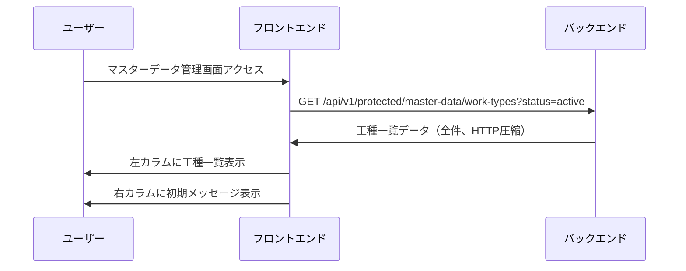
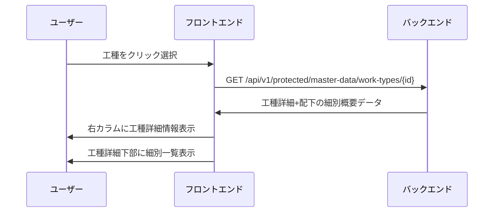
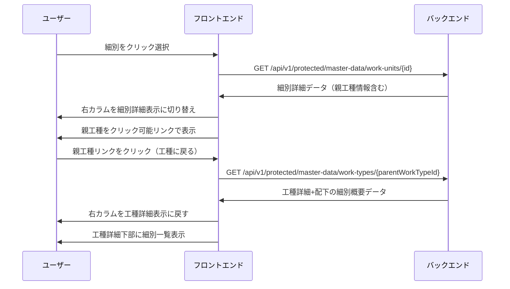
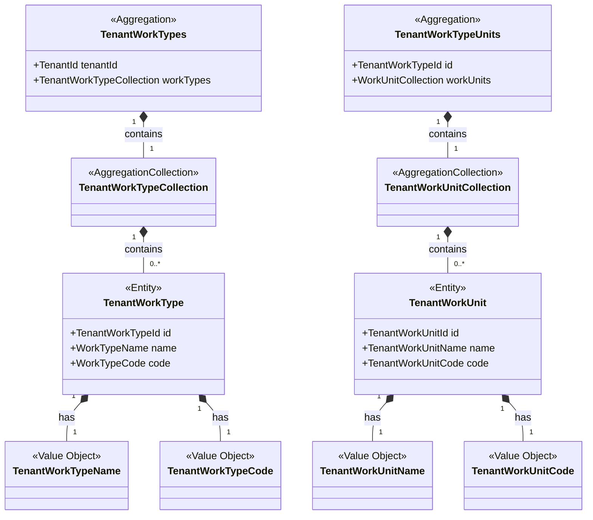
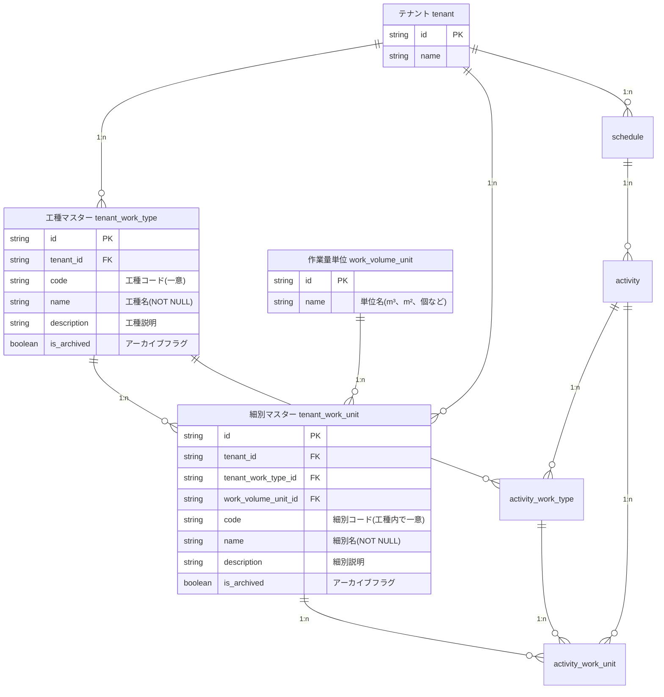
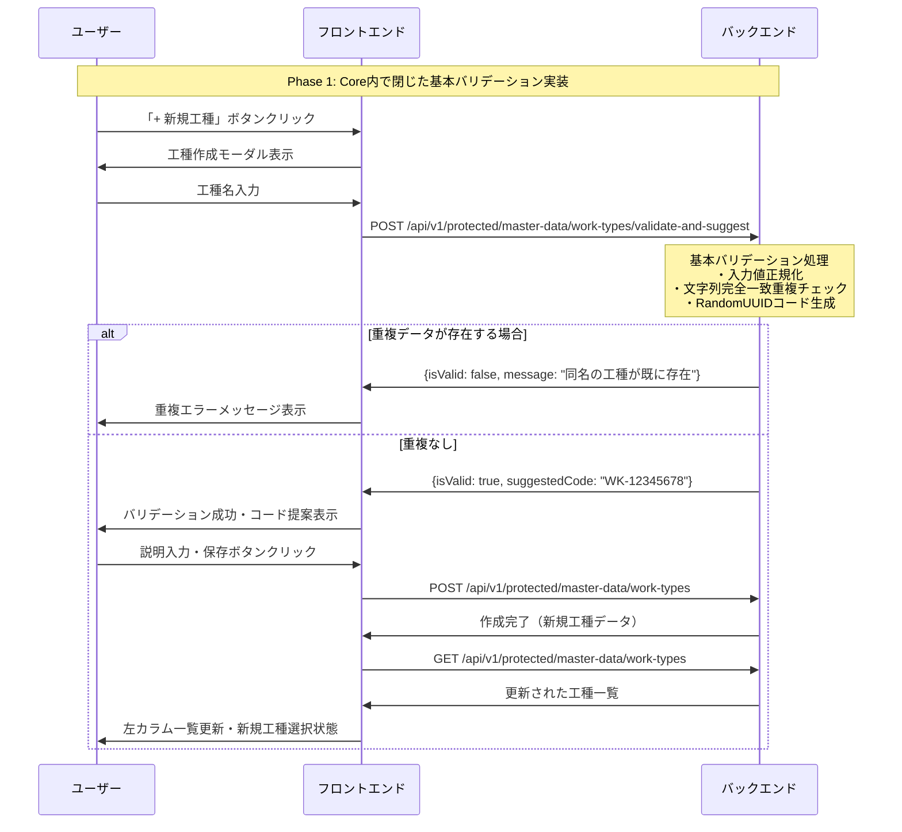
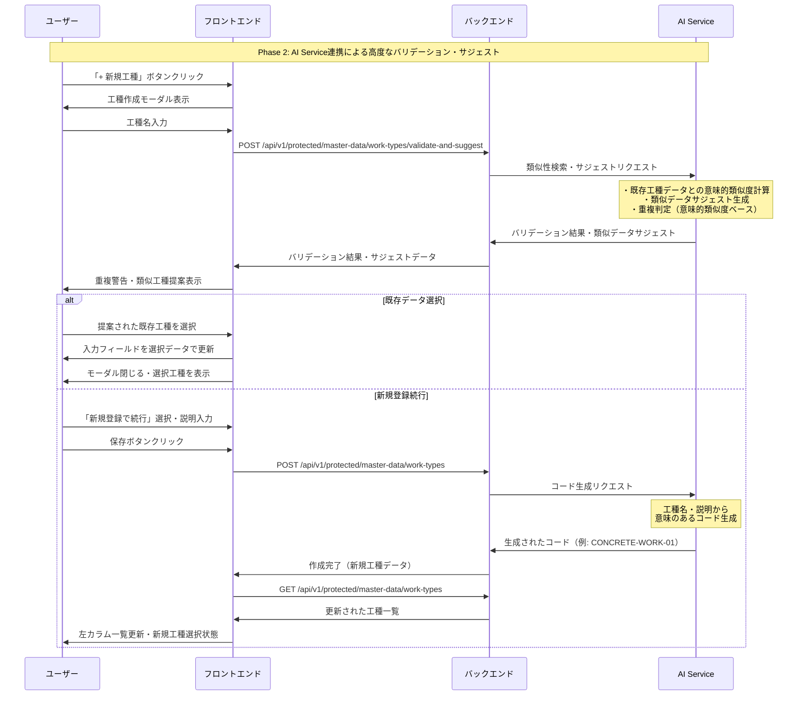

# 概要
## 目的

本機能は、建設業向けの工程管理システムにおいて、工種・細別の階層構造を持つマスターデータを管理するためのWebアプリケーション機能である。工程表作成時のデータ一貫性・再利用性を高め、表記揺れを防止し、工程表機能との連携を容易にすることを目的とする。特に、工程表機能における工種・細別データの標準化を重視した設計とする。

## 主要機能の概要

1. **工種マスターデータ管理機能**
    - 工種の新規作成・編集・閲覧・アーカイブ化
    - 工種コードの自動生成と重複防止
    - 表記ゆれバリデーション機能

2. **細別マスターデータ管理機能**
    - 細別の新規作成・編集・閲覧・アーカイブ化
    - 工種との階層関係管理
    - 作業単位（m³、m²、個など）の設定

3. **階層構造表示機能**
    - 工種＞細別の2階層での一覧表示
    - テナント単位でのデータ管理

4. **検索・フィルタリング機能**
    - テキスト検索（工種名・細別名・コード検索）
    - ステータスフィルター（すべて/アクティブ/アーカイブ済み）
    - 検索結果のリアルタイム表示・ハイライト
    - フィルター条件の組み合わせ対応

5. **データ整合性管理機能**
    - 名称重複・表記ゆれの検出・防止
    - 工程表機能との連携バリデーション

6. **アーカイブ・復元機能**
    - 工種・細別のアーカイブ化（論理削除）
    - アーカイブ時の下位階層一括処理
    - アーカイブデータの復元・アクティブ化機能
    - アーカイブデータの表示・非表示切替


これらの機能により、建設プロジェクトにおける工程情報の標準化と再利用性向上、データ品質の確保を実現する。

# 要件定義

## ユーザーストーリー

### 工種マスターデータ管理

1. **工程管理責任者として**、工種マスターデータを階層で表示したい。それにより、工種と細別の関係を体系的に把握できる。
2. **現場責任者として**、新しい工種を作成したい。それにより、プロジェクト固有の工事分類を管理できる。
3. **工程管理者として**、工種の詳細情報を閲覧したい。それにより、適切な工種選択ができる。
4. **現場責任者として**、工種情報を編集したい。それにより、変更要求に柔軟に対応できる。
5. **工程管理責任者として**、不要な工種をアーカイブ化したい。それにより、データの整理と混乱防止ができる。

### 細別マスターデータ管理

1. **工程管理者として**、工種に属する細別を作成したい。それにより、詳細な作業分類を管理できる。
2. **現場責任者として**、細別の詳細情報を閲覧したい。それにより、正確な作業内容を把握できる。
3. **工程管理者として**、細別情報を編集したい。それにより、作業内容の変更に対応できる。
4. **工程管理責任者として**、不要な細別をアーカイブ化したい。それにより、選択肢の整理ができる。
5. **工程管理者として**、細別に作業単位を設定したい。それにより、数量管理と歩掛計算を正確に行える。

## 機能要件

### 工種マスターデータ管理機能

1. システムは、テナント単位で工種マスターデータを管理できること
2. システムは、工種の新規作成時に工種名・説明・コードを設定できること
3. システムは、工種コードを工種名から自動生成できること
4. システムは、工種名の重複を検出・防止できること
5. システムは、工種の編集・更新ができること
6. システムは、工種をアーカイブ化できること（論理削除）
7. システムは、アーカイブされた工種をアクティブ化できること
8. システムは、工種アーカイブ時に関連する細別も一括アーカイブできること

### 細別マスターデータ管理機能

1. システムは、工種に紐づく細別マスターデータを管理できること
2. システムは、細別の新規作成時に細別名・説明・コード・単位を設定できること
3. システムは、細別コードを細別名から自動生成できること
4. システムは、同一工種内での細別名重複を検出・防止できること
5. システムは、細別の編集・更新ができること
6. システムは、細別をアーカイブ化できること（論理削除）
7. システムは、アーカイブされた細別をアクティブ化できること
8. システムは、作業単位マスターから単位を選択できること

### 階層構造表示機能

1. システムは、工種＞細別の2階層でデータを表示できること
2. システムは、階層の展開・折りたたみができること
3. システムは、階層レベルを視覚的に区別して表示できること
4. システムは、「すべて展開」「すべて折りたたみ」の一括操作ができること

### 検索・フィルタリング機能

1. システムは、テキスト検索フィールドで工種名・細別名・コードを検索できること
2. システムは、検索結果をリアルタイムで表示できること
3. システムは、検索結果の該当箇所をハイライト表示できること
4. システムは、ステータスフィルター（すべて/アクティブ/アーカイブ済み）で表示を切り替えできること
5. システムは、テキスト検索とステータスフィルターを組み合わせて適用できること
6. システムは、検索・フィルター条件をクリアできること
7. システムは、検索結果が0件の場合に適切なメッセージを表示できること

### データ整合性管理機能

1. ~~システムは、名称の表記ゆれ（全角/半角、ひらがな/カタカナ/漢字）を検出できること~~
2. ~~システムは、類似名称の警告を表示できること~~
3. システムは、データ保存時のバリデーションを実行できること
4. システムは、参照整合性を維持できること
   - 工程表で使用中の工種・細別の削除防止
   - 工種削除時の関連細別の適切な処理
   - テナント間でのデータ分離保証
   - 外部キー制約の維持


1.2に関して、この機能は、AI連携による高度なバリデーション・サジェスト機能により実装するため、本設計においてはスコープ外である。

# 非機能要件

## パフォーマンス要件

- マスターデータ一覧表示は2秒以内に完了すること（HTTP圧縮により転送量を削減）
- 階層表示の展開・折りたたみは1秒以内に応答すること
- テキスト検索結果は即座に表示されること（フロントエンドでのリアルタイムフィルタリング）
- ステータスフィルター切り替えは2秒以内に完了すること（サーバーからの再取得）
- 1000件以上のマスターデータでも動作すること
- 大量データ時（10000件以上）でも階層表示の制御により操作可能であること

## データ整合性要件

- マスターデータの作成・更新時にバリデーションを実行すること
- 工程表との参照整合性を常時保持すること
- アーカイブ処理時のデータ整合性を保証すること

## ユーザビリティ要件

- 階層構造が直感的に理解できるUI設計
- 表記ゆれ検出時の分かりやすい警告表示
- エラーメッセージの日本語対応
- モバイルデバイスでの基本操作対応

## セキュリティ要件

- テナント間のデータ分離
- ユーザー権限による操作制限
- 入力データのサニタイゼーション
- マスターデータ変更の監査ログ

# 画面レイアウト

## コンセプト

建設業の現場で使用されることを考慮し、階層構造の理解しやすさと操作の簡単さを重視したレイアウトとする。特に重要なのは「工種と細別の関係」が一目でわかる構造と、工程表との連携がスムーズに行える設計である。

## 画面構成

### 1. マスターデータ管理画面（メイン画面）

#### ヘッダー部
- **ページタイトル**: 「工程データ管理」
- **説明テキスト**: 工種と細別の階層構造でマスターデータを管理
- **検索フィールド**: 「工種名や細別名で検索...」
- **表示切替タブ**: 「すべて」「アクティブ」「アーカイブ済み」
- **表示オプション**: 「すべて展開」「すべて折りたたみ」トグルボタン
- **新規作成ボタン**: 「+ 新規工種」（右上配置）

#### メイン表示エリア（2カラムレイアウト）

##### 左カラム: 工種・細別ツリー
- **階層リスト表示**: 
  - 工種名 + 細別数カウント（例：「(4)」）+ アクティブステータス
  - 展開/折りたたみアイコン（▷/▽）
  - フォルダアイコンで工種を視覚的に表現
- **工種表示項目**:
  - 工種名（例：「仮設工事」「土工事」）
  - 細別数カウント
  - ステータス表示（「アクティブ」バッジ）
- **細別表示項目**（工種展開時）:
  - 細別名（例：「仮囲い・ゲート」）
  - 細別コード（例：「KASETSU_KARIKAKOI」）
  - ステータス表示（「アクティブ」バッジ）
  - 編集アイコン

##### 右カラム: 詳細情報パネル
- **工種詳細表示**（工種選択時）:
  - 工種名（大見出し）
  - コード表示（例：「<> KASETSU」）
  - 説明フィールド
  - 作成日表示
  - ステータス切替（アクティブ/アーカイブのトグルスイッチ）
  - 「編集」ボタン
- **細別一覧セクション**（工種選択時）:
  - 「細別一覧 (4件)」見出し
  - 「+ 細別を追加」ボタン
  - 細別カード形式表示（名前、コード、ステータス、編集アイコン）

- **細別詳細表示**（細別選択時）:
  - 細別名（大見出し）
  - 細別コード（例：「KASETSU_KARIKAKOI」）
  - **親工種情報**（クリック可能リンク：「親工種: 仮設工事」）
  - 説明フィールド
  - 作業単位表示
  - 作成日表示
  - ステータス切替（アクティブ/アーカイブのトグルスイッチ）
  - 「編集」ボタン

### 2. 工種・細別作成・編集モーダル

#### 工種作成・編集フォーム
- 工種名（必須）
- 工種説明
- 工種コード（自動生成）
- 保存・キャンセルボタン

#### 細別作成・編集フォーム
- 親工種選択（ドロップダウン）
- 細別名（必須）
- 細別説明
- 細別コード（自動生成）
- 作業単位選択（ドロップダウン）
- 保存・キャンセルボタン

### 3. 工程表連携選択画面

#### 選択画面レイアウト
- **検索・フィルター部**: 工種・細別名での絞り込み
- **階層選択エリア**: チェックボックス付き階層表示
- **選択済み表示**: 現在選択中の工種・細別リスト
- **操作ボタン**: 新規登録・確定・キャンセル

## 設計ポイント

1. **階層視覚化**
    - インデントと線による親子関係の明確化
    - アイコンによる展開状態の表示
    - 色分けによる階層レベルの区別

2. **操作効率化**
    - インライン編集機能
    - 右クリックコンテキストメニュー
    - キーボードショートカット対応

3. **データ品質向上**
    - リアルタイムバリデーション
    - 重複・類似名称の警告表示
    - 自動コード生成の表示

# 機能詳細

## マスターデータ閲覧・選択フロー

### 1. 初期画面表示フロー



**詳細ステップ:**
1. マスターデータ管理画面のロード
2. **API呼び出し**: `GET /api/v1/protected/master-data/work-types?status=active`
3. **レスポンス処理**: 工種一覧データを受信（全件、HTTP圧縮により転送量を削減）
4. 左カラムに工種一覧を表示、右カラムに「工種を選択してください」メッセージ表示

### 2. 工種選択・詳細表示フロー



**詳細ステップ:**
1. 左カラムで工種をクリック選択
2. **API呼び出し**: `GET /api/v1/protected/master-data/work-types/{id}`
3. **レスポンス処理**: 工種詳細と配下の細別概要データを受信
4. 右カラムに工種詳細情報を表示（工種名、コード、説明、作成日、ステータス、編集ボタン）
5. 工種詳細の下部に「細別一覧 (4件)」セクションを表示
6. 各細別を概要カード形式で表示、「+ 細別を追加」ボタンを表示

### 3. 細別選択・詳細表示フロー



**詳細ステップ:**
1. 工種詳細画面の細別一覧で細別をクリック
2. **API呼び出し**: `GET /api/v1/protected/master-data/work-units/{id}`
3. **レスポンス処理**: 細別詳細データ（親工種情報含む）を受信
4. 右カラムの表示を細別詳細に切り替え：
   - 細別名（大見出し）
   - 細別コード
   - **親工種情報**（クリック可能リンク形式で表示：「親工種: 仮設工事」）
   - 説明文、作業単位、作成日、ステータス、編集ボタン
5. **親工種リンククリック時の遷移**:
   - **API呼び出し**: `GET /api/v1/protected/master-data/work-types/{parentWorkTypeId}`
   - 右カラムを工種詳細表示に戻す（工種詳細+細別一覧）

### 4. 工種作成フロー

**詳細ステップ:**
1. 「+ 新規工種」ボタンをクリック
2. 工種作成モーダルが表示される
3. ~~**リアルタイムバリデーション・サジェスト**: `POST /api/v1/protected/master-data/work-types/validate-and-suggest`~~
   - 基本重複チェック・RandomUUIDコード生成
   - ~~Phase 2: AI連携による類似データサジェスト・意味のあるコード生成~~
4. ~~バリデーション結果と類似データサジェストを表示~~
5. ~~ユーザー選択：~~
   - **既存データ選択**: 類似データを選択し入力フィールド更新
   - **新規登録続行**: 新規データとして登録処理継続
6. **API呼び出し**: `POST /api/v1/protected/master-data/work-types`
7. **一覧更新**: `GET /api/v1/protected/master-data/work-types`で全データ再取得

> **参考**: 段階的実装戦略とシーケンス図については「[AI連携による高度なバリデーション・サジェスト機能](#ai連携による高度なバリデーション・サジェスト機能)」を参照
5### 5. 細別作成フロー（AI連携バリデーション・サジェスト対応）
### 5. 細別作成フロー（AI連携バリデーション・サジェスト対応）

**詳細ステップ:**
1. 工種詳細表示中に「+ 細別を追加」ボタンをクリック
2. 細別作成モーダルが表示される（親工種が事前選択）
3. ~~**リアルタイムバリデーション・サジェスト**: `POST /api/v1/protected/master-data/work-units/validate-and-suggest`~~
   - Phase 1: 同一工種内重複チェック・RandomUUIDコード生成
   - Phase 2: AI連携による類似データサジェスト・意味のあるコード生成
4. バリデーション結果と類似データサジェストを表示
5. ユーザー選択：
   - **既存データ選択**: 類似データを選択し入力フィールド更新
   - **新規登録続行**: 新規データとして登録処理継続
6. **API呼び出し**: `POST /api/v1/protected/master-data/work-units`
7. **詳細更新**: `GET /api/v1/protected/master-data/work-types/{id}`で工種詳細+細別一覧再取得

> **参考**: 段階的実装戦略とシーケンス図については「[AI連携による高度なバリデーション・サジェスト機能](#ai連携による高度なバリデーション・サジェスト機能)」を参照

## 工程表連携について

工程表機能との連携（アクティビティへのマスターデータ割り当て）については、工程表エディター画面上で実行される機能のため、詳細な仕様は以下のドキュメントを参照してください：

> **参考**: [AOA工程表機能 Design Doc](02.%20resources/AOA工程表機能.md) - アクティビティ詳細設定・マスターデータ選択機能

**工程表連携で提供されるAPI:**
- 工程表用マスターデータ一覧取得（アクティブデータのみ）
- アクティビティへの工種・細別割り当て
- 工程表エディター内でのマスターデータ新規登録

## 検索・フィルタリング機能フロー

### 1. 初期表示
1. マスターデータ管理画面のロード
2. デフォルトで「すべて」タブが選択状態
3. 階層ツリーに全ての工種・細別を表示（ページネーション適用）
4. 検索フィールドは空の状態

### 2. 検索・フィルタリング統合フロー
#### テキスト検索操作時（フロントエンドフィルタリング）
1. ユーザーが検索フィールドに文字を入力
2. フロントエンドで保持している全データに対してリアルタイムフィルタリング実行
3. 工種名・細別名・コードに対して部分一致検索実行（AND条件）
4. 検索結果を階層構造で表示、該当箇所をハイライト
5. 検索結果件数を表示（例：「25件の結果」）
6. 検索結果が0件の場合、「該当するデータが見つかりません」メッセージ表示

#### ステータスフィルター操作時（サーバーサイドフィルタリング）
1. ユーザーが「すべて」「アクティブ」「アーカイブ済み」タブをクリック
2. 選択されたタブを視覚的にハイライト（緑色背景）
3. 選択されたステータスでサーバーにデータ再取得リクエスト送信
4. **API呼び出し**: `GET /api/v1/protected/master-data/work-types?status={selected_status}`
5. サーバーから該当ステータスのデータのみを受信（HTTP圧縮）
6. 受信したデータをフロントエンドで保持し、テキスト検索可能な状態にする
7. 結果を階層構造で表示（テキスト検索がある場合はキーワードをハイライト）

### 3. 大量データ表示の最適化
1. 初期ロード時に全データを取得（HTTP圧縮により転送量を削減）
2. フロントエンドでのメモリ内データ管理により高速な検索を実現
3. 階層表示の展開・折りたたみによりDOM要素数を制御

### 4. 検索条件クリアフロー
1. 検索フィールドのクリアボタン（×）をクリック
2. テキスト検索条件をクリア、ステータスフィルターは保持
3. 「すべて」タブ以外が選択されている場合はそのままのフィルター状態で表示
4. 階層ツリーを初期状態（またはフィルター状態）に戻す

### 5. パフォーマンス最適化
1. **HTTP圧縮**: サーバーからのデータ転送時にgzip/brotli圧縮を使用
2. **キャッシュ機能**: 同一検索条件の結果をクライアントサイドでキャッシュ
3. **プリロード**: よく使用される検索パターンの事前読み込み
4. **仮想スクロール**: 大量データ表示時のレンダリング最適化（将来対応）
5. **階層表示制御**: 展開・折りたたみによるDOM要素数の最適化
6. **フロントエンドテキスト検索**: テキスト検索処理をクライアント側で実行し、即座に結果を表示

## アーカイブ・アクティブ化フロー

### 1. アーカイブ化
1. 対象工種・細別の右クリックまたは詳細画面で「アーカイブ」選択
2. 影響範囲の確認ダイアログ表示（下位階層・関連工程表）
3. 確認後、論理削除実行
4. 一覧画面では非表示、検索対象外に設定

### 2. アクティブ化
1. 「アーカイブ表示」で非活性データを表示
2. 対象データの「アクティブ化」ボタンをクリック
3. 確認ダイアログ表示
4. アクティブ化実行、通常表示・選択対象に復帰

# ドメインモデル設計（DDD）

## ドメイン境界とコンテキスト

本機能は建設プロジェクトの工程管理における **「マスターデータ管理」** のBounded Contextに属する。工程表機能とは協調するが、独立したドメインとして管理される。

## 集約設計

(※ `RoA`: ReandonlyAggregation)




### TenantWorkTypes集約（テナント工種管理集約）

工程表作成の効率化とデータ一貫性確保のため、テナント単位での工種マスターデータの統一管理が必要。各テナントは独自の工種体系を持つため、テナント境界でのデータ分離が必須。

**主な責務**:
- テナント単位での工種の管理（作成・編集・アーカイブ・再アクティブ化）
- テナント内での工種名・コードの一意性保証
- 工種コレクションの一括操作（検索・フィルタリング・統計情報取得）

**主要ビジネスルール**:
- **工種名の一意性**: テナント内で工種名は一意である（擁壁工、鉄筋工など）
- **工種コードの一意性**: テナント内で工種コードは一意である（工種名から自動生成され、ユーザーによる手動入力不可）
- **工種の階層制約**: 工種は細別の親として機能し、工種がアーカイブされると配下細別も一括アーカイブされる
- **工程表参照制約**: 工程表で使用中の工種はアーカイブ不可（進行中の工事への影響を防ぐ）
- **テナント分離**: テナント間での工種データは完全に分離され、他テナントの工種を参照できない
- **工種の業務意味**: 工種は「一定の構造を持つ部位を施工するための一連作業の総称」として定義される

### WorkTypeUnit集約（工種細別管理集約）

工種配下での細別の詳細管理が必要。細別は工種に紐づくが、独立したビジネスエンティティとして、作業量単位や詳細作業内容の管理を行う。

**主な責務**:
- 特定工種配下での細別の管理
- 工種内での細別名・コードの一意性保証
- 作業量単位との関連管理
- 細別固有の詳細情報管理

**主要ビジネスルール**:
- **細別の業務定義**: 細別は「工事を構成する基本的な単位目的物もしくは単位仮設物であって、単位とともに契約数量を表示するレベル」として定義される
- **細別の階層制約**: 細別は必ず工種に紐づき、工種がアーカイブされると細別も一括アーカイブされる
- **細別名の一意性**: 同一工種内で細別名は一意である（擁壁工の「コンクリート打設」「型枠組立」など）
- **細別コードの一意性**: 同一工種内で細別コードは一意である（細別名から自動生成され、ユーザーによる手動入力不可）
- **細別の作業単位**: 細別は歩掛算出の単位として機能し、作業量単位（m³、m²、個など）を持つ
- **工程表参照制約**: 工程表で使用中の細別はアーカイブ不可（進行中の工事への影響を防ぐ）
- **細別の再利用性**: アーカイブされた細別は再アクティブ化可能（過去の工事データとの整合性を保つ）
- **細別の詳細情報**: 細別は作業内容、必要機械装置、必要資材等の詳細情報を持つ


# データモデル

## 主要エンティティ



## データ設計の考慮事項

### 1. テナント分離設計
- 全てのマスターデータはテナントIDで分離
- テナント間での誤った参照を防止
- マルチテナント対応のパフォーマンス最適化

### 2. コード体系設計
- 工種コード・細別コードは意味を持つ構造化コード
- LLM連携を考慮した可読性重視
- テナント内での一意性保証

### 3. アーカイブ設計
- 論理削除によるデータ保持
- 参照整合性の維持
- 履歴・監査対応

### 4. 階層関係設計
- 工種＞細別の2階層に限定
- 将来的な階層拡張への考慮
- パフォーマンスを重視したシンプルな構造

# API設計

## マスターデータ管理API

### 工種一覧・検索API
- **GET /api/v1/protected/master-data/work-types** - 工種一覧取得（全データ一括取得、HTTP圧縮対応）

**仕様:**
- 全工種・細別データを一括で取得
- 細別名のみがヒットした場合、その親工種も結果に含める
- 階層関係を保持した検索結果を返却
- HTTP圧縮（gzip/brotli）により転送量を削減
- 検索はフロントエンドで実行

**クエリパラメータ:**
```
?status=all|active|archived  # ステータスフィルター（サーバーサイドフィルタ）
&sort=name|created_at        # ソート項目
&order=asc|desc              # ソート順
```

**レスポンス例（全データ取得）:**
```json
{
  "data": [
    {
      "id": "work-type-001",
      "name": "仮設工事",
      "code": "KASETSU",
      "work_unit_count": 4,
      "is_archived": false,
      "created_at": "2023/04/01",
      "match_reason": "child_unit_matched",
      "work_units": [
        {
          "id": "work-unit-001",
          "name": "仮囲い・ゲート",
          "code": "KASETSU_KARIKAKOI",
          "is_archived": false
        }
      ]
    },
    {
      "id": "work-type-002",
      "name": "外構工事", 
      "code": "GAIKOU",
      "work_unit_count": 3,
      "is_archived": false,
      "created_at": "2023/04/02",
      "match_reason": "child_unit_matched",
      "work_units": [
        {
          "id": "work-unit-015",
          "name": "門扉・ゲート設置",
          "code": "GAIKOU_GATE",
          "is_archived": false
        }
      ]
    }
  ]
}
```

### 工種詳細・細別概要取得API
- **GET /api/v1/protected/master-data/work-types/{id}** - 工種詳細と配下の細別概要を一括取得

**レスポンス例:**
```json
{
  "work_type": {
    "id": "work-type-id",
    "name": "仮設工事",
    "code": "KASETSU",
    "description": "本工事を円滑に進めるための一次的な施設・設備の工事",
    "is_archived": false,
    "created_at": "2023/04/01",
    "updated_at": "2023/04/01"
  },
  "work_units": [
    {
      "id": "work-unit-id-1",
      "name": "仮囲い・ゲート",
      "code": "KASETSU_KARIKAKOI",
      "is_archived": false
    },
    {
      "id": "work-unit-id-2", 
      "name": "仮設事務所・詰所",
      "code": "KASETSU_JIMUSHO",
      "is_archived": false
    }
  ]
}
```

### 細別詳細取得API
- **GET /api/v1/protected/master-data/work-units/{id}** - 細別詳細取得

**レスポンス例:**
```json
{
  "id": "work-unit-id",
  "name": "仮囲い・ゲート",
  "code": "KASETSU_KARIKAKOI",
  "description": "工事現場の安全確保のための仮囲い設置",
  "work_volume_unit": {
    "id": "unit-id",
    "name": "メートル",
    "symbol": "m"
  },
  "work_type": {
    "id": "work-type-id",
    "name": "仮設工事",
    "code": "KASETSU"
  },
  "is_archived": false,
  "created_at": "2023/04/01",
  "updated_at": "2023/04/01"
}
```

### CRUD操作API
工種：
- **POST /api/v1/protected/master-data/work-types** - 工種新規作成
- **PUT /api/v1/protected/master-data/work-types/{id}** - 工種更新
- **DELETE /api/v1/protected/master-data/work-types/{id}** - 工種アーカイブ化
- **PUT /api/v1/protected/master-data/work-types/{id}/activate** - 工種アクティブ化

細別:
- **POST /api/v1/protected/master-data/work-units** - 細別新規作成
- **PUT /api/v1/protected/master-data/work-units/{id}** - 細別更新
- **DELETE /api/v1/protected/master-data/work-units/{id}** - 細別アーカイブ化
- **PUT /api/v1/protected/master-data/work-units/{id}/activate** - 細別アクティブ化

全体：
- **GET /api/v1/protected/work-volume-units** - 作業量単位一覧取得

### ~~バリデーション・サジェスト機能~~
- ~~**POST /api/v1/protected/master-data/work-types/validate-and-suggest** - 工種名バリデーション・類似データサジェスト~~
- ~~**POST /api/v1/protected/master-data/work-units/validate-and-suggest** - 細別名バリデーション・類似データサジェスト~~

#### ~~工種バリデーション・サジェストAPI~~
**POST /api/v1/protected/master-data/work-types/validate-and-suggest**

**リクエスト例:**
```json
{
  "name": "仮設建設工事",
  "tenant_id": "tenant-123"
}
```

**レスポンス例:**
```json
{
  "validation": {
    "is_duplicate": false,
    "is_similar": true,
    "warnings": [
      "類似した工種名が存在します。既存データの利用をご検討ください。"
    ]
  },
  "suggestions": [
    {
      "id": "work-type-001",
      "name": "仮設工事",
      "code": "KASETSU",
      "description": "本工事を円滑に進めるための一次的な施設・設備の工事",
      "similarity_score": 0.87,
      "match_type": "semantic"
    },
    {
      "id": "work-type-002", 
      "name": "建設工事",
      "code": "KENSETSU",
      "description": "建物・構造物の建設に関する工事",
      "similarity_score": 0.72,
      "match_type": "partial"
    }
  ],
  "generated_code": "KASETSU_KENSETSU_001" // Phase 2でAI生成、Phase 1ではRandomUUID
}
```

#### ~~細別バリデーション・サジェストAPI~~
**POST /api/v1/protected/master-data/work-units/validate-and-suggest**

**リクエスト例:**
```json
{
  "name": "仮囲い設置",
  "work_type_id": "work-type-001",
  "tenant_id": "tenant-123"
}
```

**レスポンス例:**
```json
{
  "validation": {
    "is_duplicate": false,
    "is_similar": true,
    "warnings": [
      "同一工種内に類似した細別名が存在します。"
    ]
  },
  "suggestions": [
    {
      "id": "work-unit-001",
      "name": "仮囲い・ゲート",
      "code": "KASETSU_KARIKAKOI",
      "description": "工事現場の安全確保のための仮囲い設置",
      "work_volume_unit": {
        "name": "メートル",
        "symbol": "m"
      },
      "similarity_score": 0.91,
      "match_type": "semantic"
    }
  ],
  "generated_code": "KASETSU_KARIKAKOI_001" // Phase 2でAI生成
}
```

# 技術的考慮事項

## AI連携による高度なバリデーション・サジェスト機能
refs: 
- https://linear.app/kencopa/issue/COPA-179/工種・細別マスター追加時のcode-name-validationをどう進めていくか

注: この機能は、AI連携による高度なバリデーション・サジェスト機能により実装するため、本設計においてはスコープ外である。

### 課題の背景
工程マスターデータの管理において、一見単純なCRUDに見える機能であるが、実際には以下の高度な処理が必要である：

1. **バリデーション機能**
   - 名称の表記ゆれ・重複の検出・警告
   - 全角/半角、ひらがな/カタカナ/漢字の違いの検出
   - テナント内での重複防止

2. **サジェスト機能**
   - ユーザー入力値と意味的に類似した既存工種・細別の提案
   - データの一貫性保持とユーザビリティ向上の両立
   - 新規登録か既存データ選択かの選択肢提供

3. **意味理解に基づくコード生成**
   - LLMが理解しやすい英数字コードの自動生成
   - 工種・細別の意味を反映したコード体系
   - テナント内での一意性保証

### サブドメイン分離の課題
KencopaのサービスアーキテクチャはCoreとAIの2つのサブドメインに分かれている：

- **Core**: 一般的な機能（現場作成、工程表作成など）
- **AI**: 知識ベース活用やユーザー入力からの自動生成機能

マスターデータのバリデーション・サジェスト機能は、単純なCore機能では実現困難な以下の処理を含む：
- 自然言語処理による類似性判定・サジェスト
- 意味的なコード生成
- 大量データからの類似アイテム検索・提案

### 提案される技術アプローチ

#### 1. 段階的実装戦略

| 比較項目 | Phase 1: Core単体実装 | Phase 2: AI Service連携 |
|---------|---------------------|------------------------|
| **重複チェック** | 文字列完全一致 | 意味的類似度による判定 |
| **コード生成** | RandomUUID（例: WK-12345678） | 意味のあるコード（例: CONCRETE-WORK-01） |
| **サジェスト機能** | なし | 類似工種・細別の提案表示 |
| **システム連携** | Core-Database間のみ | Core-AI Service間の連携 |
| **実装難易度** | 低（基本的なCRUD操作） | 高（AI連携・非同期処理） |

**Phase 1: 基本バリデーション（Core単体）**
- 文字列完全一致による重複チェック
- 基本的な表記正規化（全角→半角変換等）
- RandomUUIDベースのコード生成（暫定実装）
- シンプルなバリデーションメッセージ表示



~~**Phase 2: AI連携バリデーション・サジェスト**~~
- Kunai-AIを活用した類似工種・細別検索・提案
- 意味的類似度による重複判定・警告
- ユーザー入力値に基づく既存データサジェスト機能
- サジェストデータ選択時の入力フィールド自動更新
- LLM理解可能な意味のあるコード生成



#### 2. 技術実装上の検討事項

**API設計**
- Core-AI間の通信パターン
- AI処理の応答時間を考慮したUX設計
- フォールバック機能（AI不可時のCore単体処理）

**データフロー**
- AI学習データの継続的更新
- パフォーマンス最適化（キャッシュ戦略）

**ユーザー体験**
- 類似データサジェストの表示タイミング・方法
- サジェストデータの選択・却下フロー
- 「新規登録で続行」と「既存データ選択」の明確な選択肢提供
- 段階的な機能公開によるユーザー習熟

### 未解決課題・今後の検討事項

- Core-AI間のデータ交換仕様
- エラーハンドリング・リトライ機能
- パフォーマンス要件の定義

> **参考**: Linear Issue [COPA-179](https://linear.app/kencopa/issue/COPA-179) - 工種・細別マスター追加時のcode, name validationをどう進めていくか

# 実装計画

## Phase 1：基本マスターデータ管理（Core単体実装）
1. 工種・細別の基本CRUD操作
2. 階層表示機能（展開・折りたたみ）
3. テキスト検索機能（フロントエンドでのリアルタイムフィルタリング）
4. ステータスフィルタリング機能（サーバーサイドでのフィルタリング）
5. テナント分離機能
6. 基本的なバリデーション（必須項目・文字列完全一致重複チェック）
7. 基本的な表記正規化（全角→半角変換等）
8. RandomUUIDベースのコード生成（暫定実装）
9. アーカイブ・アクティブ化機能
10. HTTP圧縮による大量データの効率的な転送

## ~~Phase 2：AI連携による高度なバリデーション・サジェスト~~
1. Kunai-AI連携による類似工種・細別検索・提案
2. 意味的類似度による重複判定・警告
3. ユーザー入力値に基づく既存データサジェスト機能
4. サジェストデータ選択時の入力フィールド自動更新
5. LLM理解可能な意味のあるコード生成
6. 高度なバリデーション・警告機能

# References

- Q&A
  - https://linear.app/kencopa/issue/KUN-176/現状の画面遷移と要件・機能の把握
