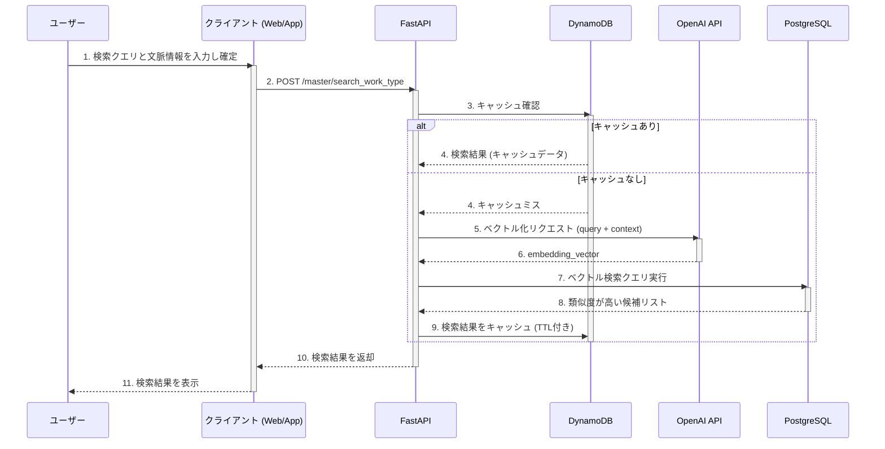

## 目的
表記揺れによって実質的に同じ内容の工程マスタが複数登録されるのを防ぐため、入力文字列に対して意味的に類似する工程マスタを候補として返すAPIを実装する。

---
## 要件定義
- **ユーザーストーリー**
	- **現場担当者**
		- 工程名を入力して検索した際に、すでに存在する類似した工程名が候補として表示されてほしい。 これにより、重複した工程マスタの登録を防ぎ、入力の手間を省きたい。
	- **管理者**
		- 「工程マスタ」 のデータ品質を維持したい。
- **機能要件**
	- ユーザーが工程名を入力し検索した際に、類似する既存の工程名を提示できること。
	- 表記揺れがあっても同じ工程として認識できること。
	- 検索結果は類似度順に並べられること。

---
## 非機能要件
#### 1. パフォーマンス
- **応答速度**:
    - **類似検索API**: 初回検索時は平均**100ms以内**、キャッシュヒット時は**50ms以内**を目指します。ユーザーがスムーズな検索体験を得られることを目標とします。
- **スケーラビリティ**:
    - マスタデータ数や同時アクセスユーザー数が増加しても、パフォーマンスが維持できること。
    - サービス負荷に応じて、FastAPIやPostgreSQLなどの各コンポーネントが水平スケーリングできる設計とします。

---
#### 2. 可用性と信頼性
- **可用性**:
    - システムは24時間365日稼働し、高い可用性（例: 年間稼働率99.9%以上）を確保します。
    - PostgreSQLは冗長構成とし、単一障害点（SPOF）を排除します。
- **データ整合性**:
    - マスタデータはPostgreSQLに一元管理され、データの一貫性が保証されること。
- **エラーハンドリング**:
    - APIからの応答に失敗した場合、HTTPステータスコード（例: 4xx, 5xx）と、問題内容を明確に示すエラーメッセージを返すこと。

---
#### 3. セキュリティ
- **アクセス制御**:
    - APIへのアクセスには認証・認可の仕組みを設けます。PoCでは簡易的なAPIキー、本番環境ではOAuth2.0などの標準プロトコルを検討します。
- **ネットワーク分離**:
    - データベースはプライベートネットワーク内に配置し、外部からの直接アクセスを遮断します。
- **通信の暗号化**:
    - FastAPIとデータベース間の通信、またはFastAPIとクライアント間の通信は、TLS/SSLで暗号化します。

---
#### 4. 運用と保守性
- **ロギング**:
    - 全てのAPIリクエスト、エラー、パフォーマンスに関する情報をログとして記録します。ログは集中管理システムに集約し、分析やデバッグに活用します。
- **モニタリング**:
    - CPU使用率、メモリ、I/Oなどのシステムリソース、およびAPIの応答速度、エラー率、スループットをリアルタイムで監視できる仕組みを構築します。
- **デプロイ**:
    - 自動化されたCI/CDパイプラインを構築し、安全かつ迅速にコードをデプロイできる体制を整えます。
    - 本番環境へのデプロイメントは、Blue/Greenデプロイメントやカナリアリリースなどの手法を検討し、ダウンタイムを最小限に抑えます。

---
# 設計方針
## 技術選定
#### 1. APIフレームワーク: FastAPI
- **理由**:
    - **高性能**: Pythonの非同期処理をネイティブにサポートしており、高いスループットを実現します。
    - **開発効率**: Pydanticによる型ヒントの活用と、OpenAPI/Swagger UIの自動生成により、開発とドキュメント作成の工数を削減できます。
    - **Pythonエコシステム**: 機械学習やデータ処理のための豊富なPythonライブラリと親和性が高く、スムーズな開発が可能です。

---
### 2.データベース: PostgreSQL + `pgvector`
- **シンプルさとコスト**: 既存のインフラであるPostgreSQLを流用できるため、新たなサービス（Elasticsearchなど）を導入するコストや運用負荷がかかりません。PostgreSQL一つでマスタデータの永続化とベクトル検索を完結でき、**インフラ構成が大幅にシンプルになります**。
- **性能と要件のバランス**: Elasticsearchは大規模データや複雑な検索に強みがありますが、今回の「数万件程度」という要件であれば、`pgvector`の性能で十分に満たせます。
- **運用負荷**: Elasticsearchは、シャードやレプリカといった複雑なクラスター管理が必要となる場合がありますが、`pgvector`はPostgreSQLの拡張機能であるため、**既存のPostgreSQLの運用ノウハウをそのまま活かせます**。

---
#### 3. キャッシュ: DynamoDB
- **理由**:
    - **既存インフラの活用**: 新たにRedisを導入・運用する手間とコストを避け、既存のDynamoDBをキャッシュとして活用します。
    - **シンプルさ**: マネージドサービスであるため、運用管理が非常に楽です。
    - **パフォーマンス**: 同一検索クエリに対する2回目以降の応答を高速化し、API全体のパフォーマンス向上とOpenAI APIのコスト削減に貢献します。

---
#### 4. ベクトル化モデル: OpenAI Embedding API
- **理由**:
    - **開発の迅速化**: モデルの運用（ホスティング、スケーリング、管理）をすべてOpenAIに任せることで、PoCのコアである検索ロジックの実装に集中できます。
    - **管理負荷ゼロ**: モデルのアップデートやパフォーマンスチューニングを自社で行う必要がありません。
    - **高品質**: 最新の高性能なモデルを手間なく利用でき、高い検索精度を期待できます。

---
## API設計
### 類似検索API
このAPIは、ユーザーが検索を確定した際に、高精度な類似検索を実行します。同一クエリに対してはキャッシュを返し、応答を高速化します。

#### エンドポイント
`POST /api/v1/master/search_work_type`

#### リクエストボディ (JSON)
| フィールド | 型 | 必須 | 説明 |
| --- | --- | --- | --- |
| **`query`** | `string` | ✔️ | 検索対象となる主要なキーワード（例: "掘削工"）。 |
| **`context`** | `string` | | **[オプショナル]** 検索の文脈を補完する情報（例: "道路工事"）。`query`と統合されてベクトル化されます。 |

#### 検索ロジック
1.  **キャッシュキー生成**: `query`と`context`から一意なキャッシュキーを生成します。
2.  **キャッシュ確認**: 生成したキーでDynamoDBのキャッシュを確認します。キャッシュにヒットした場合、即座に結果を返します。
3.  **ベクトル化 (キャッシュミス時)**: FastAPI側で、`query`と`context`を統合し、OpenAIのEmbedding APIを使ってベクトルに変換します。
4.  **DB検索 (キャッシュミス時)**: PostgreSQLに対し、`pgvector`を使ってベクトル検索を実行するSQLクエリを送信します。
5.  **結果整形**: 類似度スコアが閾値（例: `0.7`）を超える候補を抽出し、類似度の高い順に並べ替えます。
6.  **キャッシュ書き込み**: 得られた最終結果をDynamoDBに書き込みます（TTL付き）。
7.  **レスポンス返却**: 検索結果をクライアントに返します。

#### レスポンス (JSON)
```json
{
  "candidates": [
    {
      "id": "f5f84f1a-b62a-4f51-b01b-c6b0f92b7607",
      "name": "掘さく工",
      "type": "WORK_TYPE",
      "similarity": 0.94
    },
    ...
  ]
}
```

---
## Domain Model
## テーブル定義
### `work_masters` テーブル
これが主要な工程マスタを格納するテーブルです。事前に定義されたマスタデータと、ユーザーが追加するデータの両方を一元管理します。

| カラム名 | データ型 | 制約 | 説明 |
| --- | --- | --- | --- |
| **`id`** | `UUID` | `PRIMARY KEY` | 工程マスタを一意に識別するID。`UUID`を使用することで、データの分散管理にも対応できます。 |
| **`name`** | `VARCHAR(255)` | `NOT NULL` | ユーザーが入力する工程名。この文字列が検索の主要なキーワードとなります。 |
| **`type`** | `VARCHAR(50)` | `NOT NULL` | 工程の種類（例: `"WORK_TYPE"`, `"WORK_UNIT"`など）。マスタのカテゴリを分類します。 |
| **`embedding_vector`** | `VECTOR(1536)` | `NOT NULL` | OpenAIのEmbedding APIで生成された、`name`の意味を表現するベクトルデータです。 |
| **`created_at`** | `TIMESTAMPTZ` | `NOT NULL` | レコードが作成された日時。 |
| **`updated_at`** | `TIMESTAMPTZ` | `NOT NULL` | レコードが最後に更新された日時。 |

---
## ベクトル初期データの準備
### 1. マスタデータの準備
まず、PostgreSQLなどのデータベースではなく、CSVファイルとして手元にあるマスタデータを準備します。このCSVファイルには、少なくとも以下の2つの列が必要です。
- **`id`**: 各レコードを一意に識別するID。
- **`name`**: ベクトル化したいテキストデータ（例: 工程名）。

### 2. ベクトル化スクリプトの作成
次に、このCSVファイルを読み込み、OpenAIのEmbedding APIを呼び出してベクトルデータを生成するPythonスクリプトを作成します。
**スクリプトの主な処理**
1. **データの読み込み**: `pandas`ライブラリを使ってCSVファイルを読み込み、`DataFrame`として扱います。
2. **APIキーの管理**: 環境変数から`OPENAI_API_KEY`を安全に読み込みます。
3. **バッチ処理**: APIへのリクエスト回数を減らすため、一度に複数のテキスト（例: 100件）をまとめてAPIに送信します。これにより、処理速度が大幅に向上し、APIコストも抑えられます。
4. **ベクトルデータの生成**: APIからの応答を受け取り、各テキストに対応するベクトル（数値の配列）を抽出します。
5. **データフレームへの追加**: 生成されたベクトルデータを、元の`DataFrame`に新しい列として追加します。

### 3. PostgreSQLへのデータ投入
最後に、ベクトルデータが追加された`DataFrame`をPostgreSQLに一括で投入します。
**具体的な方法**
- **`sqlalchemy`と`psycopg2`の利用**: Pythonからデータベースに直接接続し、`DataFrame`の`to_sql`メソッドを使ってデータを投入します。この方法が最もシンプルで、CSVファイルを中間的に扱う手間が省けます。

---
## シーケンス図
#### 類似検索API


---
### ディレクトリ構成
```
/work_master_poc
├─── .env                      # 環境変数
├─── docker-compose.yml        # コンテナ定義ファイル
├─── Makefile                  # 開発用コマンドをまとめる
├─── /app                      # FastAPIアプリケーション
│    ├─── main.py                 # アプリケーションのエントリーポイント
│    ├─── /api
│    │    └─── v1
│    │         └─── endpoints
│    │              └─── search.py   # 類似検索APIの定義
│    ├─── /core
│    │    ├─── config.py         # 設定クラス（.envを読み込む）
│    │    └─── __init__.py
│    ├─── /schemas
│    │    └─── work_master.py      # APIの入出力モデル
│    ├─── /services
│    │    ├─── openai_client.py    # OpenAI APIとの接続
│    │    ├─── database.py         # DB接続とクエリ実行
│    │    ├─── cache.py            # DynamoDBキャッシュ処理
│    │    └─── __init__.py
│    └─── /db
│         └─── session.py          # PostgreSQLとのセッション管理
└─── requirements.txt            # Pythonライブラリリスト
```

---
## 実装計画
### フェーズ1：開発環境の構築とデータの準備
このフェーズでは、開発の土台を固めます。
- **ステップ1.1: プロジェクトの初期設定**
    - Gitリポジトリを作成し、プロジェクトのディレクトリ構成を定義します。
    - Poetryを使ってPythonの依存関係を管理する環境を構築します。
- **ステップ1.2: Docker環境の構築**
    - `docker-compose.yml`を作成し、FastAPIとPostgreSQLを定義します。
    - これにより、開発環境を簡単に立ち上げられるようにします。
- **ステップ1.3: マスタデータの準備と投入**
    - CSV形式のダミーデータを準備します。
    - OpenAIのEmbedding APIを使ってテキストをベクトル化するスクリプトを作成します。
    - PostgreSQLに`work_masters`テーブルを作成し、`pgvector`拡張機能を有効にします。
    - 作成したベクトルデータをPostgreSQLに投入します。

---
### フェーズ2：APIの実装とコアロジック開発
このフェーズでは、システムの核となるAPIと検索ロジックを実装します。
- **ステップ2.1: OpenAI APIクライアントの実装**
    - OpenAIのEmbedding APIにリクエストを送信し、テキストをベクトル化するクライアントモジュールを作成します。
- **ステップ2.2: 類似検索APIの実装**
    - **`POST /api/v1/master/search_work_type`**エンドポイントをFastAPIで定義します。
    - DynamoDBをキャッシュとして活用するロジックを組み込みます。
    - キャッシュがない場合、`query`と`context`を統合してベクトル化し、`pgvector`を使ったベクトル検索を実行するロジックを実装します。

---
### フェーズ3：テストと検証
このフェーズで、PoCの品質を高め、次のステップに進むための準備をします。
- **ステップ3.1: APIテスト**
    - `pytest`などを使ってAPIエンドポイントのユニットテストや統合テストを実施します。
- **ステップ3.2: パフォーマンス検証**
    - 負荷テストツールを使って、APIの応答速度が非機能要件を満たしているか検証します。
- **ステップ3.3: PoCの評価と課題整理**
    - PoCの機能と性能について評価し、結果をまとめます。
    - 本番環境へ移行する上で必要な課題（例：データ同期の仕組み）を洗い出します。
