## Executive Summary

Kenvasは、Canvas描画技術に基づくAOA（Activity on Arrow）工程表エディターライブラリである。従来のDOM-based UIフレームワークでは実現困難な高性能描画とリアルタイムインタラクションを提供するため、Canvas特有の技術要件に最適化された独自のアーキテクチャを採用している。

**主要な特徴:**
- **Feature-First Canvas Architecture**: 機能別システムの独立性を重視した、Canvas特化型のアーキテクチャパターン
- **4層座標系**: ビジネスドメインから画面ピクセルまでの段階的な座標変換
- **EventEmitter駆動**: React状態管理から分離された高頻度更新対応の状態管理
- **マルチデバイス対応**: マウス・タッチ・ホイール操作の統一的な処理
- **Viewport Culling**: 表示範囲外要素の描画スキップによる高性能化

**適用領域:**
- AOA工程表エディタ
- 大規模データの可視化（数千要素）
- リアルタイムインタラクションが必要な描画アプリケーション

## 1. アーキテクチャ全体像

### 1.1 レイヤー構成

Kenvasは4つの主要レイヤーで構成される：

```
┌─────────────────────────────────────────────────┐
│          UI Layer (React Components)            │
│  - KenvasAOA, DrawingArea, Timeline, Toolbar   │
└─────────────────────────────────────────────────┘
                      ↓ ↑
┌─────────────────────────────────────────────────┐
│         Adapter Layer (Provider/Hooks)          │
│  - AOADrawingEngineProvider                     │
│  - useAOADrawingEngine                          │
└─────────────────────────────────────────────────┘
                      ↓ ↑
┌─────────────────────────────────────────────────┐
│      Core Layer (Orchestrator)                  │
│  - AOADrawingEngine                             │
│    - ライフサイクル管理                            │
│    - Public Interface提供                        │
│    - Systems Layer統合                           │
└─────────────────────────────────────────────────┘
                      ↓ ↑
┌─────────────────────────────────────────────────┐
│           Systems Layer                         │
│  ┌──────────────┬──────────────┬─────────────┐ │
│  │ Coordinate   │ State        │ Action      │ │
│  │ - Coordinate │ - Element    │ - Pointer   │ │
│  │   Manager    │   State      │   Action    │ │
│  │              │ - Coordinate │ - Wheel     │ │
│  │              │   State      │   Action    │ │
│  │              │ - Operation  │ - Touch     │ │
│  │              │   State      │   Action    │ │
│  │              │              │ - Context   │ │
│  │              │              │   Menu      │ │
│  ├──────────────┼──────────────┼─────────────┤ │
│  │ Renderer     │ Drawer       │ Event       │ │
│  │ - Canvas     │ - Activity   │ - Drawing   │ │
│  │   Renderer   │   Drawer     │   Events    │ │
│  │ - Timeline   │ - Dependency │ - Coordinate│ │
│  │   Renderer   │   Drawer     │   Events    │ │
│  └──────────────┴──────────────┴─────────────┘ │
└─────────────────────────────────────────────────┘
```

### 1.2 設計原則

**単一責任の原則 (SRP)**
各システムが特定の機能域に特化し、明確な責任境界を持つ：
- CoordinateManager: 座標変換専門
- ElementStateManager: 要素状態管理専門
- PointerActionManager: ポインタ操作専門

**依存関係の逆転 (DIP)**
上位層が下位層の抽象に依存し、具体的な実装詳細に依存しない：
```typescript
// UI Layer は AOADrawingEngine の抽象インターフェースに依存
function DrawingArea() {
  const engine = useAOADrawingEngine();
  // engineの具体的な実装詳細を知らない
}
```

**イベント駆動 (Event-Driven)**
システム間の疎結合な通信により、拡張性と保守性を確保：
```typescript
// Drawing Eventの発行
drawingEventEmitter.emit('aoaActivityUpdated', { activity });

// 別のシステムでの受信
engine.addDrawingEventListener('aoaActivityUpdated', (data) => {
  // React層への非同期通知
});
```

**オーケストレーション**
Core LayerのAOADrawingEngineがSystems Layerの統合管理を担当：
```typescript
class AOADrawingEngine {
  // Systems Layerの各システムを統合
  private coordinate: CoordinateManager;
  private elementState: ElementStateManager;
  private pointerActionManager: PointerActionManager;
  private renderer: CanvasRenderer;
  
  // 統一されたPublic Interfaceを提供
  initialize(container: HTMLDivElement): void
  updateElements(elements): void
  addDrawingEventListener(event, callback): void
}
```

## 2. コアコンセプト

### 2.1 Canvas描画アプリケーションの固有課題

Canvas描画アプリケーションは、従来のWebアプリケーションとは根本的に異なる技術的課題を抱えている：

**座標系変換の複雑性**
- ビジネスドメイン（日付・作業項目）から画面ピクセルまでの多段階変換
- ズーム・パン操作による動的な座標系変更
- マウス・タッチイベントの逆変換処理

**描画パフォーマンスの要求**
- 数千要素の高頻度再描画
- 直接的な`redraw()`呼び出しによる即応的な描画更新
- Viewport culling による描画最適化

**イベントハンドリングの特殊性**
- Canvas要素単一のDOM要素上での複雑なヒットテスト
- 仮想的な要素に対するマウスイベント処理
- 重なり順序とイベント伝播の制御

これらの課題に対し、汎用的なMVC/MVVMパターンを適用することは、抽象化レベルのミスマッチと性能劣化を引き起こす。

### 2.2 4層座標系アーキテクチャ

Canvas描画における最も重要な設計決定の一つが座標系の設計である。Kenvasでは4層の座標系を定義し、段階的な抽象化を実現している：

```typescript
// 1. Project Coordinate - ビジネスドメイン表現
type ProjectCoordinate = {
    date: Date;        // 作業日付
    index: number;     // 作業項目インデックス
}

// 2. Grid Coordinate - 格子状配置
type GridCoordinate = {
    col: number;       // 列番号（日付に対応）
    row: number;       // 行番号（作業項目に対応）
}

// 3. Virtual Coordinate - 仮想空間座標
type VirtualCoordinate = {
    x: number;         // 仮想X座標（ピクセル単位）
    y: number;         // 仮想Y座標（ピクセル単位）
}

// 4. Viewport Coordinate - 画面表示座標
type ViewportCoordinate = {
    x: number;         // 画面X座標
    y: number;         // 画面Y座標
}
```

**座標変換の流れ:**

```
Project Coordinate (2024-07-15, index:16)
        ↓ projectToGrid
Grid Coordinate (col:35, row:16)
        ↓ gridToVirtual
Virtual Coordinate (x:1750, y:800)
        ↓ virtualToViewport
Viewport Coordinate (x:350, y:200)
```
![[スクリーンショット 2025-10-01 12.10.11.png]]

**CoordinateManagerの実装:**

```typescript
class CoordinateManager {
    // ビジネスドメイン → 格子配置
    projectToGrid(project: ProjectCoordinate): GridCoordinate {
        const daysDiff = differenceInDays(project.date, this.baseDate);
        return { col: daysDiff, row: project.index };
    }

    // 格子配置 → 仮想空間
    gridToVirtual(grid: GridCoordinate): VirtualCoordinate {
        const x = grid.col * this.gridSize.width + this.gridSize.width / 2;
        const y = grid.row * this.gridSize.height + this.gridSize.height / 2;
        return { x, y };
    }

    // 仮想空間 → 画面表示
    virtualToViewport(virtual: VirtualCoordinate): ViewportCoordinate {
        const x = virtual.x - this.coordinateState.viewportScrollOffset.virtualX;
        const y = virtual.y - this.coordinateState.viewportScrollOffset.virtualY;
        return { x, y };
    }
    
    // 複合変換（よく使用されるパターン）
    viewportToProject(viewport: ViewportCoordinate): ProjectCoordinate {
        const virtual = this.viewportToVirtual(viewport);
        const grid = this.virtualToGrid(virtual);
        const project = this.gridToProject(grid);
        return project;
    }
}
```

**4層設計の利点:**
- **関心事の分離**: 各層が特定の責任を持つ
- **テスタビリティ**: 各変換処理の独立テスト
- **デバッグ容易性**: 座標変換エラーの特定が容易
- **拡張性**: 新しい座標系の追加が容易

### 2.3 EventEmitter駆動アーキテクチャ

Canvas描画アプリケーションでは、描画頻度がReactの再レンダリング頻度と一致しない。この課題を解決するため、KenvasではEventEmitterパターンによる状態管理を採用している。

#### 頻度の違い

Canvas描画とReact状態更新では、更新頻度が根本的に異なる：

```typescript
// Canvas描画の更新頻度
// - マウス移動: 秒間60-120回のイベント発生
// - ドラッグ操作: 連続的な座標更新が必要
// → 毎回Reactを再レンダリングすると性能劣化

const handleMouseMove = (event: MouseEvent) => {
  // このイベントは1秒間に60-120回発生する
  const virtualCoord = coordinateManager.viewportToVirtual({
    x: event.clientX,
    y: event.clientY
  });
  
  // Canvas内部で高頻度更新を処理（React再レンダリングなし）
  element.updateInteraction(virtualCoord, offset);
  this.redraw(); // ← 直接Canvas更新
};

// React状態更新の理想的な頻度
// - ユーザーアクション完了時: ボタンクリック、フォーム送信
// - データフェッチ完了時: API通信完了
// → 比較的低頻度（秒間数回程度）

const handleButtonClick = () => {
  // このような操作は秒間1-2回程度
  setActivityName(newName); // React再レンダリング
};
```

#### EventEmitterの2つの役割

EventEmitterは、Canvas描画の高頻度更新とReact状態管理を分離する2つの役割を持つ：

**役割1: Canvas内部の高頻度更新（React再レンダリングを回避）**

```typescript
// ポインタ移動時の処理
onPointerMove(event: PointerEventWithViewport): void {
  // 座標変換・要素更新・再描画をCanvas内部で完結
  const virtualCoord = this.coordinateManager.viewportToVirtual({
    x: event.viewportX,
    y: event.viewportY
  });
  
  // 要素の位置を更新
  this.draggedElement.updateInteraction(virtualCoord, offset);
  
  // Canvas直接更新（Reactは関与しない）
  this.redraw(); // ← 秒間60-120回実行されてもReactは再レンダリングされない
}
```

**役割2: 重要な状態変更のみReactに通知**

```typescript
// ポインタ解放時の処理（操作完了）
onPointerUp(event: PointerEventWithViewport): void {
  // ドラッグ操作を完了
  this.draggedElement.endInteraction();
  
  // 操作完了時のみReactに通知（秒間1-2回程度）
  this.drawingEventEmitter.emit('aoaActivityUpdated', {
    activity: this.draggedElement,
  });
  
  // この時点でReactコンポーネントが必要に応じて再レンダリング
  // - データベース更新
  // - UI状態の同期
  // - 他コンポーネントへの通知
}
```

**React側での受信:**

```typescript
function DrawingArea() {
  const engine = useAOADrawingEngine();
  const [activities, setActivities] = useState<AOAActivityElement[]>([]);

  useEffect(() => {
    // 操作完了時のみReact状態を更新
    const handleActivityUpdated = (data: { activity: AOAActivityElement }) => {
      setActivities(prev => 
        prev.map(act => act.id === data.activity.id ? data.activity : act)
      );
      
      // データベース更新などの副作用
      updateActivityInDatabase(data.activity);
    };

    engine.addDrawingEventListener('aoaActivityUpdated', handleActivityUpdated);
    return () => {
      engine.removeDrawingEventListener('aoaActivityUpdated', handleActivityUpdated);
    };
  }, [engine]);

  return <canvas ref={canvasRef} />;
}
```

**型安全なイベントシステム:**

```typescript
// Drawing Event定義
type DrawingEventMap = {
    'aoaActivityAdded': { activity: AOAActivityElement };
    'aoaActivityUpdated': { activity: AOAActivityElement };
    'aoaActivityDeleted': { activityId: string };
    'dependencyAdded': { dependency: DependencyElement };
    'selectionChanged': { selectedIds: string[] };
};

// Coordinate Event定義
type CoordinateEventMap = {
    'viewportSizeChanged': { viewport: { width: number; height: number } };
    'viewportScrollOffsetChanged': { viewportScrollOffset: ViewportScrollOffset };
    'gridSizeChanged': { gridSize: GridSize };
};

// 型安全なEventEmitter
class TypedEventEmitter<TEventMap> {
    on<K extends keyof TEventMap>(
        eventName: K,
        callback: (data: TEventMap[K]) => void
    ): void {
        // 実装
    }

    emit<K extends keyof TEventMap>(
        eventName: K,
        data: TEventMap[K]
    ): void {
        // 実装
    }
}
```
## 3. Core Layer - AOADrawingEngine

### 3.1 責務と役割

`AOADrawingEngine`は、Core Layerの中核として以下の責任を持つオーケストレーターである：

**ライフサイクル管理**
- Canvas要素の初期化・破棄処理
- Systems Layer各コンポーネントの初期化順序制御
- リソースのクリーンアップとメモリリーク防止

**Public Interface提供**
- UI Layerに対する統一されたAPI公開
- 座標系情報の取得（getVisibleGridRange、getViewportSize等）
- イベントリスナー登録・削除の管理

**Systems Layer統合**
- 各システム間の協調動作制御
- イベントフロー管理とシステム間通信
- エラーハンドリングと状態整合性保証

### 3.2 クラス構造

```typescript
class AOADrawingEngine {
    // ========================================
    // Systems Layerのインスタンス管理
    // ========================================
    
    // Renderer
    private renderer: CanvasRenderer;
    private timelineRenderer: CanvasTimelineRenderer;
    
    // Coordinate
    private coordinate: CoordinateManager;
    
    // State Manager
    private elementState: ElementStateManager;
    private coordinateState: CoordinateStateManager;
    private drawingState: OperationStateManager;
    
    // Action Manager
    private pointerActionManager: PointerActionManager;
    private doubleTouchActionManager: DoubleTouchActionManager;
    private wheelActionManager: WheelActionManager;
    private contextMenuActionManager: ContextMenuActionManager;
    
    // Drawer
    private activityDrawer: ActivityDrawer;
    private dependencyDrawer: DependencyDrawer;
    
    // Event Emitter
    private drawingEventEmitter: DrawingEventEmitter;
    private coordinateEventEmitter: CoordinateEventEmitter;

    // ========================================
    // Public Interface - ライフサイクル管理
    // ========================================
    initialize(parentContainer: HTMLDivElement): void
    initializeTimeline(parentContainer: HTMLDivElement): void
    dispose(): void
    disposeTimeline(): void

    // ========================================
    // Public Interface - 要素管理
    // ========================================
    updateElements(elements: {
        activities: KenvasActivityProps["elements"];
        dependencies: KenvasDependencyProps["elements"];
    }): void

    // ========================================
    // Public Interface - 座標・表示情報取得
    // ========================================
    getGridSize(): { width: number; height: number }
    getVisibleTimelineDateCells(): DateCell[]
    getVisibleHeadingRows(): HeadingRow[]
    getViewportSize(): { width: number; height: number }
    getViewportRect(): { left: number; top: number; width: number; height: number }
    
    // ========================================
    // Public Interface - 操作モード
    // ========================================
    setOperationMode(mode: OperationModeType): void
    
    // ========================================
    // Public Interface - ズーム操作
    // ========================================
    periodZoomIn(): void
    periodZoomOut(): void
    headingZoomIn(): void
    headingZoomOut(): void
    setViewportLeftDate(date: Date): void
    fitDateRangeToViewport(from: Date, to: Date): void

    // ========================================
    // Public Interface - イベント管理
    // ========================================
    addDrawingEventListener<K>(eventName: K, callback: Function): void
    removeDrawingEventListener<K>(eventName: K, callback: Function): void
    addCoordinateEventListener<K>(eventName: K, callback: Function): void
    removeCoordinateEventListener<K>(eventName: K, callback: Function): void

    // ========================================
    // Systems Layer統合・オーケストレーション
    // ========================================
    private setupInternalEventListeners(): void
    private onViewportSizeChanged(data): void
    private onViewportScrollOffsetChanged(data): void
    private onGridSizeChanged(data): void
    
    // ========================================
    // Internal Renderer Event Handler/Dispatcher
    // ========================================
    private onRawPointerDownEventHandler(e: PointerEventWithViewport): void
    private onRawPointerMoveEventHandler(e: PointerEventWithViewport): void
    private onRawPointerUpEventHandler(e: PointerEventWithViewport): void
    private onRawWheelEventHandler(e: WheelEvent): void
    private onRawContextMenuEventHandler(e: MouseEventWithViewport): void
    private onRawDoubleTouchStartEventHandler(e: DoubleTouchEventWithViewport): void
    private onRawDoubleTouchMoveEventHandler(e: DoubleTouchEventWithViewport): void
    private onRawDoubleTouchEndEventHandler(e: DoubleTouchEventWithViewport): void
    
    // ========================================
    // Redraw Methods
    // ========================================
    redraw(): void
    redrawTimeline(): void
    private drawVisibleGrid(): void
    private clearCanvas(): void
    private drawAllElements(): void
}
```

### 3.3 初期化フロー

```typescript
// 1. コンストラクタでSystems Layerを構築
constructor(props: AOADrawingEngineProps) {
    // Event Emitter初期化
    this.drawingEventEmitter = new EventEmitter();
    this.coordinateEventEmitter = new EventEmitter();
    
    // State Manager初期化
    this.coordinateState = new CoordinateStateManager({...});
    this.drawingState = new OperationStateManager({});
    
    // Coordinate Manager初期化
    this.coordinate = new CoordinateManager({...});
    this.elementState = new ElementStateManager([], this.coordinate);
    
    // Renderer初期化
    this.renderer = new CanvasRenderer({...});
    this.timelineRenderer = new CanvasTimelineRenderer({...});
    
    // Drawer初期化
    this.activityDrawer = new ActivityDrawer(this.renderer, this.coordinate, this.elementState);
    this.dependencyDrawer = new DependencyDrawer(this.renderer, this.coordinate, this.elementState);
    
    // Action Manager初期化
    this.pointerActionManager = new PointerActionManager({...});
    this.wheelActionManager = new WheelActionManager({...});
    this.doubleTouchActionManager = new DoubleTouchActionManager({...});
    this.contextMenuActionManager = new ContextMenuActionManager({...});
    
    // 内部イベントリスナー設定
    this.setupInternalEventListeners();
}

// 2. UI Layerからの初期化呼び出し
initialize(parentContainer: HTMLDivElement) {
    if (this._isInitialized) return;
    
    // Rendererの初期化（Canvas要素作成、イベントリスナー設定）
    this.renderer.initialize(parentContainer);
    
    // 初回描画
    this.redraw();
    
    this._isInitialized = true;
    
    // 待機中のTimelineがあれば初期化
    this.initializePendingRenderer();
}
```

### 3.4 Systems Layer間の協調動作

**座標状態変更時のフロー:**

```typescript
// 内部イベントリスナーの設定
private setupInternalEventListeners(): void {
    this.coordinateEventEmitter.on(
        COORDINATE_EVENT.viewportSizeChanged, 
        this.onViewportSizeChanged.bind(this)
    );
    this.coordinateEventEmitter.on(
        COORDINATE_EVENT.viewportScrollOffsetChanged,
        this.onViewportScrollOffsetChanged.bind(this)
    );
    this.coordinateEventEmitter.on(
        COORDINATE_EVENT.gridSizeChanged,
        this.onGridSizeChanged.bind(this)
    );
}

// 座標状態変更時のハンドリング
private onViewportScrollOffsetChanged(data): void {
    // 全体の再描画をトリガー
    this.redraw();
}

private onGridSizeChanged(data): void {
    // グリッドサイズ変更時も再描画
    this.redraw();
}
```

## 4. Systems Layer詳細

### 4.1 State Manager

Systems Layerでは、関心事ごとに3つの独立したState Managerを配置している：

#### 4.1.1 ElementStateManager

**責務:** 描画要素（Activity、Dependency）の状態管理

```typescript
class ElementStateManager {
    private _elements: Map<string, IElement> = new Map();
    private _elementZIndexSortedCache: IElement[] | null = null;
    private _selectedElementIds: Set<string> = new Set();
    private _draggedElementIds: Set<string> = new Set();
    
    // 要素の追加・削除
    add(element: IElement, bindings?: ElementBindingInfo[]): boolean
    remove(id: string): void
    set(elements: IElement[]): void
    clear(): void
    
    // 要素の検索・取得
    get(id: string): IElement | undefined
    getAllInZIndexOrder(): IElement[]
    getActivities(): AOAActivityElement[]
    getDependencies(): DependencyElement[]
    findPointAt(point: VirtualCoordinate): IElement[]
    findPointTopAt(point: VirtualCoordinate): IElement | null
    
    // 選択状態管理
    isElementSelected(id: string): boolean
    setSelectedElementIds(ids: string[]): void
    clearSelectedElements(): void
    
    // ドラッグ状態管理
    setDraggedElementIds(ids: string[]): void
    getDraggedElementIds(): string[]
    clearDraggedElements(): void
    
    // バインディング管理（Private）
    private bindElements(...): boolean
    private cleanupBindings(elementId: string): void
    
    // 依存関係検証
    private validateDependency(dependency: DependencyElement): boolean
    private wouldCreateCycle(newDependency: DependencyElement): boolean
}
```

**Fractional Indexingによる重なり順序管理:**

```typescript
import { generateKeyBetween } from "fractional-indexing";

// zIndexの生成
private generateZIndexForInsertion(): string {
    const sortedCache = this.getZIndexSortedCache();
    if (sortedCache.length === 0) return generateKeyBetween(null, null);
    const lastIndex = sortedCache[sortedCache.length - 1].property.zIndex;
    return generateKeyBetween(lastIndex, null);
}

// zIndex順ソート済みキャッシュ
private getZIndexSortedCache(): IElement[] {
    if (!this._elementZIndexSortedCache) {
        this._elementZIndexSortedCache = Array.from(this._elements.values())
            .sort((a, b) => a.property.zIndex.localeCompare(b.property.zIndex));
    }
    return this._elementZIndexSortedCache;
}

// ヒットテスト（最前面から順に検証）
findPointAt(point: VirtualCoordinate): IElement[] {
    const sortedElements = this.getZIndexSortedCache();
    const candidates: IElement[] = [];
    
    // 最前面から背面へバウンディングボックスチェック
    for (let i = sortedElements.length - 1; i >= 0; i--) {
        if (!sortedElements[i].isVisible()) continue;
        if (this.isPointInBoundingBox(point, sortedElements[i])) {
            candidates.push(sortedElements[i]);
        }
    }
    
    // 詳細なヒットテスト
    return candidates.filter(element => element.hitTest(point));
}
```

**Fractional Indexingの利点:**
- **動的な順序挿入**: 任意の位置への要素挿入が効率的
- **文字列比較**: `localeCompare`による安定したソート
- **スケーラビリティ**: 大量要素での順序管理に適応

#### 4.1.2 CoordinateStateManager

**責務:** 座標系の状態管理（グリッドサイズ、スクロールオフセット、ビューポートサイズ）

```typescript
class CoordinateStateManager {
    private _gridSize: GridSize;
    private _viewportSize: ViewportSize;
    private _viewportScrollOffset: ViewportScrollOffset;
    private _baseDate: Date;
    private coordinateEventEmitter: CoordinateEventEmitter;
    
    // Getters
    get gridSize(): GridSize
    get viewportSize(): ViewportSize
    get viewportScrollOffset(): ViewportScrollOffset
    get baseDate(): Date
    
    // Setters（イベント発行を伴う）
    setGridSize(size: GridSize): void {
        this._gridSize = {
            width: this.clamp(size.width, 1, 100),
            height: this.clamp(size.height, 12, 100),
        };
        this.coordinateEventEmitter.emit(COORDINATE_EVENT.gridSizeChanged, { gridSize: size });
    }
    
    setViewportScrollOffset(offset: ViewportScrollOffset): void {
        this._viewportScrollOffset = offset;
        this.coordinateEventEmitter.emit(
            COORDINATE_EVENT.viewportScrollOffsetChanged,
            { viewportScrollOffset: offset }
        );
    }
    
    setViewportSize(size: ViewportSize): void {
        this._viewportSize = size;
        this.coordinateEventEmitter.emit(
            COORDINATE_EVENT.viewportSizeChanged,
            { viewport: size }
        );
    }
}
```

**CoordinateStateManager vs CoordinateManager:**

| クラス | 責務 | 保持データ |
|--------|------|-----------|
| CoordinateStateManager | 座標系の**状態**を保持・管理 | gridSize, viewportScrollOffset, viewportSize |
| CoordinateManager | 座標系の**変換**を実行 | なし（CoordinateStateManagerから取得） |

#### 4.1.3 OperationStateManager

**責務:** 操作モード（SELECT、ARROW、DEPENDENCY）と操作状態の管理

```typescript
class OperationStateManager {
    private _operationMode: OperationModeType = OPERATION_MODES.SELECT;
    private _isDragging: boolean = false;
    private _isDrawing: boolean = false;
    private _operationStartPoint: VirtualCoordinate | null = null;
    private _operationCurrentPoint: VirtualCoordinate | null = null;
    
    get operationMode(): OperationModeType
    get isDragging(): boolean
    get isDrawing(): boolean
    get operationOffset(): VirtualCoordinate | null
    
    setOperationMode(mode: OperationModeType): void
    
    startOperation(point: VirtualCoordinate, type: 'dragging' | 'drawing'): void
    updateOperation(point: VirtualCoordinate, type: 'dragging' | 'drawing'): void
    endOperation(type: 'dragging' | 'drawing'): void
}
```

### 4.2 Action Manager

Action Managerは、ユーザーインタラクションを受け取り、適切な処理を実行するStrategyパターンの実装である。

#### 4.2.1 PointerActionManager

**責務:** マウス・タッチのポインタ操作を操作モードに応じて振り分け

```typescript
class PointerActionManager {
    private actions: Map<OperationModeType, IDrawingAction> = new Map();
    private drawingState: OperationStateManager;
    
    constructor(props: PointerActionManagerProps) {
        this.drawingState = props.drawingState;
        
        // 各操作モードのActionを登録
        this.actions.set(OPERATION_MODES.ARROW, new ArrowDrawingAction(...));
        this.actions.set(OPERATION_MODES.SELECT, new SelectDrawingAction(...));
        this.actions.set(OPERATION_MODES.DEPENDENCY, new DependencyDrawingAction(...));
    }
    
    private getCurrentAction(): IDrawingAction | null {
        const action = this.actions.get(this.drawingState.operationMode);
        return action?.isEnabled() ? action : null;
    }
    
    onPointerDown(event: PointerEventWithViewport): void {
        const action = this.getCurrentAction();
        if (!action) return;
        action.onPointerDown(event);
    }
    
    onPointerMove(event: PointerEventWithViewport): void {
        const action = this.getCurrentAction();
        if (!action) return;
        action.onPointerMove(event);
    }
    
    onPointerUp(event: PointerEventWithViewport): void {
        const action = this.getCurrentAction();
        if (!action) return;
        action.onPointerUp(event);
    }
}
```

**IDrawingAction インターフェース:**

```typescript
interface IDrawingAction {
    onPointerDown(event: PointerEventWithViewport): void;
    onPointerMove(event: PointerEventWithViewport): void;
    onPointerUp(event: PointerEventWithViewport): void;
    isEnabled(): boolean;
}
```

**SelectDrawingAction 実装例:**

```typescript
class SelectDrawingAction implements IDrawingAction {
    onPointerDown(event: PointerEventWithViewport): void {
        const virtualCoord = this.coordinateManager.viewportToVirtual({
            x: event.viewportX,
            y: event.viewportY
        });
        
        const hitElement = this.elementState.findPointTopAt(virtualCoord);
        if (hitElement) {
            // 要素を選択し、ドラッグ開始
            this.elementState.setSelectedElementIds([hitElement.property.id]);
            this.elementState.setDraggedElementIds([hitElement.property.id]);
            this.operationStateManager.startOperation(virtualCoord, "dragging");
            
            // インタラクションポイントの判定
            const interactionPoint = hitElement.hitTestInteractionPoint(virtualCoord);
            if (interactionPoint) {
                hitElement.startInteraction(interactionPoint.type);
            } else {
                hitElement.startInteraction("move");
            }
        } else {
            this.elementState.clearSelectedElements();
        }
        
        this.redrawCallback();
    }
    
    onPointerMove(event: PointerEventWithViewport): void {
        if (!this.operationStateManager.isDragging) return;
        
        const virtualCoord = this.coordinateManager.viewportToVirtual({
            x: event.viewportX,
            y: event.viewportY
        });
        
        this.operationStateManager.updateOperation(virtualCoord, "dragging");
        
        const offset = this.operationStateManager.operationOffset;
        if (!offset) return;
        
        const draggedElements = this.elementState.getByIds(
            this.elementState.getDraggedElementIds()
        );
        
        for (const element of draggedElements) {
            if (!element.isDraggable()) continue;
            element.updateInteraction(virtualCoord, offset);
        }
        
        this.redrawCallback();
    }
    
    onPointerUp(event: PointerEventWithViewport): void {
        if (!this.operationStateManager.isDragging) return;
        
        const draggedElements = this.elementState.getByIds(
            this.elementState.getDraggedElementIds()
        );
        
        // インタラクション終了
        for (const element of draggedElements) {
            element.endInteraction();
        }
        
        // 状態クリア
        this.elementState.clearDraggedElements();
        this.elementState.clearSelectedElements();
        this.operationStateManager.endOperation("dragging");
        
        // イベント発行
        this.emitUpdateDrawingEvent(draggedElements);
        
        this.redrawCallback();
    }
    
    isEnabled(): boolean {
        return this.operationStateManager.operationMode === OPERATION_MODES.SELECT;
    }
}
```

#### 4.2.2 WheelActionManager

**責務:** マウスホイール操作によるズーム・スクロール

```typescript
class WheelActionManager {
    private coordinateState: CoordinateStateManager;
    private coordinateManager: CoordinateManager;
    
    onWheel(event: WheelEvent): void {
        event.preventDefault();
        
        const action = new WheelAction(this.coordinateState, this.coordinateManager);
        action.onWheel(event);
    }
}

class WheelAction {
    onWheel(event: WheelEvent): void {
        // Ctrl/Cmd + ホイールでズーム
        if (event.ctrlKey || event.metaKey) {
            this.handleZoom(event);
        } else {
            // 通常のホイールでスクロール
            this.handleScroll(event);
        }
    }
    
    private handleZoom(event: WheelEvent): void {
        const zoomFactor = event.deltaY > 0 ? 0.9 : 1.1;
        const currentGridSize = this.coordinateState.gridSize;
        
        this.coordinateState.setGridSize({
            width: currentGridSize.width * zoomFactor,
            height: currentGridSize.height,
        });
    }
    
    private handleScroll(event: WheelEvent): void {
        const currentOffset = this.coordinateState.viewportScrollOffset;
        
        this.coordinateState.setViewportScrollOffset({
            virtualX: currentOffset.virtualX + event.deltaX,
            virtualY: currentOffset.virtualY + event.deltaY,
        });
    }
}
```

#### 4.2.3 DoubleTouchActionManager

**責務:** タッチデバイスでのピンチズーム操作

```typescript
class DoubleTouchActionManager {
    private coordinateState: CoordinateStateManager;
    private action: TouchZoomingAction;
    
    onDoubleTouchStart(event: DoubleTouchEventWithViewport): void {
        this.action.onDoubleTouchStart(event);
    }
    
    onDoubleTouchMove(event: DoubleTouchEventWithViewport): void {
        this.action.onDoubleTouchMove(event);
    }
    
    onDoubleTouchEnd(event: DoubleTouchEventWithViewport): void {
        this.action.onDoubleTouchEnd(event);
    }
}

class TouchZoomingAction {
    private initialDistance: number = 0;
    private initialGridSize: GridSize;
    
    onDoubleTouchStart(event: DoubleTouchEventWithViewport): void {
        this.initialDistance = this.calcDistance(event);
        this.initialGridSize = this.coordinateState.gridSize;
    }
    
    onDoubleTouchMove(event: DoubleTouchEventWithViewport): void {
        const currentDistance = this.calcDistance(event);
        const scaleFactor = currentDistance / this.initialDistance;
        
        this.coordinateState.setGridSize({
            width: this.initialGridSize.width * scaleFactor,
            height: this.initialGridSize.height,
        });
    }
    
    private calcDistance(event: DoubleTouchEventWithViewport): number {
        const dx = event.viewportX1 - event.viewportX0;
        const dy = event.viewportY1 - event.viewportY0;
        return Math.sqrt(dx * dx + dy * dy);
    }
}
```

#### 4.2.4 ContextMenuActionManager

**責務:** 右クリックコンテキストメニュー操作

```typescript
class ContextMenuActionManager {
    private eventEmitter: DrawingEventEmitter;
    private coordinateManager: CoordinateManager;
    private elementState: ElementStateManager;
    
    onContextMenu(event: MouseEventWithViewport): void {
        const action = new OpenContextMenuAction(
            this.eventEmitter,
            this.coordinateManager,
            this.elementState
        );
        action.onContextMenu(event);
    }
}

class OpenContextMenuAction {
    onContextMenu(event: MouseEventWithViewport): void {
        const virtualCoord = this.coordinateManager.viewportToVirtual({
            x: event.viewportX,
            y: event.viewportY
        });
        
        const hitElement = this.elementState.findPointTopAt(virtualCoord);
        
        if (hitElement) {
            // 要素上でのコンテキストメニュー
            this.eventEmitter.emit('contextMenuOpened', {
                element: hitElement,
                position: { x: event.rawEvent.clientX, y: event.rawEvent.clientY }
            });
        } else {
            // 空白エリアでのコンテキストメニュー
            this.eventEmitter.emit('contextMenuOpened', {
                element: null,
                position: { x: event.rawEvent.clientX, y: event.rawEvent.clientY }
            });
        }
    }
}
```

### 4.3 Renderer

Rendererは、Canvas APIへの低レベルアクセスを抽象化し、描画プリミティブを提供する。

#### 4.3.1 CanvasRenderer

**責務:** メイン描画エリアのCanvas描画・イベント処理

```typescript
class CanvasRenderer {
    private canvas: HTMLCanvasElement | null = null;
    private ctx: CanvasRenderingContext2D | null = null;
    private resizeObserver: ResizeObserver | null = null;
    
    // イベントハンドラー（外部から注入）
    private onPointerDownEventHandler: (e: PointerEventWithViewport) => void;
    private onPointerMoveEventHandler: (e: PointerEventWithViewport) => void;
    private onPointerUpEventHandler: (e: PointerEventWithViewport) => void;
    private onWheelEventHandler: (e: WheelEvent) => void;
    private onContextMenuEventHandler: (e: MouseEventWithViewport) => void;
    private onDoubleTouchStartEventHandler: (e: DoubleTouchEventWithViewport) => void;
    private onDoubleTouchMoveEventHandler: (e: DoubleTouchEventWithViewport) => void;
    private onDoubleTouchEndEventHandler: (e: DoubleTouchEventWithViewport) => void;
    
    initialize(parentContainer: HTMLElement): void {
        // Canvas要素作成
        this.canvas = document.createElement("canvas");
        this.canvas.className = "w-full h-full";
        parentContainer.appendChild(this.canvas);
        this.ctx = this.canvas.getContext("2d");
        
        // ResizeObserver設定
        this.setupInteractionSizeObserver(parentContainer);
        
        // イベントリスナー設定
        this.setupEventListeners();
        
        // 座標状態初期化
        this.setupState();
    }
    
    private setupEventListeners(): void {
        if (!this.canvas) return;
        
        // ポインタイベント
        this.canvas.addEventListener("pointerdown", this.handlePointerDown);
        this.canvas.addEventListener("pointermove", this.handlePointerMove);
        this.canvas.addEventListener("pointerup", this.handlePointerUp);
        
        // ホイールイベント
        this.canvas.addEventListener("wheel", this.handleWheel, { passive: false });
        
        // コンテキストメニュー
        this.canvas.addEventListener("contextmenu", this.handleContextMenu);
        
        // タッチイベント
        this.canvas.addEventListener("touchstart", this.handleTouchStart, { passive: false });
        this.canvas.addEventListener("touchmove", this.handleTouchMove, { passive: false });
        this.canvas.addEventListener("touchend", this.handleTouchEnd, { passive: false });
    }
    
    // ========================================
    // 描画プリミティブ
    // ========================================
    
    clearCanvas(): void {
        if (!this.ctx || !this.canvas) return;
        this.ctx.clearRect(0, 0, this.canvas.width, this.canvas.height);
    }
    
    drawLine(x1: number, y1: number, x2: number, y2: number, color: string, lineWidth: number): void {
        if (!this.ctx) return;
        this.ctx.beginPath();
        this.ctx.moveTo(x1, y1);
        this.ctx.lineTo(x2, y2);
        this.ctx.strokeStyle = color;
        this.ctx.lineWidth = lineWidth;
        this.ctx.stroke();
    }
    
    drawCircle(x: number, y: number, options: CircleOptions): void {
        if (!this.ctx) return;
        this.ctx.beginPath();
        this.ctx.arc(x, y, options.radius, 0, Math.PI * 2);
        this.ctx.fillStyle = options.fillColor;
        this.ctx.fill();
        if (options.strokeColor) {
            this.ctx.strokeStyle = options.strokeColor;
            this.ctx.lineWidth = options.lineWidth ?? 1;
            this.ctx.stroke();
        }
    }
    
    drawArrowHead(x: number, y: number, fromX: number, fromY: number, color: string, lineWidth: number): void {
        if (!this.ctx) return;
        const angle = Math.atan2(y - fromY, x - fromX);
        const arrowLength = 8;
        const arrowAngle = Math.PI / 6;
        
        this.ctx.beginPath();
        this.ctx.moveTo(x, y);
        this.ctx.lineTo(
            x - arrowLength * Math.cos(angle - arrowAngle),
            y - arrowLength * Math.sin(angle - arrowAngle)
        );
        this.ctx.moveTo(x, y);
        this.ctx.lineTo(
            x - arrowLength * Math.cos(angle + arrowAngle),
            y - arrowLength * Math.sin(angle + arrowAngle)
        );
        this.ctx.strokeStyle = color;
        this.ctx.lineWidth = lineWidth;
        this.ctx.stroke();
    }
    
    drawVisibleGrid(visibleRange: GridRange): void {
        if (!this.ctx || !this.canvas) return;
        
        const gridSize = this.coordinateState.gridSize;
        
        // 垂直グリッド線
        for (let col = visibleRange.startCol; col <= visibleRange.endCol; col++) {
            const virtualX = col * gridSize.width;
            const viewportX = virtualX - this.coordinateState.viewportScrollOffset.virtualX;
            
            this.ctx.beginPath();
            this.ctx.moveTo(viewportX, 0);
            this.ctx.lineTo(viewportX, this.canvas.height);
            this.ctx.strokeStyle = "#e5e7eb";
            this.ctx.lineWidth = 1;
            this.ctx.stroke();
        }
        
        // 水平グリッド線
        for (let row = visibleRange.startRow; row <= visibleRange.endRow; row++) {
            const virtualY = row * gridSize.height;
            const viewportY = virtualY - this.coordinateState.viewportScrollOffset.virtualY;
            
            this.ctx.beginPath();
            this.ctx.moveTo(0, viewportY);
            this.ctx.lineTo(this.canvas.width, viewportY);
            this.ctx.strokeStyle = "#e5e7eb";
            this.ctx.lineWidth = 1;
            this.ctx.stroke();
        }
    }
}
```

#### 4.3.2 CanvasTimelineRenderer

**責務:** タイムライン（時間軸）の描画

```typescript
class CanvasTimelineRenderer {
    private canvas: HTMLCanvasElement | null = null;
    private ctx: CanvasRenderingContext2D | null = null;
    
    renderTimeline(params: { dateCells: DateCell[] }): void {
        if (!this.ctx || !this.canvas) return;
        
        const timeScale = this.getTimelineTimeScale();
        
        for (const cell of params.dateCells) {
            if (!cell.isVisible) continue;
            
            // セルの背景
            this.ctx.fillStyle = "#f9fafb";
            this.ctx.fillRect(cell.left, 0, cell.width, this.canvas.height);
            
            // セルの境界線
            this.ctx.beginPath();
            this.ctx.moveTo(cell.left, 0);
            this.ctx.lineTo(cell.left, this.canvas.height);
            this.ctx.strokeStyle = "#e5e7eb";
            this.ctx.lineWidth = 1;
            this.ctx.stroke();
            
            // 日付テキスト
            this.ctx.fillStyle = "#374151";
            this.ctx.font = "12px sans-serif";
            this.ctx.textAlign = "center";
            this.ctx.fillText(
                this.formatDate(cell.date, timeScale),
                cell.left + cell.width / 2,
                this.canvas.height / 2
            );
        }
    }
    
    private getTimelineTimeScale(): TimeScale {
        const gridSize = this.coordinateState.gridSize;
        
        if (gridSize.width >= 15) return "day";
        if (gridSize.width >= 5) return "week";
        if (gridSize.width >= 2.5) return "month";
        if (gridSize.width >= 1) return "quarter";
        return "year";
    }
    
    private formatDate(date: Date, scale: TimeScale): string {
        switch (scale) {
            case "day": return format(date, "M/d");
            case "week": return `W${getWeek(date)}`;
            case "month": return format(date, "MMM");
            case "quarter": return `Q${Math.ceil((date.getMonth() + 1) / 3)}`;
            case "year": return format(date, "yyyy");
        }
    }
}
```

### 4.4 Drawer

Drawerは、ビジネスロジックに基づいて具体的な要素の描画を担当する。Rendererが提供するプリミティブを組み合わせて、高レベルの描画を実現する。

#### 4.4.1 ActivityDrawer

**責務:** AOAアクティビティ（矢印）の描画

```typescript
class ActivityDrawer {
    private readonly defaultActivityStyle: ActivityStyle = {
        lineColor: "#166534",
        lineWidth: 2,
        startNodeColor: "#166534",
        startNodeFillColor: "#ffffff",
        startNodeStrokeColor: "#166534",
        startNodeStrokeWidth: 2,
        startNodeRadius: 3,
    };
    
    private readonly selectedActivityStyle: ActivityStyle = {
        lineColor: "#166534",
        lineWidth: 4,
        startNodeRadius: 5,
        startNodeStrokeWidth: 3,
        endNodeRadius: 5,
        endNodeStrokeWidth: 3,
    };
    
    constructor(
        private renderer: CanvasRenderer,
        private coordinateManager: CoordinateManager,
        private elementState: ElementStateManager
    ) {}
    
    drawActivities(activities: AOAActivityElement[]): void {
        activities.forEach(activity => this.drawActivity(activity));
    }
    
    drawActivity(activity: AOAActivityElement, customStyle?: ActivityStyle, mode?: DrawActivityMode): void {
        const isSelected = this.elementState.isElementSelected(activity.property.id);
        
        const startViewport = this.coordinateManager.projectToViewport({
            date: activity.property.startDate,
            index: activity.property.startHeadingIndex,
        });
        
        const endViewport = this.coordinateManager.projectToViewport({
            date: activity.property.endDate,
            index: activity.property.endHeadingIndex,
        });
        
        const style = this.getActivityStyle(
            customStyle,
            isSelected ? "selected" : (mode ?? "normal")
        );
        
        this.drawActivityArrow(startViewport, endViewport, style, isSelected ? "selected" : mode);
    }
    
    private drawActivityArrow(
        startCoord: ViewportCoordinate,
        endCoord: ViewportCoordinate,
        style: ActivityStyle,
        mode: DrawActivityMode = "normal"
    ): void {
        // 開始ノード
        this.drawStartNode(startCoord, style);
        
        // L字型パス描画
        if (startCoord.x === endCoord.x) {
            // 垂直線のみ
            this.renderer.drawLine(startCoord.x, startCoord.y, endCoord.x, endCoord.y, style.lineColor, style.lineWidth);
            this.renderer.drawArrowHead(endCoord.x, endCoord.y, startCoord.x, startCoord.y, style.lineColor, style.lineWidth);
        } else {
            // L字型
            const cornerX = startCoord.x;
            const cornerY = endCoord.y;
            
            // 垂直線
            this.renderer.drawLine(startCoord.x, startCoord.y, cornerX, cornerY, style.lineColor, style.lineWidth);
            
            // 水平線
            this.renderer.drawLine(cornerX, cornerY, endCoord.x, endCoord.y, style.lineColor, style.lineWidth);
            
            // 矢印
            this.renderer.drawArrowHead(endCoord.x, endCoord.y, cornerX, cornerY, style.lineColor, style.lineWidth);
        }
        
        // 選択時は終点ノードも描画
        if (mode === "selected") {
            this.drawEndNode(endCoord, style);
        }
    }
    
    isActivityInViewport(activity: AOAActivityElement): boolean {
        const visibleRange = this.coordinateManager.getVisibleGridRange();
        const bbox = activity.getBoundingBox();
        
        return !(
            bbox.endCol < visibleRange.startCol ||
            bbox.startCol > visibleRange.endCol ||
            bbox.endRow < visibleRange.startRow ||
            bbox.startRow > visibleRange.endRow
        );
    }
}
```

#### 4.4.2 DependencyDrawer

**責務:** 依存関係線の描画

```typescript
class DependencyDrawer {
    constructor(
        private renderer: CanvasRenderer,
        private coordinateManager: CoordinateManager,
        private elementState: ElementStateManager
    ) {}
    
    drawDependencies(dependencies: DependencyElement[]): void {
        dependencies.forEach(dependency => this.drawDependency(dependency));
    }
    
    drawDependency(dependency: DependencyElement): void {
        const startViewport = this.coordinateManager.projectToViewport({
            date: dependency.property.startDate,
            index: dependency.property.startHeadingIndex,
        });
        
        const endViewport = this.coordinateManager.projectToViewport({
            date: dependency.property.endDate,
            index: dependency.property.endHeadingIndex,
        });
        
        // 直線で描画
        this.renderer.drawLine(
            startViewport.x,
            startViewport.y,
            endViewport.x,
            endViewport.y,
            "#3b82f6",
            2
        );
    }
    
    isDependencyInViewport(dependency: DependencyElement): boolean {
        const visibleRange = this.coordinateManager.getVisibleGridRange();
        const bbox = dependency.getBoundingBox();
        
        return !(
            bbox.endCol < visibleRange.startCol ||
            bbox.startCol > visibleRange.endCol ||
            bbox.endRow < visibleRange.startRow ||
            bbox.startRow > visibleRange.endRow
        );
    }
}
```

### 4.5 Element Model

要素モデルは、Canvas上の描画要素を抽象化したものである。IElement インターフェースを実装することで、統一的な扱いを可能にする。

#### 4.5.1 IElement インターフェース

```typescript
interface IElement {
    // 基本プロパティ
    get property(): ElementProperty;
    get type(): ElementType;
    
    // Z-Index管理
    setZIndex(zIndex: string): void;
    
    // ヒットテスト処理
    hitTest(point: VirtualCoordinate): boolean;
    hitTestInteractionPoint(point: VirtualCoordinate): InteractionPoint | null;
    
    // バウンディングボックス・可視性
    getBoundingBox(): BoundingBox;
    isVisible(): boolean;
    
    // インタラクション管理
    get currentInteractionMode(): InteractionType | null;
    startInteraction(mode: InteractionType): void;
    updateInteraction(currentPointerVirtualCoord: VirtualCoordinate, offset: VirtualCoordinate): void;
    endInteraction(): void;
    isDraggable(): boolean;
    
    // 要素間バインディング
    get boundElements(): BoundElement[];
    addBoundElement(id: string, bindingPosition: BindingPosition): void;
    removeBoundElement(id: string): void;
}
```

#### 4.5.2 AOAActivityElement

**責務:** AOAアクティビティ（矢印）の状態とロジック

```typescript
class AOAActivityElement implements IElement {
    private _property: AOAActivityProperty;
    private _type: ElementType = ELEMENT.AOA_ACTIVITY;
    private _currentInteractionMode: InteractionType | null = null;
    private _originalState: OriginalState;
    private _boundElements: BoundElement[] = [];
    
    constructor(
        property: AOAActivityProperty,
        private coordinateManager: CoordinateManager,
        private elementStateManager: ElementStateManager
    ) {
        this._property = property;
        this._originalState = {
            startDate: property.startDate,
            startHeadingIndex: property.startHeadingIndex,
            endDate: property.endDate,
            endHeadingIndex: property.endHeadingIndex,
        };
    }
    
    // ========================================
    // ヒットテスト
    // ========================================
    
    hitTest(point: VirtualCoordinate): boolean {
        const bbox = this.getBoundingBox();
        
        // バウンディングボックス高速判定
        if (!GeometryUtils.isPointInBoundingBox(point, bbox)) {
            return false;
        }
        
        // L字型パス詳細判定
        return this.isPointInLShapePath(point);
    }
    
    private isPointInLShapePath(point: VirtualCoordinate): boolean {
        const lineWidth = 2;
        const hitTestTolerance = HitTestUtils.calculateLineHitTestTolerance(lineWidth);
        
        return LShapeGeometry.isPointInLShapePath(
            point,
            this.getVritualCoord().start,
            this.getVritualCoord().end,
            hitTestTolerance
        );
    }
    
    hitTestInteractionPoint(point: VirtualCoordinate): InteractionPoint | null {
        const interactionPoints = this.getInteractionPoints();
        for (const interactionPoint of interactionPoints) {
            if (CircleGeometry.isPointInCircle(point, interactionPoint.coord, interactionPoint.radius ?? 5)) {
                return interactionPoint;
            }
        }
        return null;
    }
    
    private getInteractionPoints(): InteractionPoint[] {
        return [
            {
                type: "modify-start",
                coord: this.getVritualCoord().start,
                radius: 15,
                cursor: "modify",
            },
            {
                type: "modify-end",
                coord: this.getVritualCoord().end,
                radius: 15,
                cursor: "modify",
            },
        ];
    }
    
    // ========================================
    // インタラクション
    // ========================================
    
    startInteraction(mode: InteractionType): void {
        this._currentInteractionMode = mode;
        this._originalState = {
            startDate: this._property.startDate,
            startHeadingIndex: this._property.startHeadingIndex,
            endDate: this._property.endDate,
            endHeadingIndex: this._property.endHeadingIndex,
        };
    }
    
    updateInteraction(currentPointerVirtualCoord: VirtualCoordinate, offset: VirtualCoordinate): void {
        const projectCoord = this.coordinateManager.virtualToProject(currentPointerVirtualCoord);
        
        switch (this._currentInteractionMode) {
            case "modify-start":
                this._property.startDate = projectCoord.date;
                this._property.startHeadingIndex = projectCoord.index;
                break;
            case "modify-end":
                this._property.endDate = projectCoord.date;
                this._property.endHeadingIndex = projectCoord.index;
                break;
            case "move":
                this.move(offset);
                break;
        }
        
        // バインドされた要素を更新
        this.updateBoundElements();
    }
    
    private move(offset: VirtualCoordinate): void {
        const gridDelta = this.coordinateManager.calcGridDelta(offset);
        if (gridDelta.col === 0 && gridDelta.row === 0) return;
        
        this._property.startDate = addDays(this._originalState.startDate, gridDelta.col);
        this._property.startHeadingIndex = this._originalState.startHeadingIndex + gridDelta.row;
        this._property.endDate = addDays(this._originalState.endDate, gridDelta.col);
        this._property.endHeadingIndex = this._originalState.endHeadingIndex + gridDelta.row;
    }
    
    endInteraction(): void {
        this._currentInteractionMode = null;
    }
    
    // ========================================
    // バインディング
    // ========================================
    
    private updateBoundElements(): void {
        for (const boundElement of this._boundElements) {
            const element = this.elementStateManager.get(boundElement.id);
            if (element && element instanceof DependencyElement) {
                this.updateDependencyPosition(element, boundElement.bindingPosition);
            }
        }
    }
    
    private updateDependencyPosition(dependency: DependencyElement, bindingPosition: BindingPosition): void {
        if (bindingPosition === "end") {
            dependency.updateConnectionPoint("start", {
                date: this.property.endDate,
                index: this.property.endHeadingIndex,
            });
        }
        if (bindingPosition === "start") {
            dependency.updateConnectionPoint("end", {
                date: this.property.startDate,
                index: this.property.startHeadingIndex,
            });
        }
    }
    
    addBoundElement(id: string, bindingPosition: BindingPosition): void {
        this._boundElements.push({ id, bindingPosition });
    }
    
    removeBoundElement(id: string): void {
        this._boundElements = this._boundElements.filter(element => element.id !== id);
    }
}
```

#### 4.5.3 Binding System

**BindingRules:**

```typescript
class BindingRules {
    static getBindingDirection(sourceType: ElementType, targetType: ElementType): BindingDirection {
        if (this.isAOAActivity(sourceType) && this.isDependency(targetType)) {
            return "unidirectional";
        }
        return "none";
    }
    
    static isBindingAllowed(sourceType: ElementType, targetType: ElementType): boolean {
        return this.getBindingDirection(sourceType, targetType) !== "none";
    }
    
    static getBindingPriority(sourceType: ElementType, targetType: ElementType): number {
        const direction = this.getBindingDirection(sourceType, targetType);
        switch (direction) {
            case "bidirectional": return 3;
            case "unidirectional": return 2;
            case "none": return 0;
        }
    }
}
```

**バインディングフロー:**

```
1. Activity移動開始
   ↓
2. Activity.updateInteraction()
   ↓
3. Activity.updateBoundElements()
   ↓
4. バインドされたDependencyを取得
   ↓
5. Dependency.updateConnectionPoint()
   ↓
6. 依存関係線の接続点を更新
   ↓
7. 再描画（視覚的に即座に反映）
```

## 5. Adapter Layer - React統合

### 5.1 AOADrawingEngineProvider

**責務:** AOADrawingEngineインスタンスのライフサイクル管理とContext提供

```typescript
export const drawingEngineContext = createContext<{
    engine: AOADrawingEngine | null;
}>({
    engine: null,
});

export function AOADrawingEngineProvider({ children, config }: AOADrawingEngineProviderProps) {
    const engineRef = useRef<AOADrawingEngine | null>(null);
    const [isReady, setIsReady] = useState(false);
    
    useLayoutEffect(() => {
        if (!engineRef.current) {
            // AOADrawingEngineインスタンス作成
            engineRef.current = new AOADrawingEngine({ config });
            setIsReady(true);
        }
        
        return () => {
            // クリーンアップ
            if (engineRef.current) {
                engineRef.current.dispose();
                engineRef.current = null;
            }
        };
    }, []);
    
    if (!isReady) {
        return <div>初期化中...</div>;
    }
    
    return (
        <drawingEngineContext.Provider value={{ engine: engineRef.current }}>
            {children}
        </drawingEngineContext.Provider>
    );
}
```

### 5.2 useAOADrawingEngine

**責務:** AOADrawingEngineインスタンスへのアクセス提供

```typescript
export function useAOADrawingEngine(): AOADrawingEngine {
    const context = useContext(drawingEngineContext);
    
    if (!context.engine) {
        throw new Error("useAOADrawingEngine must be used within AOADrawingEngineProvider");
    }
    
    return context.engine;
}
```

## 6. 主要機能の実装フロー

### 6.1 Arrow表示のシステムフロー

AOAアクティビティ（矢印）の表示は、React コンポーネントからCanvasへの描画まで、複数のシステムが協調して実行される。

```mermaid
sequenceDiagram
    participant UI as React Components
    participant Engine as AOADrawingEngine
    participant Element as ElementStateManager
    participant Coord as CoordinateManager
    participant Drawer as ActivityDrawer
    participant Renderer as CanvasRenderer

    UI->>Engine: initialize(containerElement)
    Engine->>Element: setupElementState(activities)
    Engine->>Coord: initialize(baseDate, gridSize)
    Engine->>Renderer: initialize(canvas)

    Note over Engine: 初期描画開始
    Engine->>Engine: redraw()
    Engine->>Renderer: clearCanvas()
    Engine->>Engine: drawAllElements()

    Engine->>Element: getActivities()
    Element-->>Engine: activity[]

    loop 各アクティビティ
        Engine->>Drawer: isActivityInViewport(activity)
        Drawer-->>Engine: true/false
        alt is visible
            Engine->>Drawer: drawActivity(activity)
            Drawer->>Coord: projectToViewport(startDate, startIndex)
            Coord-->>Drawer: startViewport
            Drawer->>Coord: projectToViewport(endDate, endIndex)
            Coord-->>Drawer: endViewport
            Drawer->>Renderer: drawLine(...)
            Drawer->>Renderer: drawArrowHead(...)
            Drawer->>Renderer: drawCircle(...)
        end
    end
```



**フロー説明:**

1. **初期化**: React ComponentsからAOADrawingEngine.initialize()が呼び出される
2. **状態セットアップ**: ElementStateManagerにアクティビティデータを登録
3. **座標系初期化**: CoordinateManagerに基準日付とグリッドサイズを設定
4. **Renderer初期化**: CanvasRendererがCanvas要素を作成
5. **初回描画**: redraw()で初期描画開始
6. **可視判定**: 各アクティビティが表示範囲内かチェック（Viewport Culling）
7. **座標変換**: Project Coordinate → Viewport Coordinateの変換
8. **描画実行**: RendererのプリミティブでL字型矢印を描画

### 6.2 UI Timeline統合のシステムフロー

kenvasのCanvas基盤は、メインの描画エリアとUI timelineの両方で活用されており、両者は密接に連動して一貫したユーザー体験を提供する。

```mermaid
sequenceDiagram
    participant User as ユーザー
    participant Renderer as CanvasRenderer
    participant Wheel as WheelActionManager
    participant Coord as CoordinateStateManager
    participant Timeline as CanvasTimelineRenderer
    participant Engine as AOADrawingEngine

    User->>Renderer: スクロール操作(wheel イベント)
    Renderer->>Wheel: handleWheel() → WheelActionManager
    Wheel->>Coord: スクロールオフセット更新/グリッドサイズ変更
    Coord->>Engine: CoordinateEvent発行
    Engine->>Timeline: 座標状態変更通知
    Timeline->>Timeline: getTimelineTimeScale() 実行
    Timeline->>Timeline: renderTimeline() による再描画
    Engine->>Renderer: 描画エリア再描画(redraw())
    Renderer->>User: 統合された表示更新
```



**Timeline統合の核心:**

1. **共有CoordinateStateManager**: 描画エリアとTimelineで同じ座標状態を参照
2. **自動スケール調整**: グリッドサイズに応じて時間スケール（日/週/月/四半期/年）を自動切り替え
3. **同期再描画**: スクロール・ズーム時に両者が同時に更新

**時間スケール判定ロジック:**

```typescript
private getTimelineTimeScale(): TimeScale {
    const gridSize = this.coordinateState.gridSize;
    
    if (gridSize.width >= 15) return "day";      // 15px以上 → 日単位
    if (gridSize.width >= 5) return "week";      // 5-15px → 週単位
    if (gridSize.width >= 2.5) return "month";   // 2.5-5px → 月単位
    if (gridSize.width >= 1) return "quarter";   // 1-2.5px → 四半期単位
    return "year";                               // 1px未満 → 年単位
}
```

### 6.3 Drag操作のシステムフロー

ユーザーによるarrowのドラッグ操作は、Kenvasの真価が発揮される場面の一つである。リアルタイムな座標変換と高頻度再描画が組み合わさり、滑らかなインタラクション体験を実現している。

```mermaid
sequenceDiagram
    participant User as User
    participant Renderer as CanvasRenderer
    participant Engine as AOADrawingEngine
    participant Action as SelectDrawingAction
    participant Element as ElementStateManager
    participant Coord as CoordinateManager
    participant Activity as AOAActivityElement

    User->>Renderer: mousedown on arrow
    Renderer->>Engine: onRawPointerDownEventHandler(event)
    Engine->>Action: onPointerDown(event)
    
    Action->>Coord: viewportToVirtual(event.x, event.y)
    Coord-->>Action: virtualCoordinate
    Action->>Element: findPointTopAt(virtualCoord)
    Element-->>Action: hitElement (AOAActivityElement)
    
    Action->>Element: setSelectedElementIds([hitElement.id])
    Action->>Element: setDraggedElementIds([hitElement.id])
    Action->>Activity: startInteraction("move")
    Activity->>Activity: 元の状態を保存
    Action->>Engine: redrawCallback()

    Note over Action: ドラッグ中の処理
    loop mousemove
        User->>Renderer: mousemove
        Renderer->>Engine: onRawPointerMoveEventHandler(event)
        Engine->>Action: onPointerMove(event)
        Action->>Coord: viewportToVirtual(event.x, event.y)
        Coord-->>Action: newVirtualCoordinate
        Action->>Activity: updateInteraction(newVirtualCoord, offset)
        Activity->>Activity: move(offset) - グリッド移動量計算
        Activity->>Activity: updateBoundElements() - 依存関係線更新
        Action->>Engine: redrawCallback()
        Engine->>Engine: redraw() - 全要素再描画
    end

    User->>Renderer: mouseup
    Renderer->>Engine: onRawPointerUpEventHandler(event)
    Engine->>Action: onPointerUp(event)
    Action->>Activity: endInteraction()
    Action->>Element: clearDraggedElements()
    Action->>Element: clearSelectedElements()
    Action->>Engine: emit('aoaActivityUpdated', activity)
    Action->>Engine: redrawCallback()
```



**ドラッグ操作の重要ポイント:**

1. **高頻度座標変換**: mousemoveイベントごとに座標変換を実行
2. **グリッドスナップ**: 移動量をグリッド単位で計算し、滑らかな移動を実現
3. **バインディング自動更新**: アクティビティ移動時に依存関係線が自動追従
4. **即座の再描画**: redrawCallback()による60FPSでの描画更新

### 6.4 座標変換の詳細フロー

Kenvasの4層座標系における座標変換は、Canvas描画アプリケーションの核心技術の一つである。

```mermaid
flowchart TD
    A["マウスイベント<br/>(clientX: 350, clientY: 200)"] --> B[CanvasRenderer]
    B --> C["Viewport Coordinate<br/>(x: 350, y: 200)"]
    C --> D[CoordinateManager.viewportToVirtual]
    D --> E["Virtual Coordinate<br/>(x: 1750, y: 800)"]
    E --> F[CoordinateManager.virtualToGrid]
    F --> G["Grid Coordinate<br/>(col: 35, row: 16)"]
    G --> H[CoordinateManager.gridToProject]
    H --> I["Project Coordinate<br/>(date: '2024-07-15', index: 16)"]
```



**実装例:**

```typescript
// マウスイベント → Project Coordinate（一気通貫の変換）
const projectCoord = coordinateManager.viewportToProject({
    x: event.viewportX,
    y: event.viewportY
});

// 内部的には以下が実行される
viewportToProject(viewport: ViewportCoordinate): ProjectCoordinate {
    const virtual = this.viewportToVirtual(viewport);
    const grid = this.virtualToGrid(virtual);
    const project = this.gridToProject(grid);
    return project;
}

// 各変換の詳細
viewportToVirtual(viewport: ViewportCoordinate): VirtualCoordinate {
    return {
        x: viewport.x + this.coordinateState.viewportScrollOffset.virtualX,
        y: viewport.y + this.coordinateState.viewportScrollOffset.virtualY,
    };
}

virtualToGrid(virtual: VirtualCoordinate): GridCoordinate {
    return {
        col: Math.floor(virtual.x / this.coordinateState.gridSize.width),
        row: Math.max(0, Math.floor(virtual.y / this.coordinateState.gridSize.height)),
    };
}

gridToProject(grid: GridCoordinate): ProjectCoordinate {
    return {
        date: addDays(this.baseDate, grid.col),
        index: grid.row,
    };
}
```

### 6.5 リアルタイム再描画フロー

Canvas描画アプリケーションにおいて、ユーザーインタラクションに対する即座の視覚フィードバックは重要な要求である。Kenvasでは、直接的な再描画実行により、リアルタイムな描画更新を実現している。

```mermaid
sequenceDiagram
    participant Action as DrawingAction
    participant Engine as AOADrawingEngine
    participant Renderer as CanvasRenderer
    participant Drawer as Drawer (Activity/Dependency)

    Action->>Engine: redrawCallback()
    Engine->>Engine: redraw()
    Engine->>Renderer: clearCanvas()
    Engine->>Engine: drawVisibleGrid()
    Engine->>Engine: drawAllElements()
    
    Note over Engine: アクティビティ描画
    Engine->>Engine: getActivities().filter(isInViewport)
    loop 各可視アクティビティ
        Engine->>Drawer: drawActivity(activity)
        Drawer->>Renderer: drawLine(...)
        Drawer->>Renderer: drawCircle(...)
    end
    
    Note over Engine: 依存関係描画
    Engine->>Engine: getDependencies().filter(isInViewport)
    loop 各可視依存関係
        Engine->>Drawer: drawDependency(dependency)
        Drawer->>Renderer: drawLine(...)
    end
    
    Note over Engine: Timeline初期化済みの場合
    Engine->>Engine: redrawTimeline()
    
    Note over Engine: 描画完了 - 即座に反映
```



**再描画フローの特徴:**

1. **直接的な再描画**: アクションから直接redrawCallback()を呼び出し
2. **全体クリア**: clearCanvas()で画面全体をクリア
3. **Viewport Culling**: 可視範囲の要素のみを描画
4. **Timeline同期**: メイン描画エリアとTimelineを同時更新

**パフォーマンス最適化:**

```typescript
// Viewport Culling実装
private drawAllElements(): void {
    // 可視範囲の取得
    const visibleRange = this.coordinate.getVisibleGridRange();
    
    // アクティビティの描画（可視のみ）
    const visibleActivities = this.elementState.getActivities().filter(activity =>
        this.activityDrawer.isActivityInViewport(activity)
    );
    this.activityDrawer.drawActivities(visibleActivities);
    
    // 依存関係の描画（可視のみ）
    const visibleDependencies = this.elementState.getDependencies().filter(dependency =>
        this.dependencyDrawer.isDependencyInViewport(dependency)
    );
    this.dependencyDrawer.drawDependencies(visibleDependencies);
}

// 可視判定
isActivityInViewport(activity: AOAActivityElement): boolean {
    const visibleRange = this.coordinateManager.getVisibleGridRange();
    const bbox = activity.getBoundingBox();
    
    return !(
        bbox.endCol < visibleRange.startCol ||
        bbox.startCol > visibleRange.endCol ||
        bbox.endRow < visibleRange.startRow ||
        bbox.startRow > visibleRange.endRow
    );
}
```

### 6.6 Binding（要素間連携）システムフロー

Kenvasのbindingシステムは、AOAアクティビティと依存関係線の間で自動的な連携を実現する重要な機能である。

```mermaid
sequenceDiagram
    participant User as User
    participant Activity as AOAActivityElement
    participant Manager as ElementStateManager
    participant Dependency as DependencyElement

    User->>Activity: drag activity (position change)
    Activity->>Activity: updateInteraction(newPosition)
    Activity->>Activity: update own property (date, index)
    Activity->>Activity: updateBoundElements()

    loop for each bound dependency
        Activity->>Manager: get(dependencyId)
        Manager-->>Activity: DependencyElement
        Activity->>Activity: updateDependencyPosition(dependency, bindingPosition)

        alt bindingPosition === 'end'
            Activity->>Dependency: updateConnectionPoint('start', newEndPoint)
        else bindingPosition === 'start'
            Activity->>Dependency: updateConnectionPoint('end', newStartPoint)
        end
    end

    Note over Activity, Dependency: 全ての関連要素が自動更新される
```



**バインディング登録:**

```typescript
// AOADrawingEngine内での初期登録
private setElementsWithBindingInfo(
    activityElements: AOAActivityElement[],
    dependencyElements: DependencyElement[]
): void {
    for (const activityElement of activityElements) {
        for (const dependencyElement of dependencyElements) {
            // 前後関係の判定とバインディング設定
            if (activityElement.property.id === dependencyElement.property.predecessorId) {
                activityElement.addBoundElement(dependencyElement.property.id, "end");
            }
            if (activityElement.property.id === dependencyElement.property.successorId) {
                activityElement.addBoundElement(dependencyElement.property.id, "start");
            }
        }
    }
    
    this.elementState.set([...activityElements, ...dependencyElements]);
}
```

**バインディング自動更新:**

```typescript
// AOAActivityElement内
private updateBoundElements(): void {
    for (const boundElement of this._boundElements) {
        const element = this.elementStateManager.get(boundElement.id);
        if (element && element instanceof DependencyElement) {
            this.updateDependencyPosition(element, boundElement.bindingPosition);
        }
    }
}

private updateDependencyPosition(dependency: DependencyElement, bindingPosition: BindingPosition): void {
    if (bindingPosition === "end") {
        // アクティビティの終点に依存関係の始点を接続
        dependency.updateConnectionPoint("start", {
            date: this.property.endDate,
            index: this.property.endHeadingIndex,
        });
    }
    if (bindingPosition === "start") {
        // アクティビティの始点に依存関係の終点を接続
        dependency.updateConnectionPoint("end", {
            date: this.property.startDate,
            index: this.property.startHeadingIndex,
        });
    }
}
```

## 7. 設計パターンと原則

### 7.1 採用している設計パターン

#### 7.1.1 Facade パターン

**適用箇所:** AOADrawingEngine

AOADrawingEngineは、複雑なSystems Layerを単純化した統一インターフェースとして機能する。

```typescript
// UI Layerからはシンプルなインターフェースのみを使用
const engine = useAOADrawingEngine();
engine.initialize(containerRef.current);
engine.updateElements({ activities, dependencies });
engine.addDrawingEventListener('aoaActivityUpdated', handleUpdate);
```

#### 7.1.2 Strategy パターン

**適用箇所:** PointerActionManager、各DrawingAction

操作モードに応じて動的に処理を切り替える。

```typescript
// 各操作モードを独立したStrategyとして実装
interface IDrawingAction {
    onPointerDown(event): void;
    onPointerMove(event): void;
    onPointerUp(event): void;
    isEnabled(): boolean;
}

class SelectDrawingAction implements IDrawingAction { /* 選択・ドラッグ処理 */ }
class ArrowDrawingAction implements IDrawingAction { /* 矢印描画処理 */ }
class DependencyDrawingAction implements IDrawingAction { /* 依存関係描画処理 */ }
```

#### 7.1.3 Observer パターン

**適用箇所:** EventEmitter (DrawingEventEmitter, CoordinateEventEmitter)

イベント駆動による疎結合なシステム間通信。

```typescript
// 発行側
drawingEventEmitter.emit('aoaActivityUpdated', { activity });

// 購読側
engine.addDrawingEventListener('aoaActivityUpdated', (data) => {
    console.log('Activity updated:', data.activity);
});
```

#### 7.1.4 Dependency Injection

**適用箇所:** 全Systems Layer

コンストラクタインジェクションによる依存性の明示化。

```typescript
class ActivityDrawer {
    constructor(
        private renderer: CanvasRenderer,
        private coordinateManager: CoordinateManager,
        private elementState: ElementStateManager
    ) {}
}
```

### 7.2 SOLID原則の適用

**Single Responsibility Principle (SRP)**
各クラスが単一の責任を持つ：
- CoordinateManager: 座標変換のみ
- CoordinateStateManager: 座標状態管理のみ
- ElementStateManager: 要素状態管理のみ

**Open/Closed Principle (OCP)**
拡張に開き、修正に閉じている：
- IDrawingActionインターフェースにより新しい操作モードを追加可能
- IElementインターフェースにより新しい要素タイプを追加可能

**Liskov Substitution Principle (LSP)**
派生クラスが基底クラスと置換可能：
- AOAActivityElement、DependencyElementはIElementとして扱える
- 各DrawingActionはIDrawingActionとして扱える

**Interface Segregation Principle (ISP)**
クライアントに不要なインターフェースを強制しない：
- IElementは必要最小限のメソッドのみを定義
- IDrawingActionも最小限のインターフェース

**Dependency Inversion Principle (DIP)**
高レベルモジュールが低レベルモジュールに依存しない：
- AOADrawingEngineは具象クラスではなく抽象インターフェースに依存
- React層はAOADrawingEngineのPublic Interfaceのみに依存

## 8. パフォーマンス最適化

### 8.1 Viewport Culling

表示範囲外要素の描画スキップによる最適化。

```typescript
// 可視範囲の計算
getVisibleGridRange(): GridRange {
    const viewportSize = this.coordinateState.viewportSize;
    const scrollOffset = this.coordinateState.viewportScrollOffset;
    const gridSize = this.coordinateState.gridSize;
    
    const startCol = Math.floor(scrollOffset.virtualX / gridSize.width);
    const endCol = Math.floor((scrollOffset.virtualX + viewportSize.width) / gridSize.width);
    const startRow = Math.max(0, Math.floor(scrollOffset.virtualY / gridSize.height));
    const endRow = Math.floor((scrollOffset.virtualY + viewportSize.height) / gridSize.height);
    
    return { startCol, endCol, startRow, endRow };
}

// 可視要素のフィルタリング
const visibleActivities = this.elementState.getActivities().filter(activity =>
    this.activityDrawer.isActivityInViewport(activity)
);
```

**効果:**
- 大規模データセット（数千要素）でも一定の描画性能
- 描画対象を可視範囲に限定することでCPU負荷を削減

### 8.2 Fractional Indexing によるZ-Index管理

文字列ベースのz-indexにより、要素の順序変更を効率化。

```typescript
// 新規要素のzIndex生成（O(1)）
private generateZIndexForInsertion(): string {
    const sortedCache = this.getZIndexSortedCache();
    if (sortedCache.length === 0) return generateKeyBetween(null, null);
    const lastIndex = sortedCache[sortedCache.length - 1].property.zIndex;
    return generateKeyBetween(lastIndex, null);  // 再ソート不要
}
```

**効果:**
- 要素挿入時の全体再ソートが不要
- 文字列比較による安定したソート

### 8.3 キャッシュの活用

zIndex順ソート済みキャッシュで頻繁な検索を高速化。

```typescript
private _elementZIndexSortedCache: IElement[] | null = null;

private getZIndexSortedCache(): IElement[] {
    if (!this._elementZIndexSortedCache) {
        this._elementZIndexSortedCache = this.generateZIndexSortedCache();
    }
    return this._elementZIndexSortedCache;
}

private invalidZIndexSortedCache(): void {
    this._elementZIndexSortedCache = null;
}
```

**効果:**
- ヒットテスト時の要素検索を高速化
- 要素追加・削除時のみキャッシュ無効化

### 8.4 直接的な再描画アプローチ

現在の実装では、requestAnimationFrameを使用せず、直接的な再描画を採用している。

```typescript
// アクションから直接redraw()を呼び出し
private redrawCallback(): void {
    this.redraw();
}

redraw(): void {
    this.clearCanvas();
    this.drawVisibleGrid();
    this.drawAllElements();
    if (this._isTimelineInitialized) {
        this.redrawTimeline();
    }
}
```

**現在のアプローチの利点:**
- 実装がシンプル
- 確実に即座の描画更新
- デバッグが容易

**将来的な最適化案（requestAnimationFrame統合）:**

```typescript
class OptimizedCanvasRenderer {
    private pendingRedraw = false;
    
    triggerRedraw(): void {
        if (this.pendingRedraw) return;
        
        this.pendingRedraw = true;
        requestAnimationFrame(() => {
            this.redraw();
            this.pendingRedraw = false;
        });
    }
}
```

この最適化により、マウス移動等の高頻度イベントでも60FPS制限による効率的な描画更新が実現される。

## 9. 拡張性への配慮

### 9.1 新しい要素タイプの追加

IElementインターフェースを実装することで、新しい要素タイプを追加可能。

```typescript
// 例: Rectangle要素の追加
class RectangleElement implements IElement {
    get property(): ElementProperty { /* ... */ }
    get type(): ElementType { return ELEMENT.RECTANGLE; }
    
    hitTest(point: VirtualCoordinate): boolean {
        // Rectangle固有のヒットテスト
    }
    
    // その他のIElementメソッド実装
}

// ElementStateManagerに自動的に統合される
elementState.add(new RectangleElement(...));
```

### 9.2 新しい操作モードの追加

IDrawingActionインターフェースを実装することで、新しい操作モードを追加可能。

```typescript
// 例: テキスト描画モードの追加
class TextDrawingAction implements IDrawingAction {
    onPointerDown(event: PointerEventWithViewport): void {
        // テキスト入力開始
    }
    
    onPointerMove(event: PointerEventWithViewport): void {
        // プレビュー表示
    }
    
    onPointerUp(event: PointerEventWithViewport): void {
        // テキスト確定
    }
    
    isEnabled(): boolean {
        return this.operationStateManager.operationMode === OPERATION_MODES.TEXT;
    }
}

// PointerActionManagerに登録
this.actions.set(OPERATION_MODES.TEXT, new TextDrawingAction(...));
```

### 9.3 プラグインシステムの準備

将来的なプラグインシステムへの拡張を考慮した設計。

```typescript
interface IDrawingPlugin {
    readonly name: string;
    readonly version: string;
    
    initialize(engine: AOADrawingEngine): void;
    dispose(): void;
}

class PluginManager {
    private plugins: Map<string, IDrawingPlugin> = new Map();
    
    registerPlugin(plugin: IDrawingPlugin): void {
        plugin.initialize(this.engine);
        this.plugins.set(plugin.name, plugin);
    }
}

// プラグイン実装例
class CollaborationPlugin implements IDrawingPlugin {
    initialize(engine: AOADrawingEngine): void {
        engine.addDrawingEventListener('aoaActivityUpdated', this.broadcastChange);
        this.websocket.onmessage = this.handleRemoteChange;
    }
    
    private broadcastChange = (data: any) => {
        this.websocket.send(JSON.stringify({
            type: 'activityChange',
            data,
            timestamp: Date.now()
        }));
    };
}
```

### 9.4 WebGL移行への準備

Renderer層を抽象化することで、将来的なWebGL移行に対応。

```typescript
interface IRenderer {
    initialize(container: HTMLElement): void;
    dispose(): void;
    clearCanvas(): void;
    drawLine(x1, y1, x2, y2, color, lineWidth): void;
    drawCircle(x, y, options): void;
    // ... その他の描画プリミティブ
}

class CanvasRenderer implements IRenderer {
    // Canvas 2D API実装
}

// 将来的なWebGLレンダラー
class WebGLRenderer implements IRenderer {
    // WebGL実装
}
```

## 10. 設計上の代替案検討

### 10.1 Canvas vs SVG vs WebGL

**Canvas 2D API選択理由:**
- **大量要素での描画性能**: SVGはDOM要素として管理されるため、数千要素では性能劣化
- **ピクセル単位の描画制御**: 細かい描画制御が容易
- **クロスブラウザ互換性**: 広範なブラウザサポート
- **開発チームの学習コスト**: Canvas 2D APIは習得が容易

**将来的なWebGL移行の可能性:**
- 数万要素以上の超大規模データセット
- 3D表現の必要性
- GPU加速による更なる高速化

### 10.2 EventEmitter vs Zustand/Redux

**EventEmitter選択理由:**
- **Canvas描画の高頻度更新に最適**: React再レンダリングを回避
- **React状態管理との分離**: 描画ロジックとUI状態の明確な分離
- **疎結合なシステム間通信**: Systems Layer間の独立性確保

**React状態との同期パターン:**

```typescript
function useDrawingElements() {
    const engine = useAOADrawingEngine();
    const [elements, setElements] = useState<IElement[]>([]);

    useEffect(() => {
        const handleElementAdded = (data: { element: IElement }) => {
            setElements(prev => [...prev, data.element]);
        };

        engine.addDrawingEventListener('aoaActivityAdded', handleElementAdded);
        return () => engine.removeDrawingEventListener('aoaActivityAdded', handleElementAdded);
    }, [engine]);

    return elements;
}
```

### 10.3 直接再描画 vs requestAnimationFrame

**現在の直接再描画アプローチ:**
- **利点**: 実装がシンプル、確実な即座の描画更新
- **欠点**: 高頻度イベント時に過剰な描画の可能性

**requestAnimationFrame統合の検討:**
- **利点**: 60FPS制限による効率的な描画、ブラウザ最適化
- **欠点**: わずかな遅延、実装複雑性の増加

現在は実装のシンプルさと確実性を優先し、直接再描画を採用。将来的なパフォーマンス最適化として、requestAnimationFrame統合を検討可能。

## 11. まとめと今後の展望

### 11.1 Kenvasアーキテクチャの成果

Kenvasは、Canvas描画アプリケーション特有の技術要件に最適化された独自のアーキテクチャを確立した：

**技術的成果:**
- **4層座標系**: ビジネスドメインから画面ピクセルまでの段階的抽象化
- **Feature-First Canvas Architecture**: 機能別システムの独立性と拡張性
- **EventEmitter駆動**: React状態管理から分離された高頻度更新対応
- **マルチデバイス対応**: マウス・タッチ・ホイール操作の統一的処理
- **Viewport Culling**: 数千要素での安定した描画性能

**設計品質:**
- **SOLID原則の適用**: 保守性・拡張性の高いコード
- **明確な責任分離**: 各レイヤー・システムの独立性
- **型安全性**: TypeScriptによる堅牢な型定義

### 11.2 今後の拡張可能性

**短期的な改善:**
- requestAnimationFrame統合による描画最適化
- キャッシュ戦略の更なる洗練
- エラーハンドリングの強化

**中期的な拡張:**
- 新しい要素タイプの追加（Rectangle、Circle、Text等）
- 操作モードの拡充（Multi-select、Copy/Paste等）
- Undo/Redo機能の実装

**長期的な展望:**
- プラグインシステムの実装
- リアルタイム協調編集機能
- WebGL移行による超大規模データ対応

### 11.3 結論

Kenvasアーキテクチャは、Canvas描画アプリケーション固有の課題に対する包括的な解決策を提供する。従来のWebアプリケーションフレームワークでは実現困難な高性能描画とリアルタイムインタラクションを、明確な設計原則と拡張性の高いアーキテクチャによって実現している。

今後も、実装の洗練と機能拡張を継続しつつ、Canvas描画技術のベストプラクティスを確立していく。

## References

- [Excalidraw](https://github.com/excalidraw/excalidraw) - Canvas描画ホワイトボードアプリケーション
- [tldraw](https://github.com/tldraw) - 無限キャンバスSDK
- [Fractional Indexing](https://www.npmjs.com/package/fractional-indexing) - 順序管理ライブラリ
- [[💭 AOA工程表 SVG vs Canvas パフォーマンス実測分析]]

