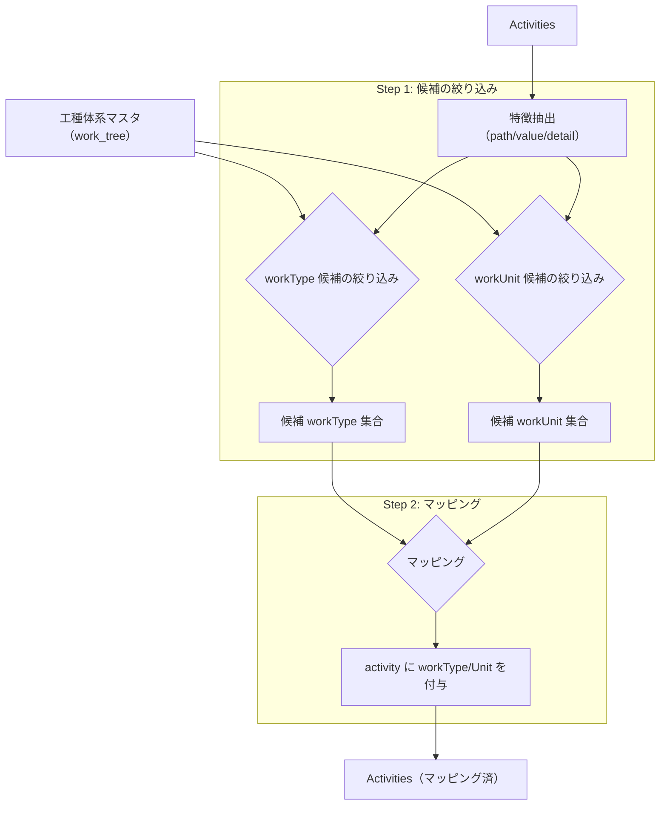
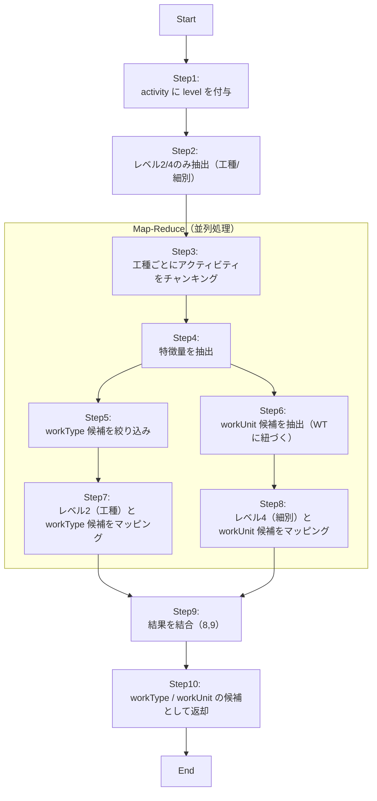

# マッピングロジックの改善

## やりたいこと

- activityに対して、workTypeとworkUnitをマッピングしたい

## 課題

- workType/Unitはユーザーが任意に増やすことができるので。コンテキストウィンドウの問題に直面する
- activity数 < workType/Unit数なので、activityでチャンキングしても問題の解決にはならない
- workType/Unitがどれだけ増えても対応できるようなシステムにする必要がある

## 方針

1. workType/Unitをactivityの情報を使って事前に絞り込む
2. 1で絞り込んだworkType/Unitとactivityをマッピングする


```mermaid
flowchart TD
  A["Activities"] --> B["特徴抽出（path/value/detail）"]
  WT["工種体系マスタ（work_tree）"] --> C
  WT --> E
  subgraph "Step 1: 候補の絞り込み"
    B --> C{"workType 候補の絞り込み"}
    B --> E{"workUnit 候補の絞り込み"}
    C --> D["候補 workType 集合"]
    E --> F["候補 workUnit 集合"]
  end
  subgraph "Step 2: マッピング"
    D --> G{"マッピング"}
    F --> G
    G --> H["activity に workType/Unit を付与"]
  end
  H --> I["Activities（マッピング済）"]
```

## Step 1: 候補の絞り込み

- 候補の絞り込みは2段階に分けて実装する
    - Phase1. Long Contextに強いLLMでworkType/Unitの候補を絞り込む方法
    - Phase2. workType/Unitのタグのような情報を付加し、LLMでタグの検索条件を作成する方法
- Phase1の方法は根本的な解決にはなっていない。LLMの性能に頼っており、workType/Unit数が多くなった際に候補の絞り込みができなくなる可能性が高い。
- Phase2の方法はworkType/Unitの増加に対してスケーラブルであるが、下記の問題を解決する必要がある
    - どのようなタグを付与すれば正確に絞り込むことができるのか
    - どのようなタグを付与すればLLMがActivitiesの特徴量から正確な絞り込み情報を生成できるのか
    - ユーザーへの負担を最小にしながら、workType/Unitの情報量を増やすにはどうすればいいか
- これらの問題にはすぐに回答できないため、直近はPhase1の方法を採用し、時期を見てPhase2の方法に移行する

### Phase1の課題

- Phase1は根本的な解決になっていない。
- そのため、activityを全量渡すとContext Windowのサイズを超えてしまうことが想定される。
- よって、activityをチャンキングして、並列処理を行う必要がある。

### 処理手順

```
1. activity に level を付与
2. レベル2（工種）・レベル4（細別）のみ抽出
3. 並列処理: 工種ごとにアクティビティをチャンキング
4. 並列処理: チャンクから特徴量を抽出
5. 並列処理: 特徴量から workType 候補を絞り込み
6. 並列処理: 6 で絞り込んだ workType に紐づく workUnit 候補を抽出
7. 並列処理: レベル2（工種）と 6 の workType 候補をマッピング
8. 並列処理: レベル4（細別）と 7 の workUnit 候補をマッピング
9. 並列処理の結果（8, 9）を結合
10. 結果を workType / workUnit の候補として返却
```


```mermaid
flowchart TD
  S["Start"] --> L["Step1: <br />activity に level を付与"]
  L --> F["Step2: <br />レベル2/4のみ抽出（工種/細別）"]
  F --> C["Step3: <br />工種ごとにアクティビティをチャンキング"]
  subgraph "Map-Reduce（並列処理）"
    C --> X["Step4: <br />特徴量を抽出"]
    X --> WT["Step5: <br />workType 候補を絞り込み"]
    X --> WU["Step6: <br />workUnit 候補を抽出（WTに紐づく）"]
    WT --> M2["Step7: <br />レベル2（工種）と workType 候補をマッピング"]
    WU --> M4["Step8: <br />レベル4（細別）と workUnit 候補をマッピング"]
  end
  M2 --> J["Step9: <br />結果を結合（8,9）"]
  M4 --> J
  J --> R["Step10: <br />workType / workUnit の候補として返却"]
  R --> E["End"]
```

### Step 1: activityにlevelを付与 / Step 2: レベル2/4のみ抽出（工種/細別）

- 既存実装をそのまま使用する
    - `src/usecases/design_document/builders/map_reduce_graph_builder.py`
        - assign_levels
        - filter_activities

### Step 3: 工種ごとにアクティビティをチャンキング

- レベル2（工種）でグルーピング（グループごとにContetext Window内に収まると仮定）
    - 現状ではContext Windowを超えた場合の分割戦略は考えない
- 同一工種内のactivityをまとめることで、関連性の高い項目を同じチャンクで処理できる

### Step 4: 特徴量を抽出（並列処理）

- 各チャンクからactivityの特徴を抽出し、workType/Unit検索用のキーワードを生成する
- 階層構造（path）、数値情報（value）、詳細説明（detail）から意味的な特徴を抽出する

#### LLMの選定

- LLMはopenai/gpt-4oを使用する
- この後のstepでも特に断りがない限り、openai/gpt-4oを使用する

#### 並列処理

- 並列処理にはLangGraphのMap-Reduceパターンを使用する
    - add_conditional_edgesを使用
    - `src/usecases/design_document/builders/map_reduce_graph_builder.py`を参考にする
- もし、並列処理の一部が失敗した場合は全体を失敗とする

```
  プロンプト例:
  以下の設計書アクティビティから、工事種別を特定するための特徴を抽出してください：
  - 作業内容、使用材料、施工方法、単位などの観点から分析
  - 各アクティビティの共通点と相違点を明確化
```

### Step 5: workType候補を絞り込み（並列処理）

- Step 4で抽出した特徴量を基に、マスタデータのworkTypeから関連性の高い候補を選定する
- 各チャンクごとに上位10-20個程度のworkType候補を抽出する
- Long Contextになることが想定されるので`gemini/gemini-2.5-flash`を使用する
  - `LangChainManage`に`get_chat_gemini`を追加

```
  プロンプト例:
  特徴量: [土砂掘削, 機械施工, m3単位, 基礎工事関連]
  以下のworkTypeマスタから最も関連性の高いものを選定してください：
  [マスタリスト] → 候補として「土工」「基礎工」等を選定
```

### Step 6: workUnit候補を抽出（並列処理）

- Step 5で絞り込んだworkTypeに紐づくworkUnitをルールベースで抽出する

### Step 7: レベル2（工種）とworkType候補をマッピング（並列処理）

- レベル2のactivityと、Step 5で絞り込んだworkType候補を1対1でマッピングする
- 名称の類似度、階層的な位置づけ、関連キーワードを総合的に評価してマッチングする

```
  プロンプト例:
  Activity（レベル2）: "土工"
  WorkType候補: ["土工事", "掘削工", "基礎土工"] → 最も適切なworkTypeを選定し、理由を説明してください。
```

### Step 8: レベル4（細別）とworkUnit候補をマッピング（並列処理）

- レベル4のactivityと、Step 6で抽出したworkUnit候補をマッピングする
- 親となるworkTypeとの整合性を保ちながら、詳細レベルでの対応付けを行う

```
  プロンプト例:
  Activity（レベル4）: "土砂掘削（小規模）_10m3未満"
  WorkUnit候補: ["機械掘削_小規模", "人力掘削", "バックホウ掘削_0.28m3"] → 技術的仕様などを考慮して最適なworkUnitを選定してください。
```

### Step 9: 結果を結合

- 各並列処理の結果を統合し、activity全体のマッピング結果を構築する
- チャンク間で重複や矛盾がある場合は、信頼度スコアに基づいて調整する
- 階層構造の整合性（親子関係）を検証し、必要に応じて修正する

### Step 10: workType/workUnitの候補として返却

- 最終的なマッピング結果を構造化データとして整形する
- 各activityに対して、選定されたworkType/workUnitを付与する

### 既存のAggregationに追加すべきメソッド

1. ExtractedData.get_activities_by_level
    - 処理概要: 指定されたレベルのアクティビティのみを抽出して返す
    - 使用するステップ: Step 2（レベル2/4のアクティビティ抽出）

2. ExtractedData.create_activity_chunks_by_work_type

    - 処理概要: レベル2（工種）のアクティビティを基準に、関連する下位レベルのアクティビティも含めてグループ化し、チャンクを作成する
    - 補足: chunk_idはUUIDでよい（実行ごとにIDは変わる）
    - 使用するステップ: Step 3（工種ごとのチャンキング）

### Graph State

```python
class MappingGraphState(BaseModel):
      """マッピング処理全体の状態"""
      tenant_id: str
      site_id: str
      extracted_data: DesignDocumentExtraction
      work_tree: WorkTree

      # 並列処理の中間結果
      chunk_features: dict[str, list[str]] | None = None  # Step 4の結果（chunk_id → features）
      work_type_candidates: dict[str, list[str]] | None = None  # Step 5の結果（chunk_id → work_type_ids）
      work_unit_candidates: dict[str, list[str]] | None = None  # Step 6の結果（chunk_id → work_unit_ids）

      # マッピング結果
      level_2_mappings: dict[str, str] | None = None  # Step 7の結果（activity_id → work_type_id）
      level_4_mappings: dict[str, str] | None = None  # Step 8の結果（activity_id → work_unit_id）

      # 最終結果
      final_mappings: list[MapWorkTreeMasterOutputItem] | None = None  # Step 9-10の結果
```

### チャンク定義（Step 3で作成）

```python
  class ActivityChunk(BaseModel):
      """工種ごとのアクティビティチャンク"""
      chunk_id: str
      work_type_name: str  # グループ化の基準となった工種名
      activity_ids: list[str]  # このチャンクに含まれるactivity_id

### LLM Output定義（各ステップの出力）


- Step 1: AssignLevelOutput（既存）

```python
  class AssignLevelOutput(BaseModel):
      """レベル割り当ての結果"""
      items: list[AssignLevelOutputItem]
```

- Step 4: FeatureExtractionOutput

```python
  class FeatureExtractionOutput(BaseModel):
      """特徴量抽出の結果"""
      chunk_id: str
      features: list[str]  # 抽出されたキーワード
      semantic_summary: str  # 意味的な要約
```

- Step 5: WorkTypeCandidateOutput

```python
  class WorkTypeCandidateOutput(BaseModel):
      """workType候補絞り込みの結果"""
      chunk_id: str
      candidates: list[WorkTypeCandidate]

  class WorkTypeCandidate(BaseModel):
      work_type_id: str
      work_type_name: str
      relevance_score: float
```

- Step 7: Level2MappingOutput

```python
  class Level2MappingOutput(BaseModel):
      """レベル2マッピングの結果"""
      mappings: list[Level2Mapping]

  class Level2Mapping(BaseModel):
      activity_id: str
      work_type_id: str
      confidence: float
      reason: str
```
- Step 8: Level4MappingOutput

```python
  class Level4MappingOutput(BaseModel):
      """レベル4マッピングの結果"""
      mappings: list[Level4Mapping]

  class Level4Mapping(BaseModel):
      activity_id: str
      work_unit_id: str
      confidence: float
      reason: str
```

- Step 10: MapWorkTreeMasterOutput（既存）

```python
  class MapWorkTreeMasterOutput(BaseModel):
      """最終的なマッピング結果"""
      items: list[MapWorkTreeMasterOutputItem]
```
