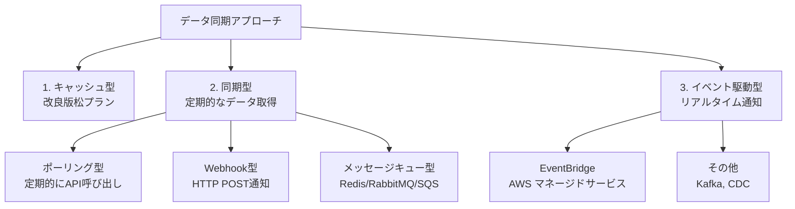
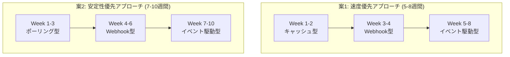
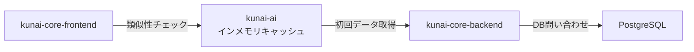
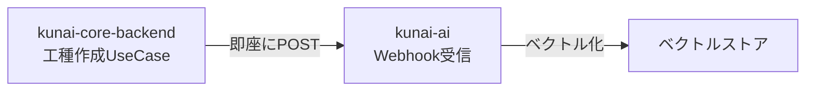
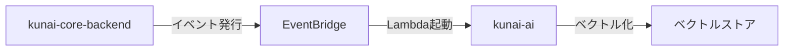
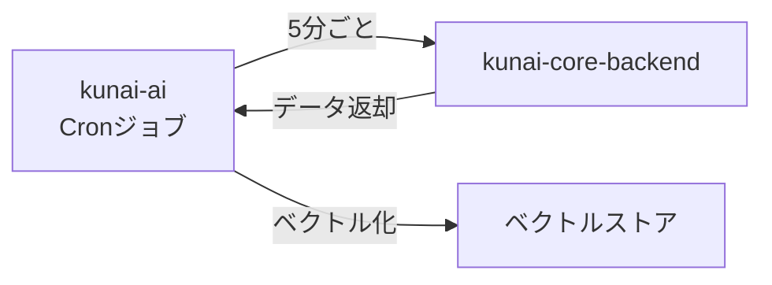
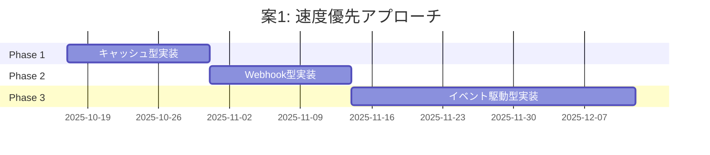
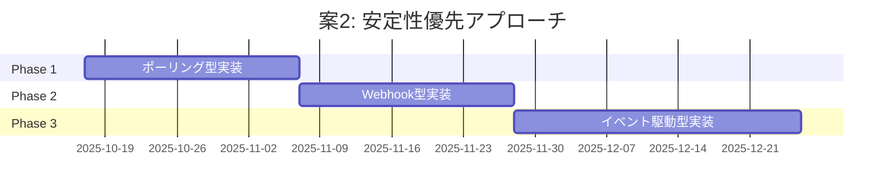

## データ同期の3つの主要アプローチ  
  

  
### 1. 松　キャッシュ型(インメモリ)  
  
- **実装**: kunai-ai起動時に全データをベクトル化してメモリに保存<cite />  
- **更新**: 手動更新API(`POST /refresh-cache`)または定期的なTTL<cite />  
- **メリット**: 最もシンプル、AWS不要<cite />  
- **デメリット**: サーバー再起動でキャッシュ消失、メモリ制約<cite />  
  
### 2. 竹　同期型(定期的なデータ取得)  
  
#### 2-1. ポーリング型  
- **実装**: Cronジョブで5分ごとにkunai-core-backendからデータ取得<cite />  
- **メリット**: 実装が簡単、イベント基盤不要<cite />  
- **デメリット**: データ鮮度に遅延(最大5分)<cite />  
  
#### 2-2. Webhook型  
- **実装**: kunai-core-backendがデータ変更時にkunai-aiのエンドポイントを直接呼び出し<cite />  
- **メリット**: リアルタイム同期、インフラ不要、イベント駆動型と同じプッシュ型のメカニズムなので移行がしやすい<cite />  
- **デメリット**: kunai-aiがダウンしていると失敗<cite />  
  
#### 2-3. メッセージキュー型  
- **実装**: Redis/RabbitMQ/SQSを介してメッセージを非同期配信<cite />  
- **メリット**: リアルタイム同期、リトライ機能、DLQ対応<cite />  
- **デメリット**: Redis等のミドルウェアが必要<cite />  
→  Redisが必要になるので却下
### 3. 梅　イベント駆動型(完全な非同期アーキテクチャ)  
  
- **実装**: AWS EventBridgeでイベントをルーティング、Lambda/ECSで処理<cite />  
- **メリット**: 最もスケーラブル、AWS統合、拡張性が高い<cite />  
- **デメリット**: 実装が最も複雑、運用コストが高い<cite />  

# 段階的な移行案

## 全体比較

---

## 案1: 速度優先アプローチ (5-8週間)

### コンセプト
**最速でMVPをリリースし、早期にユーザーフィードバックを収集**<cite />

### Phase 1: キャッシュ型 (1-2週間)

**実装内容**:
- kunai-aiにインメモリキャッシュ実装
- 起動時に全工種データをベクトル化
- 手動キャッシュ更新API追加

**システム構成**:

**実装タスク**:
| タスク | 担当 | 期間 |
|--------|------|------|
| WorkTypeVectorCache実装 | AI | 1日 |
| 類似性検索API実装 | AI | 1日 |
| キャッシュ初期化処理 | AI | 0.5日 |
| 類似性チェックボタン追加 | Frontend | 1日 |
| SimilarItemsDialog実装 | Frontend | 1日 |
| 統合テスト | 全員 | 1日 |

**成果物**:
- ✅ 初回検索: 2秒以内
- ✅ 2回目以降: 0.5秒以内
- ✅ ローカル環境で動作
- ✅ AWS不要

### Phase 2: Webhook型 (2週間)

**実装内容**:
- kunai-core-backendにWebhook呼び出し追加
- kunai-aiにWebhookエンドポイント実装
- リトライロジック追加

**システム構成**:

**実装タスク**:
| タスク | 担当 | 期間 |
|--------|------|------|
| Webhookエンドポイント実装 | AI | 1日 |
| Webhook呼び出し実装 | Backend | 1日 |
| リトライロジック | Backend | 1日 |
| ベクトルストア導入 | AI | 2日 |
| 統合テスト | 全員 | 2日 |

**成果物**:
- ✅ リアルタイム同期
- ✅ デモで即座に反映
- ✅ 検索速度: 0.3-0.5秒

### Phase 3: イベント駆動型 (3-4週間)

**実装内容**:
- LocalStackでEventBridge構築
- kunai-core-backendでイベント発行
- kunai-aiでLambda/ECSハンドラー実装

**システム構成**:

**実装タスク**:
| タスク | 担当 | 期間 |
|--------|------|------|
| EventBridge基盤構築 | Infra | 3日 |
| イベント発行実装 | Backend | 3日 |
| イベントハンドラー実装 | AI | 3日 |
| DLQ・リトライ設定 | Infra | 2日 |
| 統合テスト・監視設定 | 全員 | 3日 |

**成果物**:
- ✅ 本番環境でスケーラブル
- ✅ AWS統合
- ✅ 拡張性が高い

---

## 案2: 安定性優先アプローチ (7-10週間)

### コンセプト
**各段階で十分な検証を行い、リスクを最小化**<cite />

### Phase 1: ポーリング型 (2-3週間)

**実装内容**:
- Cronジョブで5分ごとにデータ取得
- 差分検出ロジック実装
- ベクトルストアに保存

**システム構成**:

**実装タスク**:
| タスク | 担当 | 期間 |
|--------|------|------|
| Cronジョブ実装 | AI | 1日 |
| 差分検出ロジック | AI | 1日 |
| ベクトルストア連携 | AI | 2日 |
| 検索API実装 | AI | 1日 |
| 統合テスト | 全員 | 2日 |

**成果物**:
- ✅ システムへの影響が最小限
- ✅ エラー時の自動回復
- ✅ 十分な検証期間

### Phase 2: Webhook型 (2-3週間)

**実装内容**:
- kunai-core-backendでWebhook送信
- kunai-aiでWebhookエンドポイント実装
- エラーハンドリング強化

**実装タスク**:
| タスク | 担当 | 期間 |
|--------|------|------|
| Webhookエンドポイント実装 | AI | 1日 |
| Webhook呼び出し実装 | Backend | 1日 |
| リトライロジック | Backend | 2日 |
| エラーハンドリング強化 | AI | 2日 |
| 統合テスト | 全員 | 2日 |

**成果物**:
- ✅ リアルタイム同期
- ✅ 高い信頼性

### Phase 3: イベント駆動型 (3-4週間)

**実装内容**:
- EventBridge移行
- 既存方式を段階的に削除
- 完全移行

**実装タスク**:
| タスク | 担当 | 期間 |
|--------|------|------|
| EventBridge基盤構築 | Infra | 3日 |
| イベント発行実装 | Backend | 3日 |
| イベントハンドラー実装 | AI | 3日 |
| 既存方式の削除 | 全員 | 2日 |
| 統合テスト・監視設定 | 全員 | 3日 |

**成果物**:
- ✅ 本番環境での完成形
- ✅ 高い信頼性

---

## 詳細比較表

| 項目 | 案1: 速度優先 | 案2: 安定性優先 |
|------|-------------|---------------|
| **総期間** | 5-8週間 | 7-10週間 |
| **初回リリース** | 1-2週間 | 2-3週間 |
| **Phase 1** | キャッシュ型 | ポーリング型 |
| **Phase 1の特徴** | 最速、AWS不要 | 安定、自動回復 |
| **Phase 2** | Webhook型 | Webhook型 |
| **Phase 3** | イベント駆動型 | イベント駆動型 |
| **リスク** | 中 | 低 |
| **ユーザー価値** | 早期提供 | 段階的提供 |
| **技術的負債** | 中 | 低 |
| **運用複雑性** | 低→高 | 低→高 |
| **デモ対応** | ✅ 手動更新で可能 | ⚠️ 遅延あり |

---

## 推奨する選択基準

### 案1を選ぶべき場合
- ✅ デモが近い(1-2週間以内)
- ✅ 早期にユーザーフィードバックが必要
- ✅ 開発リソースが限られている
- ✅ ローカル環境で完結したい

### 案2を選ぶべき場合
- ✅ 本番環境での安定性を重視
- ✅ 十分な検証期間が取れる
- ✅ リスクを最小化したい
- ✅ 段階的な価値提供で問題ない

---

## 実装の進め方

### 案1の進め方

### 案2の進め方

---

## まとめ

**最推奨**: 
- **デモが近い場合**: 案1(速度優先)
- **本番環境重視**: 案2(安定性優先)

どちらのアプローチも、既存のkunai-aiの進捗管理システムやWebSocket通知のパターンを活用でき、ローカル環境で開発・テストが可能です。<cite />段階的にAWS環境に移行できるため、技術的負債を最小化しながら完成形に到達できます。<cite />