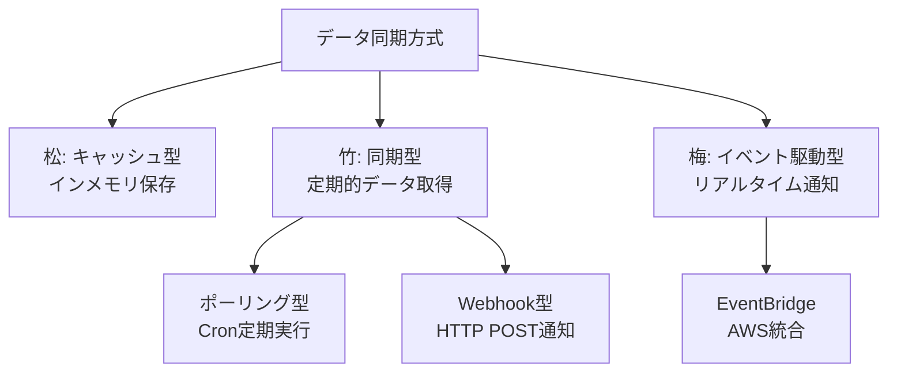
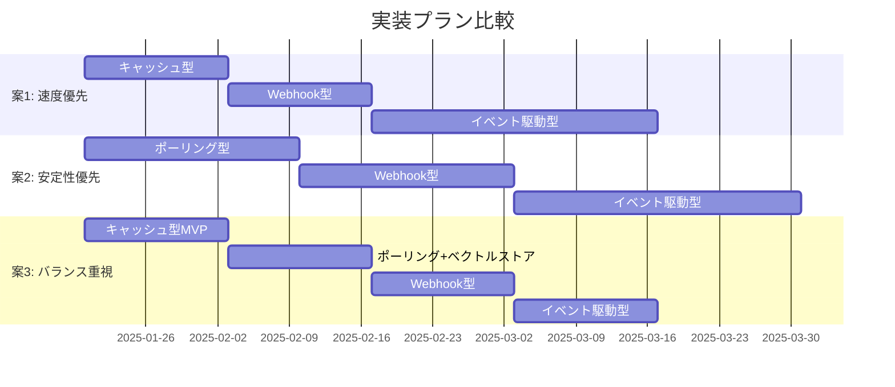

# 工種・細別ベクトル検索システム 段階的実装プラン

## データ同期アプローチの全体像



### 各方式の特徴

| 方式                 | 実装期間  | メリット                 | デメリット           |
| ------------------ | ----- | -------------------- | --------------- |
| **松(キャッシュ型)**      | 1-2週間 | 最もシンプル、AWS不要         | メモリ制約、再起動で消失    |
| **竹(ポーリング型)**      | 1-2週間 | 実装簡単、自動同期            | 遅延あり(最大5分)      |
| **竹(Webhook型)**    | 2-3週間 | リアルタイム、イベント駆動型への移行容易 | kunai-aiダウン時に失敗 |
| **梅(EventBridge)** | 1-2週間 | 最もスケーラブル、高信頼性        | 実装複雑、運用コスト高     |

---

## 3つの実装プラン比較



### 案1: 速度優先アプローチ (5-8週間)

**コンセプト**: 最速でMVPをリリースし、早期にユーザーフィードバックを収集<cite />

| Phase | 期間 | 実装内容 | 成果 |
|-------|------|---------|------|
| **1. キャッシュ型** | 1-2週間 | インメモリキャッシュ、手動更新API | 初回2秒、2回目0.5秒、AWS不要 |
| **2. Webhook型** | 2週間 | Webhook実装、ベクトルストア導入 | リアルタイム同期、検索0.3秒 |
| **3. イベント駆動型** | 3-4週間 | EventBridge、Lambda/ECS | 本番環境スケーラブル |

**推奨**: デモが1-2週間以内、最速フィードバック必要<cite />

### 案2: 安定性優先アプローチ (7-10週間)

**コンセプト**: 各段階で十分な検証を行い、リスクを最小化<cite />

| Phase | 期間 | 実装内容 | 成果 |
|-------|------|---------|------|
| **1. ポーリング型** | 2-3週間 | Cronジョブ、差分検出、ベクトルストア | システム影響最小、自動回復 |
| **2. Webhook型** | 2-3週間 | Webhook実装、エラーハンドリング強化 | リアルタイム同期、高信頼性 |
| **3. イベント駆動型** | 3-4週間 | EventBridge移行、既存方式削除 | 本番環境完成形 |

**推奨**: 本番環境安定性重視、十分な検証期間確保<cite />

### 案3: バランス重視アプローチ (6-8週間)

**コンセプト**: 早期リリースと安定性の両立<cite />

| Phase | 期間 | 実装内容 | 成果 |
|-------|------|---------|------|
| **1. キャッシュ型MVP** | 1-2週間 | インメモリキャッシュ、手動更新 | 早期価値提供、フィードバック収集 |
| **2. ポーリング+ベクトルストア** | 2週間 | Cronジョブ、ベクトルストア導入 | 検索0.3秒、1000件対応 |
| **3. Webhook型** | 2週間 | Webhook実装、ポーリング併用 | リアルタイム同期、フォールバック |
| **4. イベント駆動型** | 2週間 | EventBridge移行、Webhook削除 | 完全なイベント駆動型 |

**推奨**: 早期リリースと安定性の両立、フォールバック機能必要<cite />

---

## 技術スタック

| 層 | 技術 | 用途 |
|---|---|---|
| **フロントエンド** | React + TypeScript + Zod | UI・バリデーション |
| **バックエンド** | TypeScript + Prisma + PostgreSQL | API・データ管理 |
| **AI処理** | Python + LangChain + OpenAI Embeddings | ベクトル化・検索 |
| **ベクトルストア** | Qdrant/Pinecone | ベクトルインデックス |
| **イベント配信** | AWS EventBridge | 非同期連携 |

---

## ローカル環境での開発

既存のLocalStack環境を活用し、AWS不要で開発可能です。<cite />

```bash
# 1. kunai-core-backend起動
cd kunai-core-backend
make bootstrap

# 2. kunai-ai起動
cd kunai-ai
make up

# 3. kunai-core-frontend起動
cd kunai-core-frontend
make bootstrap
```

---

## 選択基準

| 状況 | 推奨プラン | 理由 |
|------|-----------|------|
| **デモが近い(1-2週間)** | 案1(速度優先) | 最速リリース、早期フィードバック |
| **本番環境重視** | 案2(安定性優先) | 十分な検証、リスク最小化 |
| **バランス重視** | 案3(バランス重視) | 早期リリース+安定性、フォールバック機能 |

---

## まとめ

すべてのプランは、既存のkunai-aiの進捗管理システム<cite ref="tests/integration/shared/managers/progress_manager/test_dynamo_progress_manager.py:159-241"/>のポーリングパターンを参考に実装できます。<cite />

**最推奨の進め方**:
1. まず**キャッシュ型**または**ポーリング型**で即座にリリース
2. ユーザーフィードバックを収集
3. **Webhook型**に移行してリアルタイム化
4. 本番環境で**イベント駆動型**に移行

この段階的アプローチにより、早期にユーザー価値を提供しながら、技術的な完成度を高めることができます。<cite />

Wiki pages you might want to explore:
- [AI Assistant Integration (KENCOPA/kunai-ai)](/wiki/KENCOPA/kunai-ai#7.3)
- [Structured Architecture Data (KENCOPA/kunai-ai)](/wiki/KENCOPA/kunai-ai#2.3)