# システム設計: 工種・細別ベクトル検索による意味的類似性検出システム

これまでの会話を踏まえ、kunai-core-backend、kunai-ai、kunai-core-frontendの3つのシステムを連携させた、工種・細別の意味的類似性検出システムの全体設計を抽象的に説明します。<cite />

## システム全体アーキテクチャ

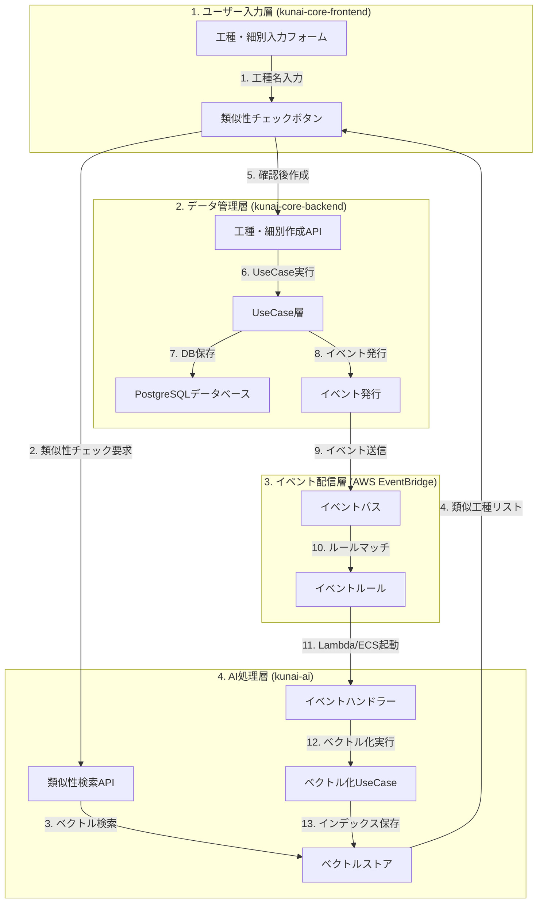

## 1. ユーザー入力フロー (kunai-core-frontend)

### 1.1 入力フォームの構成

ユーザーが工種・細別を追加する際の入力フローは以下の通りです:<cite />

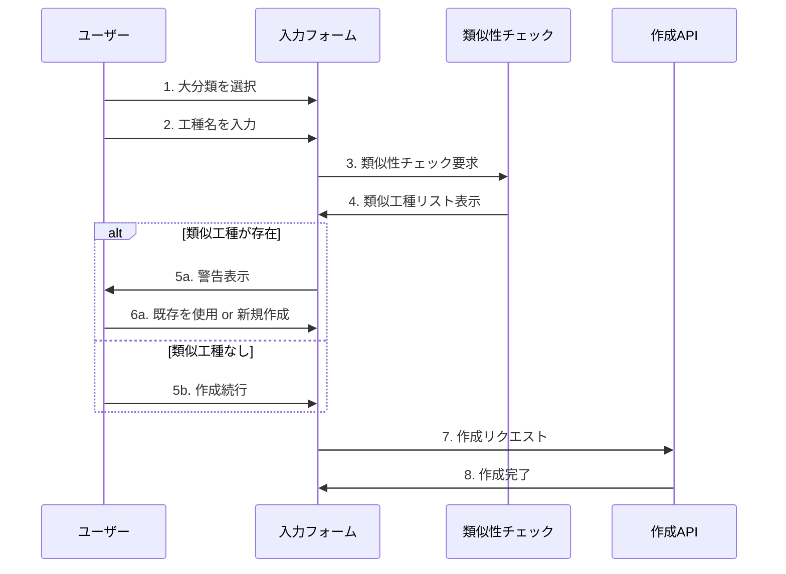

**主要コンポーネント**:
- `WorkTypeCreateModal`: 工種作成フォーム [13-cite-0](#13-cite-0) 
- `WorkUnitCreateModal`: 細別作成フォーム [13-cite-1](#13-cite-1) 

### 1.2 入力データの構造

```typescript
// 工種作成時の入力データ
{
  majorCategoryId: string,  // 大分類ID
  name: string,             // 工種名
  description?: string      // 説明(任意)
}

// 細別作成時の入力データ
{
  workTypeId: string,       // 工種ID
  name: string,             // 細別名
  description?: string      // 説明(任意)
}
```

## 2. データ管理フロー (kunai-core-backend)

### 2.1 データ階層構造  
  
kunai-core-backendでは4層のデータ階層が存在します:<cite />  
  
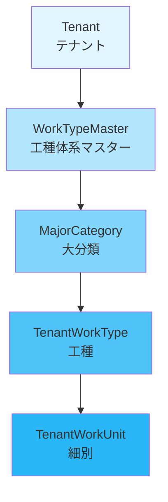
[13-cite-2](#13-cite-2)   
  
### 2.2 作成処理フロー

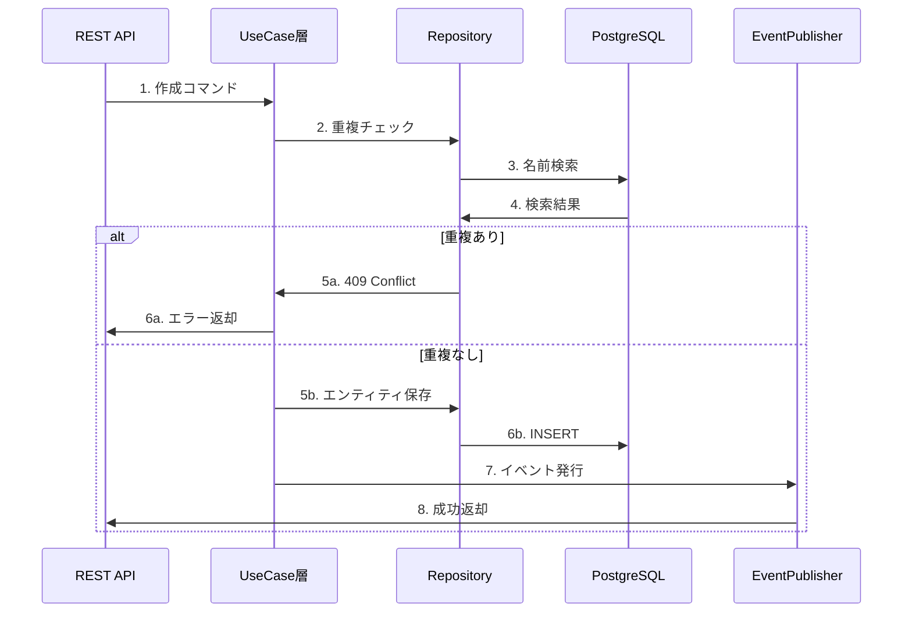

**主要UseCase**:
- `CreateTenantWorkTypeUseCase`: 工種作成 [13-cite-3](#13-cite-3) 
- `CreateTenantWorkUnitUseCase`: 細別作成 [13-cite-4](#13-cite-4) 

### 2.3 イベント発行設計

```typescript
// イベントペイロード構造
interface WorkTypeCreatedEvent {
  type: 'TenantWorkTypeCreated',
  payload: {
    tenantId: string,
    workTypeId: string,
    majorCategoryId: string,
    name: string,
    description: string | null,
    timestamp: Date
  }
}
```

**発行タイミング**:
- 工種・細別の作成時
- 工種・細別の更新時
- 工種・細別のアーカイブ/アクティベート時

## 3. イベント配信層 (AWS EventBridge)

### 3.1 イベントフロー

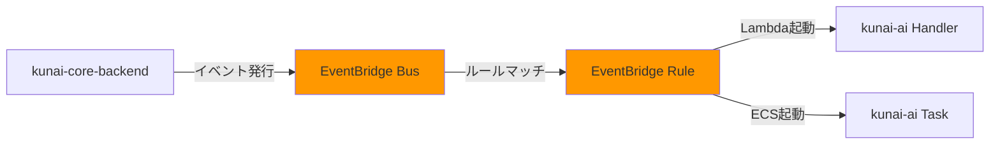

### 3.2 イベントルール設計

```json
{
  "source": ["kunai.core-backend"],
  "detail-type": [
    "TenantWorkTypeCreated",
    "TenantWorkTypeUpdated",
    "TenantWorkTypeArchived",
    "TenantWorkUnitCreated",
    "TenantWorkUnitUpdated",
    "TenantWorkUnitArchived"
  ]
}
```

## 4. AI処理フロー (kunai-ai)

### 4.1 ベクトル化処理

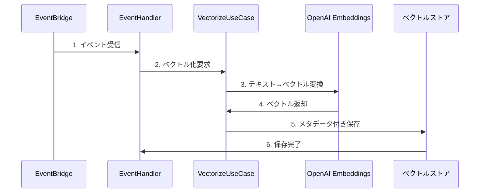

**ベクトルデータ構造**:
```python
{
  "id": "work-type-id",
  "vector": [0.1, 0.2, ...],  # 埋め込みベクトル
  "metadata": {
    "tenant_id": "tenant-xxx",
    "major_category_id": "major-category-yyy",
    "name": "工種名",
    "description": "説明",
    "type": "work_type"  # or "work_unit"
  }
}
```

### 4.2 類似性検索処理

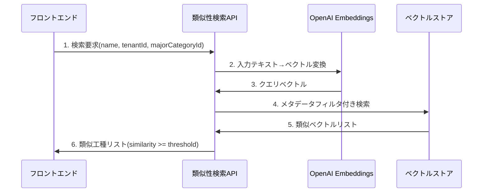

**検索リクエスト**:
```python
{
  "tenant_id": "xxx",
  "major_category_id": "yyy",  # スコープ絞り込み
  "name": "掘削工事",
  "threshold": 0.8  # 類似度閾値
}
```

**検索レスポンス**:
```python
{
  "similar_items": [
    {
      "id": "existing-id",
      "name": "掘削",
      "similarity": 0.85
    }
  ]
}
```

## 5. データ同期戦略

### 5.1 リアルタイム同期 (イベント駆動)

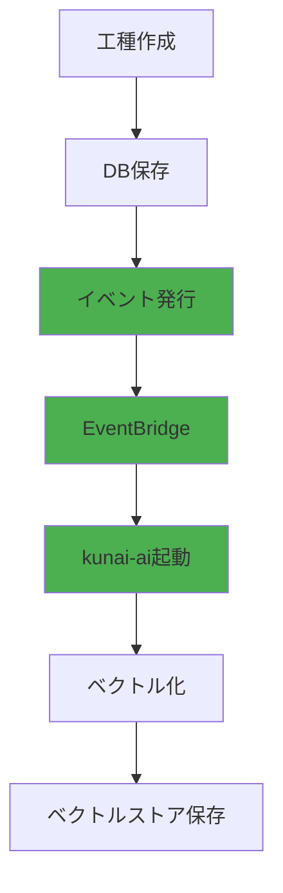

**メリット**:
- リアルタイム性: 即座にベクトル検索可能
- データ整合性: 常に最新状態を維持
- ユーザー体験: 類似性チェックが即座に機能

### 5.2 初期同期 (バッチ処理)

既存データのベクトル化には、バッチ処理を実装:<cite />

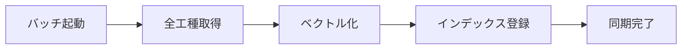

## 6. エラーハンドリング設計

### 6.1 リトライ戦略

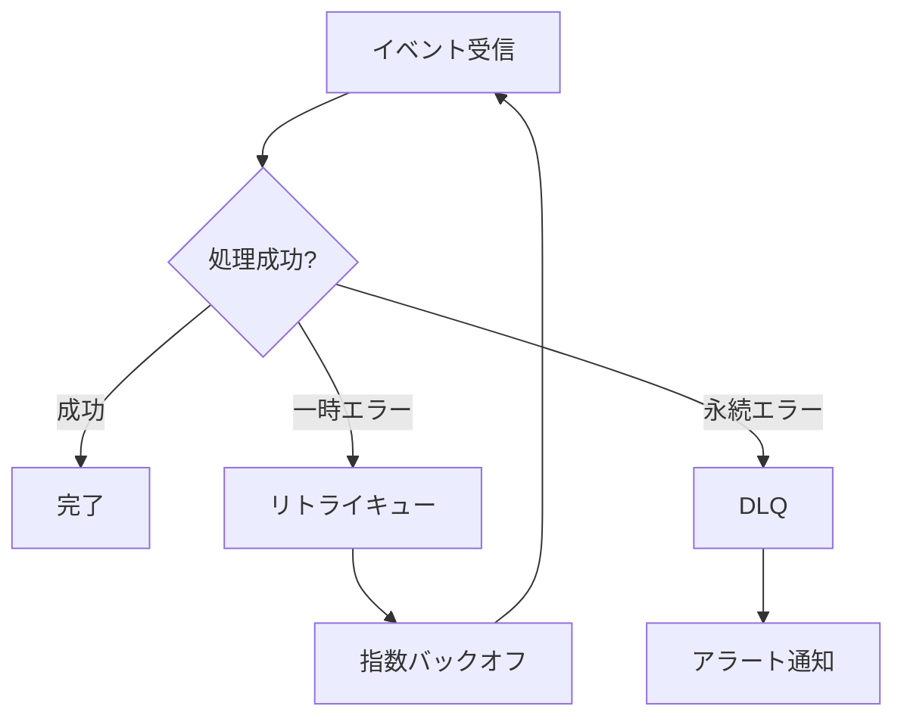

### 6.2 データ整合性チェック

```python
# 定期的な同期状態監視
async def check_sync_status(tenant_id: str) -> bool:
    db_count = await get_work_type_count_from_db(tenant_id)
    vector_count = await get_vector_count(tenant_id)
    return db_count == vector_count
```

## 7. スケーラビリティ考慮事項

### 7.1 テナント分離

- ベクトル検索時に`tenant_id`でフィルタリング<cite />
- 他テナントのデータが検索結果に含まれない保証

### 7.2 大分類スコープ

- `major_category_id`でさらに絞り込み<cite />
- 検索精度向上と処理速度改善

### 7.3 負荷分散

- EventBridgeによる非同期処理
- Lambda/ECS Fargateの自動スケーリング

## まとめ

このシステムは以下の3つの主要フローで構成されます:

1. **入力フロー**: ユーザーが工種・細別を入力 → 類似性チェック → 確認後作成
2. **同期フロー**: データ作成 → イベント発行 → ベクトル化 → インデックス保存
3. **検索フロー**: 入力テキスト → ベクトル変換 → メタデータフィルタ付き検索 → 類似工種提示

**技術スタック**:
- フロントエンド: React + TypeScript + Zod
- バックエンド: TypeScript + Prisma + PostgreSQL
- AI処理: Python + LangChain + OpenAI Embeddings
- イベント配信: AWS EventBridge
-

Wiki pages you might want to explore:
- [Core Business Domains (KENCOPA/kunai-core-backend)](/wiki/KENCOPA/kunai-core-backend#2)

### Citations

**File:** prisma/schema.prisma (L421-480)
```text
  scheduleActivityDetail   ScheduleActivityDetail   @relation(fields: [activityDetailId], references: [id], onDelete: Cascade)
  scheduleActivityWorkType ScheduleActivityWorkType @relation(fields: [activityWorkTypeId], references: [id], onDelete: Cascade)
  tenantWorkUnit           TenantWorkUnit           @relation(fields: [tenantWorkUnitId], references: [id], onDelete: Cascade)

  @@unique([activityWorkTypeId, tenantWorkUnitId])
  @@map("schedule_activity_work_units")
}

// 工種マスタ（システム共通）
model WorkType {
  id              String   @id @default(uuid())
  majorCategoryId String   @map("major_category_id")
  name            String
  description     String?
  createdAt       DateTime @default(now()) @map("created_at")
  updatedAt       DateTime @updatedAt @map("updated_at")

  // relations
  majorCategory MajorCategory @relation(fields: [majorCategoryId], references: [id], onDelete: Cascade)
  workUnits     WorkUnit[]

  @@unique([majorCategoryId, name])
  @@map("work_types")
}

// 細別マスタ（システム共通）
model WorkUnit {
  id          String   @id @default(uuid())
  workTypeId  String   @map("work_type_id")
  name        String
  description String?
  createdAt   DateTime @default(now()) @map("created_at")
  updatedAt   DateTime @updatedAt @map("updated_at")

  // relations
  workType WorkType @relation(fields: [workTypeId], references: [id], onDelete: Cascade)

  @@unique([workTypeId, name])
  @@map("work_units")
}

// 工種体系マスタ（システム共通）
model WorkTypeMaster {
  id             String   @id @default(uuid())
  name           String   @unique
  description    String?
  createdAt      DateTime @default(now()) @map("created_at")
  updatedAt      DateTime @updatedAt @map("updated_at")

  // relations
  majorCategories MajorCategory[]

  @@map("work_type_masters")
}

// 大分類（システム共通）
model MajorCategory {
  id                 String   @id @default(uuid())
  workTypeMasterId   String   @map("work_type_master_id")
  name               String
```


# 工種・細別ベクトル検索システム 実装進め方設計資料
## 案１　ステップ０から
### ステップ０: 

## 目的 
最小限の実装で類似性チェック機能を提供し、早期にユーザー価値を実現する。
## システム構成 

## 主要コンポーネント 

### 1. フロントエンド (kunai-core-frontend) 

- **WorkTypeCreateModal拡張**: 既存フォーム に類似性チェック機能追加
- **類似性チェックボタン**: 工種名入力後にクリック可能、ローディング状態表示
- **SimilarItemsDialog**: 類似工種リスト表示、類似度(%)表示、ユーザー選択肢提供

### 2. AI処理層 (kunai-ai) 

- **類似性検索API**: `POST /api/ai/v1/work-types/search-similar`
- **WorkTypeVectorCache**: インメモリキャッシュ、起動時に全工種をベクトル化
- **VectorizeUseCase**: OpenAI Embeddings APIでバッチベクトル化、コサイン類似度計算

### 3. データ管理層 (kunai-core-backend) 

- **内部API**: 既存の`GET /api/core/v1/_internal/tenant-work-types`を使用

## 実装タスク 

|タスク|担当|期間|優先度|
|---|---|---|---|
|WorkTypeVectorCache実装|AI|1日|高|
|類似性検索API実装|AI|1日|高|
|キャッシュ初期化処理|AI|0.5日|高|
|類似性チェックボタン追加|Frontend|1日|高|
|SimilarItemsDialog実装|Frontend|1日|高|
|統合テスト|全員|1日|高|

**合計期間**: 1-2週間

## 成功指標 

- ✅ 初回検索: 2秒以内
- ✅ 2回目以降: 0.5秒以内
- ✅ 類似度精度: 0.8以上で適切な工種を検出
- ✅ ローカル環境で動作確認完了

## 技術スタック 

- **フロントエンド**: React + TypeScript + Zod
- **AI処理**: Python + LangChain + OpenAI Embeddings
- **バックエンド**: TypeScript + Prisma + PostgreSQL

## メリット 

- AWS不要でローカル環境のみで動作
- イベント基盤不要
- 実装が最もシンプル
- 早期にユーザーフィードバック収集可能
## 案２　ステップ１から（ここから始めたいと思っています）
### ステップ1: 検索機能の実装 (3週間)

**目的**: 既存データに対する類似検索機能を提供

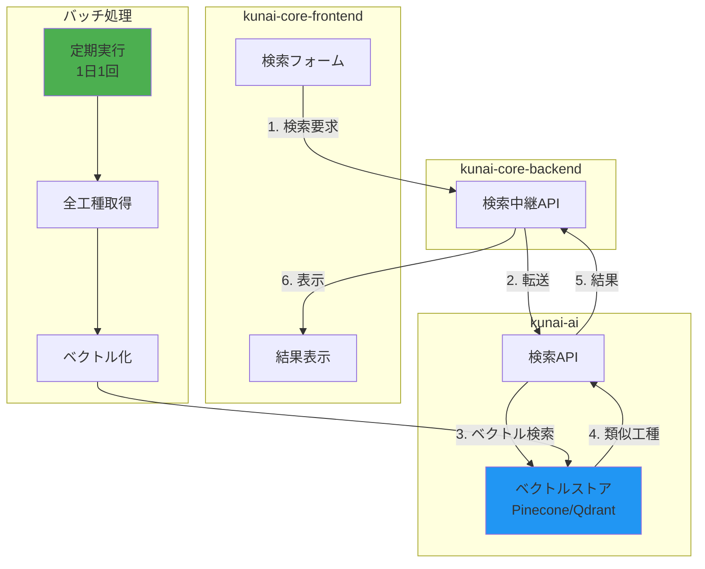

#### バッチ処理実装

**kunai-ai実装**:
```python
# src/batch/sync_work_types.py
async def sync_work_types_batch(tenant_id: str):
    # 1. kunai-core-backendから全工種取得
    # 2. バッチでベクトル化
    # 3. ベクトルストアに保存
```

**データソース**: kunai-core-backendの内部API [28-cite-1](#28-cite-1) 

#### ベクトルストア構築

**インフラ**:
- Pinecone/Qdrantのセットアップ
- メタデータ設計(tenant_id, major_category_id)
- インデックス作成

**データ構造**:
```json
{
  "id": "work-type-id",
  "vector": [0.1, 0.2, ...],
  "metadata": {
    "tenant_id": "xxx",
    "major_category_id": "yyy",
    "name": "工種名",
    "type": "work_type"
  }
}
```

#### 検索API実装

**kunai-ai**:
```python
# src/routes/api/ai/v1/protected/work_types/search_similar.py
@router.post("/search-similar")
async def search_similar(request: SearchSimilarRequest):
    # 1. 入力テキストをベクトル化
    # 2. メタデータフィルタ付きベクトル検索
    # 3. 閾値以上の結果を返却
```

**kunai-core-frontend**:
- 検索フォームコンポーネント作成
- 結果表示ダイアログ実装

---

### ステップ2: イベント基盤構築 (2週間)

**目的**: リアルタイム同期の基盤を整備

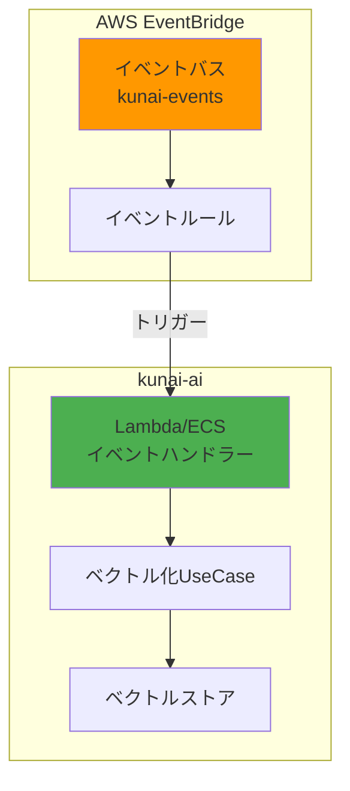

####  EventBridge構築

**Terraform実装**:
```hcl
# terraform/core/eventbridge.tf
resource "aws_cloudwatch_event_bus" "kunai_events" {
  name = "kunai-events"
}

resource "aws_cloudwatch_event_rule" "work_type_events" {
  name           = "kunai-work-type-events"
  event_bus_name = aws_cloudwatch_event_bus.kunai_events.name
  
  event_pattern = jsonencode({
    source      = ["kunai.core-backend"]
    detail-type = [
      "TenantWorkTypeCreated",
      "TenantWorkTypeUpdated"
    ]
  })
}
```

#### イベントハンドラー実装

**kunai-ai**:
```python
# src/event_handlers/work_type_event_handler.py
class WorkTypeEventHandler:
    async def handle_work_type_created(self, event: Dict[str, Any]):
        payload = event['detail']
        # ベクトル化してストアに追加
```

**Lambda/ECS設定**:
- イベントルールのターゲット設定
- DLQ(Dead Letter Queue)設定
- リトライポリシー設定

---

### ステップ3: 新規作成フローの実装 (2週間)

**目的**: 工種・細別作成時にイベントを発行

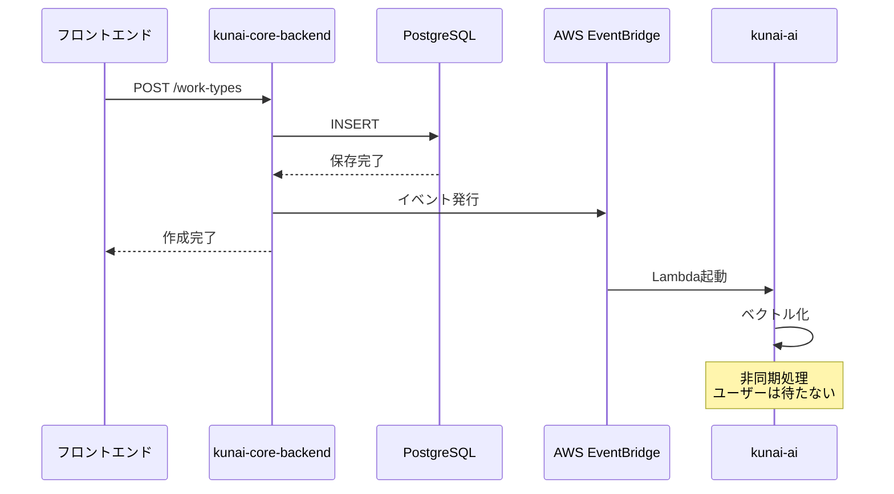

#### イベント発行インターフェース

**kunai-core-backend**:
```typescript
// src/infrastructures/events/eventPublisher.ts
export interface IEventPublisher {
  publish(event: DomainEvent): Promise<void>;
}

// src/infrastructures/events/eventBridgePublisher.ts
export class EventBridgePublisher implements IEventPublisher {
  async publish(event: DomainEvent): Promise<void> {
    await this.client.send(new PutEventsCommand({...}));
  }
}
```

####  UseCase修正

**既存のUseCaseにイベント発行を追加**:
- `CreateTenantWorkTypeUseCase` [28-cite-2](#28-cite-2) 
- `CreateTenantWorkUnitUseCase` [28-cite-3](#28-cite-3) 

```typescript
// UseCase修正例
async execute(command: CreateTenantWorkTypeCommand) {
  // 既存の実装
  await this.repository.save(workType);
  
  // イベント発行を追加
  await this.eventPublisher.publish({
    type: 'TenantWorkTypeCreated',
    payload: {...}
  });
}
```

---

### ステップ4: UI統合 (2週間)

**目的**: 工種作成時に類似性チェックを実行

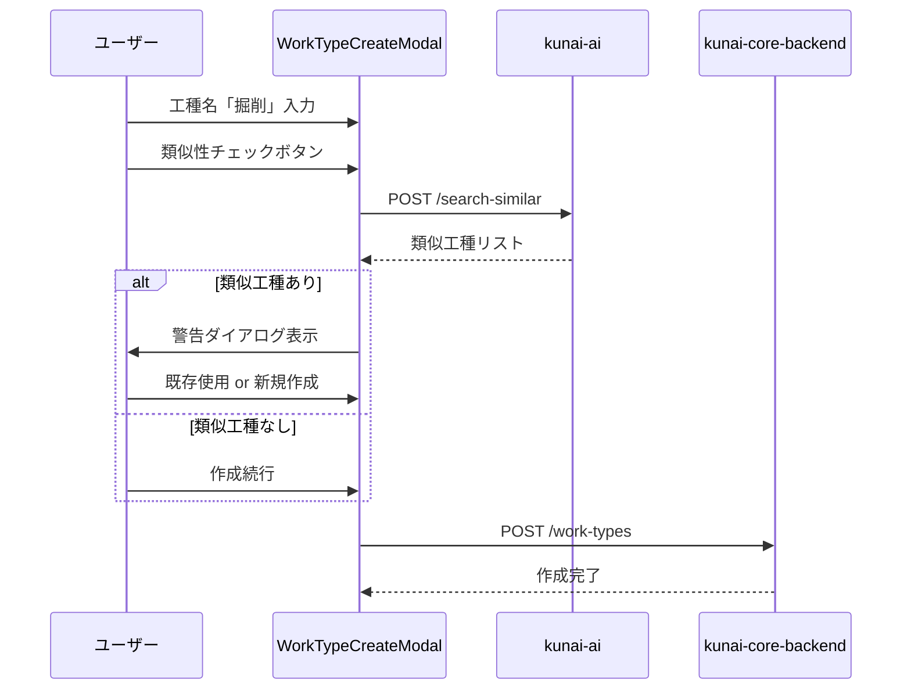

#### 類似性チェックボタン追加

**kunai-core-frontend**:
既存の`WorkTypeCreateModal` [28-cite-4](#28-cite-4) に機能追加

```typescript
const handleCheckSimilarity = async () => {
  const response = await httpClient.ai.POST("/api/ai/v1/work-types/search-similar", {
    body: {
      tenant_id: currentTenantId,
      major_category_id: selectedMajorCategoryId,
      name: form.getValues("name"),
      threshold: 0.8
    }
  });
  
  if (response.data.similar_items.length > 0) {
    showSimilarItemsDialog(response.data.similar_items);
  }
};
```

#### 統合テスト

**テストシナリオ**:
1. 工種作成→イベント発行→ベクトル化→検索で検出
2. 類似性チェック→警告表示→ユーザー判断
3. エラーケース(API障害、DLQ)の動作確認

---

## データフロー全体図

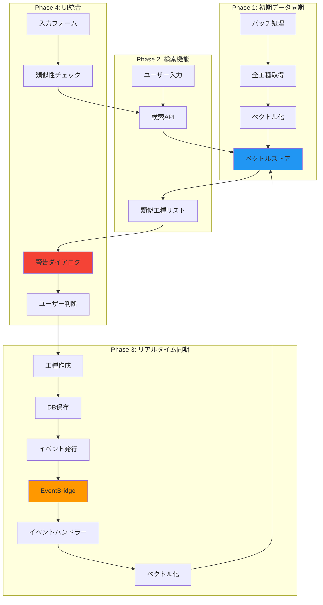

## 技術スタック

| 層 | 技術 | 用途 |
|---|---|---|
| **フロントエンド** | React + TypeScript + Zod | UI・バリデーション |
| **バックエンド** | TypeScript + Prisma | API・データ管理 |
| **AI処理** | Python + LangChain + OpenAI | ベクトル化・検索 |
| **ベクトルストア** | Pinecone/Qdrant | ベクトルインデックス |
| **イベント配信** | AWS EventBridge | 非同期連携 |
| **データベース** | PostgreSQL | 工種・細別データ |

## 成功指標

### ステップ1終了時
- [ ] 検索速度: 0.3-0.5秒
- [ ] 検索精度: 類似度0.8以上

### Citations

**File:** src/routes/api/ai/v1/protected/work_trees/search.py (L21-28)
```python
@router.post("/search", response_model=searchResponseBody)
async def search(request: searchRequestBody) -> searchResponseBody:
    # コマンド作成
    command = SearchWorktreesCommand(query=request.query, context=request.context)
    # ユースケース実行
    usecase = SearchWorktreesUsecase()
    result = await usecase.execute(command)
    return searchResponseBody(vector=result.vector)
```
