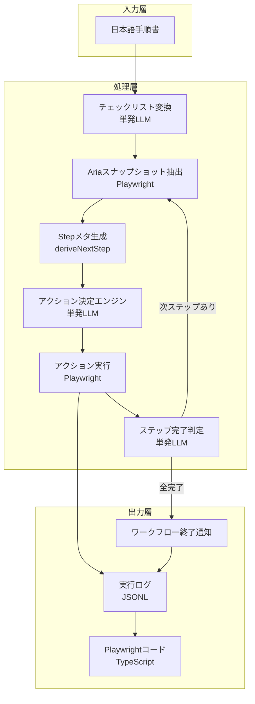

# Playwright×LLM UI 自動化システム 詳細設計書

## 🎯 目的・対象範囲

### 目的

- UI の変更に自動追従できるブラウザ自動化システムの構築
- 小規模 LLM と Playwright を組み合わせた、コンテキスト効率的な実装
- 実行ログから自動的に Playwright コードを生成できる仕組みの実現

### 対象範囲

- 一般ユーザーが記述した日本語手順書の自動実行
- Web アプリケーションの操作自動化（クリック、入力、選択、アサーション）
- 実行コストと精度のバランスを考慮した段階的最適化

## 🏗 システム構成

### 高レベルアーキテクチャ



> ステップ完了判定は「当該ステップ完了」と「全ステップ完了」を明示的に判定し、全完了時に `ワークフロー終了通知` を発火させてログ・結果出力へ遷移する。未完了の場合は次のステップに備えて Accessibility スナップショット取得へループバックする。

### 主要コンポーネント

| コンポーネント          | 責務                                                | 使用技術                     |
| ----------------------- | --------------------------------------------------- | ---------------------------- |
| Checklist Converter     | 日本語手順をチェックリスト形式に変換                | 小規模 LLM (GPT-4o-mini 等)  |
| Aria Snapshot Extractor | aria snapshot から操作可能要素を抽出                | Playwright Accessibility API |
| Step Meta Deriver       | チェックリスト/履歴/aria を基に Step を生成         | TypeScript (純関数)          |
| Action Decision Engine  | 現在のステップと aria snapshot からアクションを決定 | 小規模 LLM (ステートレス)    |
| Action Executor         | 決定されたアクションをブラウザで実行                | Playwright API               |
| Step Completion Judge   | ステップの完了判定                                  | 小規模 LLM (ステートレス)    |
| Code Generator          | 実行ログから Playwright コードを自動生成            | TypeScript                   |

## 🛠 実装詳細

### ディレクトリ構成

```text
playwright-llm-automation/
├── src/
│   ├── core/
│   │   ├── normalizer.ts         # 手順書の正規化
│   │   ├── extractor.ts          # Ariaスナップショット抽出
│   │   ├── decision.ts           # アクション決定
│   │   ├── executor.ts           # アクション実行
│   │   └── emergency.ts          # エマージェンシーモード
│   ├── adapters/
│   │   ├── playwright.ts         # Playwright統合
│   │   └── llm.ts               # LLM API統合
│   ├── services/
│   │   ├── history.ts           # 履歴管理
│   │   ├── site-profiles.ts     # サイトプロファイル
│   │   ├── site-config.ts       # ターゲットサイト取得（外部依存, TBD）
│   │   ├── sitemap-loader.ts    # sitemap動的取得/キャッシュ
│   │   └── auth-manager.ts      # 認証管理
│   ├── generators/
│   │   └── code-generator.ts    # コード生成
│   └── types/
│       └── index.ts              # 型定義
├── logs/                         # 実行ログ保存
├── generated/                    # 生成されたコード
```

### データモデル

#### Step 型定義

```typescript
type Step = {
  /** `step_${iteration}_${attempt}` のような一意ID */
  id: string;
  /** 該当チェックリスト項目のオリジナル文 */
  originalInstruction: string;
  intent:
    | "navigate"
    | "click"
    | "fill"
    | "select"
    | "upload"
    | "wait"
    | "assert"
    | "end"
    | "observe"
    | "scroll";
  target?: {
    role?: string;
    text?: string;
    label?: string;
    testId?: string;
    placeholder?: string;
    url?: string;
  };
  /** 資格情報プレースホルダや固定入力値 */
  value?: string | string[];
  asserts?: Array<{
    kind: "visible" | "urlIncludes" | "textPresent";
    arg: string;
  }>;
  timeoutMs?: number;
  fallbackStrategies?: string[];
};

type StepHistoryEntry = {
  step: Step;
  decision?: ActionDecisionOutput;
  outcome?: "success" | "retry" | "failed";
  timestamp: string;
};
```

`Step` はワークフロー開始時に固定生成せず、`deriveNextStep({ checklist, stepIndex, ariaSnapshot, history })` のような純関数で各ループ毎に再構築する。生成された Step は `WorkflowContext.stepHistory` に `StepHistoryEntry` として push し、LLM には最新 Step のみを `ActionDecisionInput.currentStepMeta` に載せて渡す。再試行時も必ず Step を再生成し、同じメタを再送しないポリシーを徹底する。

## 📝 処理フロー実装

### 0. ターゲットサイトの取得（外部依存・TBD）

```typescript
// 外部プロバイダからターゲットサイト一覧を取得する（仕様は後日確定）。
// 当面は引数・戻り値は最小限、失敗時は空配列で継続。
export interface SiteProfile {
  url: string;
  name?: string;
  characteristics?: string[];
  common_selectors?: Record<string, string>;
}

export async function getTargetSites(ctx?: {
  tenantId?: string;
  region?: string;
}): Promise<SiteProfile[]> {
  // TODO: 外部依存先（例: API Gateway, S3, DB等）を決めた後に実装。
  // ここではダミーを返す。仕様はTBD。
  return [];
}
```

#### 設定例（sites.yaml）

```yaml
sites:
  - url: "https://www.example.com"
    name: "Example"
    common_selectors:
      search_box: 'input[name="q"]'
```

注: sitemap は記載不要（実行時に動的発見）。`important_paths`/`blocked_paths` はスキーマから除外（使用しない）。

### 1. Checklist Converter（日本語 → チェックリスト）

```typescript
interface ChecklistItem {
  completed: boolean;
  text: string;
  originalIndex: number;
}

async function convertToChecklist(rawText: string): Promise<string[]> {
  const prompt = `
You are converting natural-language workflow instructions into imperatively phrased checklist items.

Rules:
1. Output a JSON array of strings. No code fences.
2. Each string must be a single action rewritten in plain imperative form.
3. Do not invent steps that were not explicitly present in the input.
4. Remove any numbering/bullets such as "1." or "(1)".
5. Keep the original order of actions.

Input instructions (Japanese may be included):
${rawText}
`;

  const response = await callLLM(prompt);
  const jsonMatch = response.match(/\[[\s\S]*\]/);
  if (!jsonMatch) {
    throw new Error("LLM did not return a JSON array");
  }

  const checklist = JSON.parse(jsonMatch[0]) as string[];
  return checklist
    .map((item) => item.trim())
    .filter((item) => item.length > 0)
    .map((item) => `[] ${item}`);
}

// 進捗管理付きチェックリスト生成
```

> Phase 1 以降、`convertToChecklist` の責務はチェックリスト文字列の整形に限定し、Step メタの生成は実行ループ内で行う。

### 2. Step Derivation（ループ毎のメタ生成）

```typescript
interface DeriveNextStepInput {
  checklist: string[];
  stepIndex: number;
  ariaSnapshot: string;
  history: StepHistoryEntry[];
}

type DeriveNextStep = (input: DeriveNextStepInput) => Option<Step>;

const deriveNextStep: DeriveNextStep = ({
  checklist,
  stepIndex,
  ariaSnapshot,
  history,
}) => {
  // instruction → intent 初期推定 → ariaSnapshot 突合せ → target/value 補完
};
```

- 生成失敗時（`None`）は従来の文字列のみで LLM を呼び出す。
- 再試行時も `deriveNextStep` を必ず再実行し、最新 DOM と履歴に基づいて更新する。
- 成功した Step は `WorkflowContext.stepHistory` に push し、`ActionDecisionInput.currentStepMeta` へ注入する。

```typescript
function formatChecklistWithProgress(
  checklist: string[],
  currentIndex: number
): string {
  return checklist
    .map((item, idx) => {
      if (idx < currentIndex) return item.replace("[]", "[x]");
      if (idx === currentIndex) return `→ ${item}`;
      return item;
    })
    .join("\n");
}
```

### 2. Aria Snapshot Extractor（軽量要素抽出）

```typescript
async function extractAriaSnapshot(page: Page): Promise<string> {
  // Accessibility Tree全体を取得（既に構造化・軽量化済み）
  const ariaSnapshot = await page.accessibility.snapshot({
    interestingOnly: true, // 操作可能な要素のみ（デコラティブ要素を除外）
  });

  // 操作可能な要素だけを抽出してシンプルな形式に変換
  const formatAriaSnapshot = (node: any): any[] => {
    const relevant = [];

    function traverse(n: any) {
      if (
        n.role &&
        ["button", "link", "textbox", "combobox", "checkbox", "radio"].includes(
          n.role
        )
      ) {
        relevant.push({
          role: n.role,
          name: n.name,
          value: n.value,
          checked: n.checked,
          selected: n.selected,
          disabled: n.disabled,
        });
      }
      if (n.children) {
        n.children.forEach(traverse);
      }
    }

    traverse(node);
    return relevant;
  };

  const simplifiedSnapshot = formatAriaSnapshot(ariaSnapshot);
  return JSON.stringify(simplifiedSnapshot, null, 2);
}
```

### 3. Action Decision Engine（アクション決定）

```typescript
interface ActionDecisionInput {
  ariaSnapshot: string; // aria-label等のアクセシビリティ情報
  currentStep: string; // 現在実行中のステップ
  checklist: string[]; // チェックリスト全体（進捗付き）
  stepIndex: number; // 現在のステップインデックス
}

interface ActionDecisionOutput {
  method: "getByRole" | "getByText" | "locator" | "getByTestId";
  selector: {
    role?: string;
    name?: string;
    text?: string;
    locator?: string;
    testId?: string;
  };
  action: "click" | "fill" | "select" | "wait";
  value?: string;
  confidence?: number; // 0.00 - 1.00（LLMが返す自信度）
  rationale?: string; // 自信度の根拠（1行）
}

async function decideAction(
  input: ActionDecisionInput
): Promise<ActionDecisionOutput> {
  const prompt = `
現在のタスク進捗:
${input.checklist
  .map((item, i) => {
    if (i < input.stepIndex) return item.replace("[]", "[x]");
    if (i === input.stepIndex) return `→ ${item}`;
    return item;
  })
  .join("\n")}

現在のステップ: "${input.currentStep}"

aria snapshot:
${input.ariaSnapshot}

次に実行すべきアクションを決定してください。
出力形式:
{
  "method": "getByRole|getByText|locator|getByTestId",
  "selector": {
    "role": "button",
    "name": "ログイン"
  },
  "action": "click|fill|select|wait",
  "value": "入力値（fillの場合）"
}
`;

  const response = await callLLM(prompt);
  return JSON.parse(response);
}
```

#### 信頼度プロンプト（要旨）

「今回の提案アクションが手順に適合する確からしさを 0.00–1.00 で数値のみ返し、続けて 1 行で根拠を述べてください。role/label での一意特定は高評価、曖昧なテキスト近似や複数候補が存在する場合は低評価としてください。」

### 4. Action Executor（実行）

```typescript
async function executeAction(
  page: Page,
  action: ActionDecisionOutput,
  mode: "aria" | "dom" = "aria"
): Promise<ExecutionResult> {
  let element;

  // モードに応じて使用可能なセレクタを制限
  if (mode === "aria") {
    // Accessibility Treeベース：限定的なセレクタのみ
    switch (action.method) {
      case "getByRole":
        element = await page.getByRole(action.selector.role, {
          name: action.selector.name,
        });
        break;
      case "getByText":
        element = await page.getByText(action.selector.text);
        break;
      case "getByTestId":
        // DOM補完情報から取得した場合のみ
        if (action.selector.testId) {
          element = await page.getByTestId(action.selector.testId);
        }
        break;
      default:
        throw new Error(`Selector ${action.method} not available in aria mode`);
    }
  } else {
    // 軽量DOM送信時：全セレクタ使用可能
    switch (action.method) {
      case "getByRole":
        element = await page.getByRole(action.selector.role, {
          name: action.selector.name,
        });
        break;
      case "getByLabel":
        element = await page.getByLabel(action.selector.label);
        break;
      case "getByPlaceholder":
        element = await page.getByPlaceholder(action.selector.placeholder);
        break;
      case "getByText":
        element = await page.getByText(action.selector.text);
        break;
      case "locator":
        element = await page.locator(action.selector.locator);
        break;
      case "getByTestId":
        element = await page.getByTestId(action.selector.testId);
        break;
    }
  }

  // アクションを実行
  switch (action.action) {
    case "click":
      await element.click();
      break;
    case "fill":
      await element.fill(action.value || "");
      break;
    case "select":
      await element.selectOption(action.value || "");
      break;
    case "wait":
      await page.waitForTimeout(parseInt(action.value || "1000"));
      break;
  }

  return {
    success: true,
    method: action.method,
    selector: action.selector,
    action: action.action,
  };
}

// ステップ完了判定
async function checkStepCompletion(
  step: string,
  ariaSnapshot: string
): Promise<boolean> {
  const prompt = `
実行したステップ: "${step}"

現在のaria snapshot:
${ariaSnapshot}

このステップは完了しましたか？

回答は "true" または "false" のみで答えてください。
`;

  const response = await callLLM(prompt);
  return response.trim().toLowerCase() === "true";
}
```

### 4.1 事前チェック補助 `resolveCandidateCount`

```typescript
// 提案された selector が解決する要素数を数える軽量プリチェック。
// 0件 or 複数件なら LLM 実行に進まず即フォールバックへ（その試行は失敗としてカウント＝attempt++）。
async function resolveCandidateCount(
  page: Page,
  action: ActionDecisionOutput
): Promise<number> {
  try {
    switch (action.method) {
      case "getByRole": {
        const loc = page.getByRole(action.selector.role as any, {
          name: action.selector.name,
        });
        return await loc.count();
      }
      case "getByText": {
        const loc = page.getByText(action.selector.text || "");
        return await loc.count();
      }
      case "getByTestId": {
        const loc = page.getByTestId(action.selector.testId || "");
        return await loc.count();
      }
      case "locator": {
        const loc = page.locator(action.selector.locator || "");
        return await loc.count();
      }
      default:
        return 0;
    }
  } catch {
    return 0;
  }
}
```

### 5. メイン実行ループ

```typescript
async function executeWorkflow(workflowText: string) {
  // Step 1: チェックリスト化
  const checklist = await convertToChecklist(workflowText);
  const results = [];

  for (let i = 0; i < checklist.length; i++) {
    const currentStep = checklist[i].replace("[]", "").trim();
    let stepCompleted = false;
    let attemptCount = 0;

    while (!stepCompleted && attemptCount < 3) {
      // aria snapshot取得（軽量！）
      const ariaSnapshot = await extractAriaSnapshot(page);

      // 進捗状況を含むチェックリスト生成
      const checklistWithProgress = checklist.map((item, idx) => {
        if (idx < i) return item.replace("[]", "[x]");
        if (idx === i) return item; // 現在のステップ
        return item;
      });

      // LLMでアクション決定（confidence と rationale を返す）
      const action = await decideAction({
        ariaSnapshot: ariaSnapshot,
        currentStep: currentStep,
        checklist: checklistWithProgress,
        stepIndex: i,
      });

      const resolvedCount = await resolveCandidateCount(page, action);
      if (resolvedCount !== 1) {
        results.push({
          step: i + 1,
          description: currentStep,
          action: {
            ...action,
            confidence: 0,
            rationale: "precheck: non-unique or zero match",
          },
          result: {
            success: false,
            method: action.method,
            selector: action.selector,
            action: action.action,
          },
          completed: false,
          timestamp: new Date(),
        });
        // 失敗としてカウントし、次のフォールバック戦略へ
        attemptCount++;
        continue;
      }

      // Playwright実行
      const result = await executeAction(page, action);

      // ステップ完了判定
      stepCompleted = await checkStepCompletion(
        currentStep,
        await extractAriaSnapshot(page)
      );

      results.push({
        step: i + 1,
        description: currentStep,
        action: action,
        result: result,
        completed: stepCompleted,
        timestamp: new Date(),
      });

      attemptCount++;
    }

    // チェックマーク更新
    if (stepCompleted) {
      checklist[i] = checklist[i].replace("[]", "[x]");
      console.log(`✅ ステップ${i + 1}完了: ${currentStep}`);
    } else {
      console.log(`❌ ステップ${i + 1}失敗: ${currentStep}`);
      // エマージェンシーモードへ移行する可能性
    }
  }

  return generateExecutionLog(results);
}
```

## 🌐 Sitemap 取得フロー

目的: アクセス先ドメインの公式 sitemap を実行時に自動取得し、内部参照できるようにする（解析して得た URL 一覧は LLM に渡す）。

挙動:

- 取得順: `https://{domain}/robots.txt` の `Sitemap:` 行 → `https://{domain}/sitemap.xml` の順で試行。
- タイムアウト: 3 秒、最大受信: 2MB、画像/ニュース系は読み飛ばし。
- キャッシュ: 永続ストアは使わず、実行中のインメモリと `/tmp` のみ（コールドスタートで破棄）。HTTP 条件付き GET（ETag/Last-Modified）を使用。
- プロンプト注入: 取得した sitemap の URL 一覧を注入する（要約/フィルタなし、分割なしの単発投入）。
- sites.yaml に sitemap を記載するオプションは設けない（常に動的発見）。

擬似コード:

```ts
async function loadSitemap(domain: string): Promise<SitemapDoc | null> {
  const cached = await cache.get(domain);
  if (cached && !cached.expired) return cached.doc;

  const targets = await discoverFromRobotsOrDefault(domain);
  const urls: string[] = [];
  for (const u of targets) {
    const doc = await fetchXml(u, { timeoutMs: 3000, maxBytes: 2_000_000 });
    if (!doc) continue;
    urls.push(...extractUrls(doc));
    if (isIndex(doc)) urls.push(...(await expandIndex(doc))); // ネスト展開のみ、クロールはしない
  }

  const result = { domain, urls: dedupe(urls) };
  await cache.set(domain, result, { ttlHours: 24 });
  return result;
}
```

### プロンプト投入の上限制御（実装規約・単発）

- 分割は行わない。1 回のプロンプトで渡す。
- 上限: 最大 300 URL または 10,000 文字のいずれか小さい方。
- キャッシュ: 永続ストアは使わず、実行中のインメモリと `/tmp` のみ（コールドスタートで破棄）。HTTP 条件付き GET（ETag/Last-Modified）を使用。
- 形式: `urls:\n<URL1>\n<URL2>\n...` のプレーンテキスト列挙。

## DOM 投入タイミング

- 通常は A11y のみ。
- エマージェンシーのみ軽量 DOM を投入し、大規模モデルで分析。

## 🔥 エマージェンシーモード実装

```typescript
class EmergencyMode {
  private failureCount = 0;
  private lastActionTime = Date.now();
  private confidenceHistory: number[] = [];

  shouldActivate(context: ExecutionContext): boolean {
    // 3回以上失敗
    if (this.failureCount >= 3) return true;

    // 30秒以上停滞
    if (Date.now() - this.lastActionTime > 30000) return true;

    // 信頼度が継続的に低い（直近5件の移動平均 < 0.3）
    const window = this.confidenceHistory.slice(-5);
    const avgConfidence = window.length
      ? window.reduce((a, b) => a + b, 0) / window.length
      : 1.0;
    if (avgConfidence < 0.3) return true;

    return false;
  }

  async analyze(page: Page, context: ExecutionContext): Promise<RecoveryPlan> {
    // 大規模LLMに切り替え
    const llmModel = "gpt-4"; // or 'claude-3-opus'

    // body配下の軽量DOMを取得（CSS/JS削除済み）
    const lightweightDOM = await page.evaluate(() => {
      const body = document.body.cloneNode(true);
      // script/styleタグを削除
      body
        .querySelectorAll('script, style, link[rel="stylesheet"]')
        .forEach((el) => el.remove());
      // 不要な属性を削除（class以外のstyle関連属性など）
      body.querySelectorAll("*").forEach((el) => {
        el.removeAttribute("style");
        // data-testid等の有用な属性は残す
      });
      return body.innerHTML;
    });

    // 包括的な分析プロンプト（軽量DOM投入は緊急時のみ）
    const analysis = await callLLM({
      model: llmModel,
      prompt: `
現在の状況を分析してください：

目的: ${context.userGoal}
現在のステップ: ${context.currentStep}

直近の試行:
${JSON.stringify(context.recentActions, null, 2)}

エラー:
${JSON.stringify(context.errors, null, 2)}

軽量DOM（body配下、CSS/JS削除済み）:
${lightweightDOM}

問題を特定し、次のアクションを提案してください。
使用可能なセレクタ: getByRole, getByLabel, getByPlaceholder, getByText, locator, 近接セレクタ
      `,
    });

    return this.buildRecoveryPlan(analysis);
  }
}
```

## 🎭 複雑 UI 対応実装

### 仮想リスト探索

```typescript
class VirtualListNavigator {
  private scrollHistory: Array<{ position: number; timestamp: number }> = [];
  private maxScrollAttempts = 10;

  // 検出ヒューリスティクス
  async detectVirtualList(
    page: Page,
    container: ElementHandle
  ): Promise<boolean> {
    const meta = await container.evaluate((el) => ({
      scrollHeight: el.scrollHeight,
      clientHeight: el.clientHeight,
      overflowY: getComputedStyle(el).overflowY,
    }));
    const ratio = meta.clientHeight ? meta.scrollHeight / meta.clientHeight : 1;
    if ((meta.overflowY === "auto" || meta.overflowY === "scroll") && ratio > 2)
      return true;
    // 役割ベース
    const role = await container.getAttribute("role");
    return (
      !!role && ["list", "listbox", "grid", "table", "tree"].includes(role)
    );
  }

  async findInVirtualList(
    page: Page,
    containerSelector: string,
    targetText: string
  ): Promise<ElementHandle | null> {
    const container = await page.$(containerSelector);
    if (!container) return null;

    // スクロール可能性/仮想リスト検出
    const isScrollable = await page.evaluate(
      (el) => el.scrollHeight > el.clientHeight,
      container
    );
    const isVirtual =
      isScrollable && (await this.detectVirtualList(page, container));
    if (!isScrollable || !isVirtual) return null;

    // 段階的探索
    for (let i = 0; i < this.maxScrollAttempts; i++) {
      // 現在のビューポート内を探索
      const found = await this.searchInViewport(page, targetText);
      if (found) return found;

      // スクロール（ループ検出付き）
      const scrolled = await this.smartScroll(container);
      if (!scrolled) break;
    }

    return null;
  }

  private async smartScroll(container: ElementHandle): Promise<boolean> {
    const currentPosition = await container.evaluate((el) => el.scrollTop);

    // ループ検出
    if (
      this.scrollHistory.some((h) => Math.abs(h.position - currentPosition) < 5)
    ) {
      return false;
    }

    this.scrollHistory.push({
      position: currentPosition,
      timestamp: Date.now(),
    });

    // スクロール実行
    await container.evaluate((el) => {
      el.scrollTop += el.clientHeight * 0.8;
    });

    await new Promise((r) => setTimeout(r, 300));
    return true;
  }
}
```

### Canvas（非対応）

Canvas 内部の論理オブジェクト操作はサポートしない。対象操作が Canvas 内部のみである場合、即座にエラー `CANVAS_UNSUPPORTED` を返す。

## 📊 実行ログ仕様

```json
{
  "sessionId": "session_20240126_001",
  "workflow": "売上データ確認",
  "timestamp": "2024-01-26T10:00:00Z",
  "steps": [
    {
      "stepNumber": 1,
      "originalInstruction": "ログインする",
      "ariaSnapshot": "...", // その時点のアクセシビリティスナップショット（抜粋可）
      "llmDecision": {
        "type": "click",
        "selector": { "role": "button", "name": "ログイン" },
        "confidence": 0.95,
        "rationale": "role=button, name完全一致で一意特定"
      },
      "execution": {
        "strategy": "byTestId",
        "selector": "page.getByTestId('login-btn')",
        "success": true,
        "duration": 450
      },
      "costs": {
        "llmTokens": 320,
        "llmResponseTime": 120
      }
    }
  ],
  "summary": {
    "totalSteps": 5,
    "successfulSteps": 5,
    "totalTokens": 1600,
    "totalDuration": 12500
  }
}
```

## 🛑 失敗時ログ仕様（ExecutionError）

実行失敗時に収集する詳細情報。運用・デバッグ・将来の自動復旧に活用する。

### 収集タイミング（発火条件）

- ステップが完了判定に至らず最大試行を超過（ELEMENT_NOT_FOUND/TIMEOUT 等）
- ADR で非対応と定義した条件（CANVAS_UNSUPPORTED）
- アサーションが満たされない（ASSERTION_FAILED）
- ナビゲーションの失敗/中断（NAVIGATION_FAILED）

### データモデル

```typescript
type ErrorType =
  | "ELEMENT_NOT_FOUND"
  | "TIMEOUT"
  | "NAVIGATION_FAILED"
  | "ASSERTION_FAILED"
  | "CANVAS_UNSUPPORTED";

type SelectorMethod =
  | "getByRole"
  | "getByLabel"
  | "getByPlaceholder"
  | "getByText"
  | "locator"
  | "getByTestId";

interface AttemptedSelector {
  method: SelectorMethod;
  selector: {
    role?: string;
    name?: string;
    label?: string;
    placeholder?: string;
    text?: string;
    locator?: string;
    testId?: string;
  };
  success: boolean;
  durationMs: number;
  errorMessage?: string;
}

interface ConsoleEntry {
  type: "log" | "info" | "warn" | "error";
  text: string;
  timestamp: string; // ISO8601
}

interface ExecutionError {
  sessionId: string;
  step: number; // 1-based
  intent: string; // 例: "click: ログイン"
  errorType: ErrorType;
  pageUrl: string;
  timestamp: string; // ISO8601
  details: {
    attempted: AttemptedSelector[];
    ariaSnapshot?: string; // 最大50KBにトリム
    screenshot?: string; // Base64（小規模）
    screenshotPath?: string; // 推奨: ファイル参照
    console: ConsoleEntry[];
  };
  hint?: string; // 次アクションの提案
}
```

### 保存場所と命名規約

- JSON: `logs/{sessionId}/errors/step-{step}-{ts}.json`
- スクリーンショット: `logs/{sessionId}/screenshots/error-{ts}.png`（`details.screenshotPath`で参照）
- サイズ制限: `ariaSnapshot`は 50KB で打ち切り（末尾に`...<truncated>`）

### マスキングとプライバシー

- 自動マスク（MUST）: email/電話/カード番号/セッション ID/クッキー/アクセストークン等は `****` に置換
- 任意フィールド除外（MAY）: 設定で `mask.screenshot=true` の場合、`screenshot`は保存せず `screenshotPath` のみ

### エラー分類基準

- ELEMENT_NOT_FOUND: 許可セレクタ全てが不一致（attempted 全て `success=false`）
- TIMEOUT: ステップの `timeoutMs` 超過、または待機タイムアウト
- NAVIGATION_FAILED: `page.goto()` 等の失敗、ネットワーク中断
- ASSERTION_FAILED: `asserts` 未達
- CANVAS_UNSUPPORTED: 非対応の Canvas 内部操作が唯一の選択肢

### サンプル

```json
{
  "sessionId": "session_20250110_001",
  "step": 2,
  "intent": "click: ログイン",
  "errorType": "ELEMENT_NOT_FOUND",
  "pageUrl": "https://example.com/signin",
  "timestamp": "2025-01-10T09:00:15.123Z",
  "details": {
    "attempted": [
      {
        "method": "getByRole",
        "selector": { "role": "button", "name": "ログイン" },
        "success": false,
        "durationMs": 820,
        "errorMessage": "locator resolved to 0 elements"
      },
      {
        "method": "getByText",
        "selector": { "text": "ログイン" },
        "success": false,
        "durationMs": 410
      }
    ],
    "ariaSnapshot": "[{\"role\":\"button\",\"name\":\"サインイン\"}]",
    "screenshotPath": "logs/session_20250110_001/screenshots/error-20250110T090015Z.png",
    "console": [
      {
        "type": "warn",
        "text": "Deprecated API used",
        "timestamp": "2025-01-10T09:00:14.950Z"
      }
    ]
  },
  "hint": "ボタン表記が『サインイン』に変更。getByRole(name:'サインイン')を試す"
}
```

## 🔧 非機能要件

### パフォーマンス要件

- **LLM レスポンス時間**: 200ms 以下（小規模モデル使用）
- **要素抽出時間**: 50ms 以下（Accessibility Tree API は高速）
- **1 ステップ実行時間**: 平均 2 秒以内
- **Accessibility Tree サイズ**: 通常 5-30KB（DOM 全体の 1/10 以下）

### 信頼性

- **リトライ機構**: 各アクション最大 3 回試行
- **フォールバック戦略**: 複数のセレクタ戦略を順次試行
- **エラーリカバリ**: ページリロード、再ログイン処理

### セキュリティ

- **認証情報管理**: 環境変数での管理
- **ログマスキング**: パスワード等の機密情報をマスク
- **実行環境分離**: サンドボックス環境での実行

## 🚀 実装計画

### Phase 0: 準備（1 日）

- [ ] TypeScript プロジェクトセットアップ
- [ ] 基本的な型定義とインターフェース

### Phase 1: MVP 実装（1 週間）

- [ ] Checklist Converter の基本実装
- [ ] Aria Snapshot 抽出機能
- [ ] シンプルな Action Decision Engine
- [ ] 基本的な Action Executor
- [ ] Step Completion Judge 実装
- [ ] 実行ログ記録機能

### Phase 2: 堅牢化・最適化（2 週間目）

- [ ] エマージェンシーモード実装
- [ ] 仮想リスト対応
- [ ] ワークフロー履歴システム
- [ ] 自然言語インテント解析
- [ ] コード自動生成機能

### Phase 3: 本番運用（3 週間目〜）

- [ ] ターゲットサイトリスト整備
- [ ] セキュアな認証情報管理
- [ ] 実行モード切り替え
- [ ] 監視・アラート機能
- [ ] パフォーマンスチューニング

---

関連ドキュメント:

- [[🗒️ 000024-playwright-llm-adaptive-automation-adr.md]]（ADR）
- [[🗒️ 000023-Playwright×LLMのUI複雑性とi18n対応ポリシー.md]]（初期検討）
