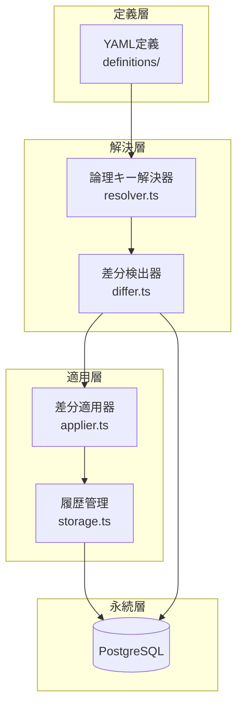

# マスタデータマイグレーションシステム設計

## 概要

本ドキュメントは、kunai-backendにおけるマスタデータ管理システムの設計について記述する。

### 背景と課題

- **現状の課題**
  - マスタデータ（`workType`、`workUnit`、`label`等）の管理が手作業依存
  - 環境間でのデータ不整合リスク
  - Seedは初期投入のみで、追加・変更・削除の履歴管理ができない
  - スキーママイグレーションとデータ変更が混在し、視認性が悪い

- **目標**
  - SSoT（Single Source of Truth）をアプリケーションコードとして管理
  - Prismaマイグレーションと同様の開発体験
  - 環境差分のない一貫したマスタデータ管理
  - 人間可読な差分履歴の実現

## アーキテクチャ

### 技術選定

| 技術 | 選定理由 |
|------|----------|
| **umzug** | ORM/DB非依存で軽量、TypeScript親和性が高い、責務がシンプル |
| **YAML** | 人間可読性が高い、JSONより記述が簡潔、コメント記述可能 |
| **Prisma Client** | 既存のDB接続を再利用、型安全性の確保 |
| **TypeScript** | 型安全性、既存コードベースとの統一性 |

### なぜumzugか

- **代替案の検討**
  - node-pg-migrate: PostgreSQL専用で柔軟性に欠ける
  - Knex migrations: Query Builder全体の導入が必要で重い
  - Liquibase/Flyway: エンタープライズ向けで複雑すぎる

- **umzugの利点**
  - 最小限の責務（順序管理・履歴管理・up/down実行）
  - Prisma Clientとの統合が簡単
  - 将来的な移行コストが低い
  - context注入による柔軟な拡張

### システム配置

Backend内に実装する（別リポジトリ化しない）理由：

1. **YAGNI原則**: 現時点では1プロジェクトのみ使用
2. **密結合の妥当性**: マスタデータは業務ドメインと密接
3. **開発効率**: 単一リポジトリでの高速イテレーション
4. **段階的拡張**: 将来必要になったら汎用部分のみ切り出し可能

```
kunai-backend/
├── src/                        # アプリケーション
├── prisma/                     # スキーマ定義
├── master-data/                # マスタマイグレーション（新規）
│   ├── definitions/            # YAML定義（SSoT）
│   ├── migrations/             # マイグレーションファイル
│   ├── lib/
│   │   ├── core/              # 汎用化可能な部分
│   │   └── kunai/             # kunai固有実装
│   └── index.ts               # CLIエントリポイント
└── scripts/
    └── master-data.sh         # 実行スクリプト
```

## データモデル

### 論理キー方式

UUID管理の課題を解決するため、人間可読な「論理キー」を導入：

```yaml
# definitions/work-types.yaml
construction:                    # 論理キー（人間可読）
  id: auto                       # UUID自動生成
  name: 建設工事
  description: 建物の新築・改築工事
  sortOrder: 1

# definitions/work-units.yaml  
foundation_work:                 # 論理キー
  id: auto
  workTypeRef: construction      # 論理キーで参照
  label: 基礎工事
  unitPrice: 50000
  cascade: true                  # 削除時の挙動
```

### データベーススキーマ

```prisma
// マイグレーション履歴
model MasterMigration {
  name      String   @id         // ファイル名
  appliedAt DateTime @default(now())
  checksum  String?              // 改ざん防止
  
  @@map("master_migrations")
}

// 論理キーマッピング（オプション）
model MasterKeyMapping {
  logicalKey String   @id        // "workType.construction"
  uuid       String   @unique
  tableName  String
  createdAt  DateTime @default(now())
  
  @@map("master_key_mappings")
}
```

## 処理フロー

### 全体アーキテクチャ



### 論理キー解決プロセス

1. **UUID解決フェーズ**
   - 論理キーに対応するUUIDを決定
   - 既存データがあれば既存UUID、なければ新規生成

2. **参照解決フェーズ**
   - `workTypeRef`等の参照フィールドを検出
   - 論理キー→UUID変換
   - 参照フィールドを実IDフィールドに置換

### 差分検出アルゴリズム

全レコードfetch→メモリ差分計算方式を採用：

```typescript
// 1. 現在のDBデータを全取得
const currentData = await prisma.workType.findMany();

// 2. YAMLデータとの差分を計算
const changes = {
  add: [],    // YAMLにのみ存在
  update: [],  // 両方に存在し内容が異なる
  delete: []   // DBにのみ存在
};
```

**選定理由**: 
- 数十件規模では性能問題なし
- 実装がシンプルで理解しやすい
- 具体的な差分内容を把握可能

## 実装仕様

### 依存関係管理

```typescript
// config/apply-order.ts
export const APPLY_ORDER = [
  'workType',      // 独立
  'role',          // 独立  
  'workUnit',      // workTypeに依存
  'label',         // workTypeに依存
] as const;
```

### CLIインターフェース

| コマンド | 説明 | 用途 |
|---------|------|------|
| `make master-plan` | 差分確認（dry-run） | 適用前の影響確認 |
| `make master-up` | マイグレーション適用 | 本番適用 |
| `make master-down` | ロールバック | 緊急時の切り戻し |
| `make master-status` | 適用状態確認 | 現在の状態把握 |

### 出力例

```bash
$ make master-plan

╔═══════════════════════════════════════════╗
║  Master Data Migration Plan               ║
╚═══════════════════════════════════════════╝

📊 WorkType (work-types.yaml)
  ➕ ADD (2)
    • construction: 建設工事
    • maintenance: 保守点検

📊 WorkUnit (work-units.yaml)
  ➕ ADD (2)
    • foundation_work → construction
    • electrical_inspection → maintenance

─────────────────────────────────────────────
Summary: 4 additions, 0 updates, 0 deletions
```

## セキュリティと安全性

### 安全機能

1. **Dry-run機能**: 実際の適用前に差分確認必須
2. **チェックサム検証**: マイグレーションファイルの改ざん防止
3. **トランザクション保護**: 各マイグレーションは単一トランザクション内実行
4. **削除時確認**: 本番環境での削除操作には確認プロンプト

### エラーハンドリング

```typescript
export class MasterDataError extends Error {
  constructor(
    message: string,
    public code: 'RESOLUTION' | 'DIFF' | 'APPLY' | 'ROLLBACK',
    public details?: any
  ) {
    super(message);
  }
}
```

### ロールバック戦略

- **基本方針**: Forward-onlyを推奨（問題は新規マイグレーションで修正）
- **down実装**: 破壊的変更時のみ実装
- **バックアップ**: 本番適用前の自動バックアップを推奨

## 非機能要件

### パフォーマンス

- 対象規模: 週次更新、数十件のマスタデータ
- 処理時間目標: 1分以内で完了
- メモリ使用量: 最大100MB程度

### 運用要件

- ローカル・ステージング・本番で同一コマンド体系
- CI/CDパイプラインへの組み込み可能
- 監査ログ: 全ての変更履歴を保持

### 拡張性

将来的な拡張ポイント：

1. **スケーラビリティ**
   - 大量データ対応（ストリーミング処理）
   - 並列実行（独立テーブルの並行適用）

2. **機能拡張**
   - 環境別マスタデータ
   - Web UI での可視化
   - 承認フロー統合

## 実装ロードマップ

### Phase 1: MVP（第1週）
- [x] 基本設計の確定
- [ ] umzug基本設定
- [ ] YAMLパーサー実装
- [ ] 単純な論理キー解決器
- [ ] 追加操作のみの差分適用

### Phase 2: 基本機能（第2週）
- [ ] 参照関係の解決
- [ ] 更新・削除操作対応
- [ ] CLIコマンド実装
- [ ] dry-run機能

### Phase 3: 本番対応（第3週）
- [ ] エラーハンドリング強化
- [ ] ロールバック実装
- [ ] 統合テスト
- [ ] 運用ドキュメント

## テスト戦略

### ユニットテスト
- 論理キー解決ロジック
- 差分検出アルゴリズム
- YAMLパース処理

### 統合テスト
- E2Eマイグレーションフロー
- ロールバック処理
- 依存関係解決

### 本番前検証
- ステージング環境での実行
- パフォーマンステスト
- 障害時のリカバリテスト

## まとめ

本設計により、以下が実現される：

1. **宣言的なマスタデータ管理**: YAMLによる可読性の高い定義
2. **環境一貫性**: 全環境で同一のマスタデータを保証
3. **履歴管理**: 全ての変更を追跡可能
4. **安全な運用**: dry-run、トランザクション、ロールバック対応
5. **開発効率**: Prismaマイグレーションと同様の開発体験

今後、実装を進めながら詳細を詰め、必要に応じて設計を更新していく。
