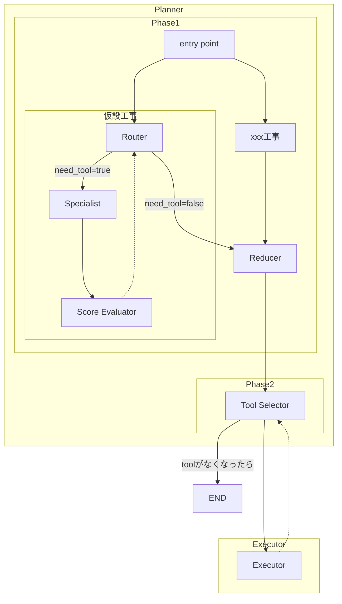

> [!info] 必要なセクションを選択して使用してください！

## 課題

- 工程表生成に必要な情報を全てPromptに突っ込みLLMのパワーを信じるもっとも愚直な方法で初版を実装した結果、responseが遅く実用に耐えうるレベルではなかった
	- 1回のtool-callにかかる時間は40~60秒
- 既存アーキテクチャは下記を参照
	- [[🗒️ 【建築】工程表生成機能の詳細設計]]
## 原因

### 長大なプロンプト

全ての情報を付加しているため、プロンプトは20,000トークンを超えており非効率的。chatGPTとClaudeによると商用プロダクトなら多くても8,000トークン以内に抑えた方がよい模様。
## 対策

入力トークンが5,000トークン以下になるよう処理を分割

## architecture_schedule_scenario_adjustment


### 戦略
- WFを呼び出すツールを決定するPlannerとツールを実行するExecutorに大別する。
- Plannerは大きく2つのPhaseから構成される。
	- Phase1：工事種別ごとに探索的にToolの候補を探す。
	- Phase2：Phase1で作成したToolの候補一覧から実際に呼び出すToolを決める。
- さらにPhase1の工事種別ごとのNodeはRouterとSpecialistに処理が分かれる。
	- Router：必要最小限の情報からどういう種類のtoolを実行すべきかを決める。
	- Specialist：Toolごとに存在。toolに渡す引数を正確に判定する。
	- Scorer：ToolのScore（≒優先度）を計算する。

### 全体

#### state

```json
{
	// 入力
	notify_message: Callable[[Message], Awaitable[None]],
	schedule_scenario: ScheduleScenario,
	structured_architecture_data: StructuredArchitectureData,
	schedule_information: ScheduleInformation
}
```
### Router

RouterはMap-Reduceパターンで下記の項目分だけ並列化する。
1. TEMPORARY：仮設工事
2. EARTHWORK：土工・地業工事
3. STRUCTURAL：躯体工事
4. ROOF_WATERPROOFING：屋根・防水工事
5. EXTERIOR：外装工事
6. INTERIOR：内装工事
7. EQUIPMENT：設備工事
8. LANDSCAPING：外構工事
9. OTHER：その他

#### promptイメージ

```
あなたはツールルーターです。今呼び出すべきツールを決定してください。

判断基準（Decision rubric）：

- structured_data に対して欠けている作業がある → "add_activity_tool"
- 重複や矛盾がある → "delete_activity_tool"
- 類似した要素が細かく分かれすぎている（過分割） → "merge_activities_tool"
- 「一式」など大きすぎて進捗管理を妨げる塊がある → "split_activities_tool"
- 工法等を加味してより適切な名前をつけることができる → "rename_activity_tool"
- よくわからない、どのケースにも当てはまらない → need_tool=false

できるだけ簡潔に答えてください。

{{工程粒度}} // HIGH/MEDIUM/LOW 
{{躯体構造}} // building_structure_type.py
{{階数}} // building_information.py
{{対象工事種別に絞った現在のアクティビティ}}
{{対象工事種別に絞った補足事項}} // ≒ユーザーからの指示
{{対象工事種別に絞った類似工程表}} // 今は空のリストでOK！
```

#### state

```json
{
	"need_tool": boolean,
	"tool_name": ToolType | None,
	"change_summary": str | None,  // このtoolの使用によって生じる変更点を60文字程度
	"brief_rationale": str | None,  // 60文字程度でtoolを呼ぶ根拠を記載
	"user_request": str | None,  // 60文字程度
	"sim_summary": str | None,  // 60文字程度
}
```

#### logics

- 工程表粒度は`src/domains/schedule_information/value_objects/schedule_scope.py`から変換する
	- MASTER：HIGH
	- MONTHLY：MIDDLE
	- WEEKLY：LOW
### Specialist

#### promptイメージ

```
あなたは工程シナリオ編集のスペシャリストです。あなたの責務は「ツールルーター が選択したツールに対して、適切な引数（arguments）を生成すること」です。

あなた自身がツールを選ぶことはありません。
Router から渡された tool_name のみに基づき、
そのツールを呼び出すための引数を設計してください。

{{躯体構造}} // building_structure_type.py
{{階数}} // building_information.py
{{対象工事種別に絞った現在のアクティビティ}}
{{Routerのstate}}
{{ツールの仕様}}  // 引数の説明など
```

#### state

```json
{
	"tool_name": ToolType,  // Routerから引き継ぎ
	"change_summary": str,  // Routerから引き継ぎ
	"brief_rationale": str,  // Routerから引き継ぎ
	"user_request": str,  // Routerから引き継ぎ
	"sim_summary": str,  // Routerから引き継ぎ
	"tool_args": ToolArgs,
	"risks": str[],  //  変更により生じるリスク（1つのリスクにつき30文字程度）
}
```

### ScoreEvaluator

#### Promptイメージ

```
あなたは建設工程シナリオの評価者です。
候補操作（tool candidate）の説明を読み、各スコアを0.0〜1.0で評価してください。

### スコアリング基準（閾値ガイド）

【1. policy_score.user（ユーザー意図一致度）】
- 1.0〜0.9 : ユーザーの方針と完全一致（明示的に同方向）
- 0.8〜0.7 : ほぼ一致（意図に沿っているが完全一致ではない）
- 0.6〜0.4 : 中立（意図が不明確または部分的に反している）
- 0.3〜0.1 : 方針に逆行（ユーザー希望と明確に異なる）
- 0.0 : 完全に逆（禁止方針）

【2. policy_score.sim（類似工事一致度）】
- 1.0〜0.9 : 類似工事でも頻繁に採用されている操作
- 0.8〜0.7 : 一般的に多く採用される傾向
- 0.6〜0.4 : どちらとも言えない（採用例が半々）
- 0.3〜0.1 : 類似工事であまり見られない
- 0.0 : 類似工事では明確に避けられている

【3. qc_score（安全・法規・品質健全度）】
- 1.0〜0.9 : 安全・法規・品質上の懸念なし（依存・検査・手順も維持）
- 0.8〜0.7 : 軽微な懸念あり（依存の順序変更や軽い検査調整が必要）
- 0.6〜0.4 : 注意が必要（品質・安全手順に影響し得る）
- 0.3〜0.1 : リスクが高い（依存破壊、検査抜け、法規違反の恐れ）
- 0.0 : 実行不可（安全・法規上の致命的欠陥）

【4. impact_score.visibility_gain（工程見通し・粒度整合）】
- 1.0〜0.9 : 見通しが大幅に向上（冗長性削減・粒度適正化・欠落補完）
- 0.8〜0.7 : 明確に改善（理解しやすく整理される）
- 0.6〜0.4 : 少し改善（効果は限定的）
- 0.3〜0.1 : ほぼ変化なし／むしろ煩雑化の可能性
- 0.0 : 悪化（工程が見づらくなる）

⚠️補足ルール：
- スコアは0.0〜1.0の範囲で小数第2位まで（例: 0.83）。
- 候補が明らかに安全・明確・整合的なら全体的に高めに。
- 曖昧な場合は0.5（中立）を採用。
  
{{Specialistのstate}}
```

#### state

```json
{
	"tool_name": ToolType,  // Specialistから引き継ぎ
	"change_summary": str,  // Specialistから引き継ぎ
	"brief_rationale": str,  // Specialistから引き継ぎ
	"user_request": str,  // Specialistから引き継ぎ
	"sim_summary": str,  // Specialistから引き継ぎ
	"tool_args": ToolArgs,  // Specialistから引き継ぎ
	"risks": str[],  // Specialistから引き継ぎ
	"policy_score": {
		"user": float,  // ユーザーの意図との一致度
		"sim": float  // 類似工事との一致度
	},
	"qc_score": float,  // 安全・法規・品質の健全度
	"impact_score": {
		"visibility_gain": float,  // 工程の見通し・粒度整合がどれだけ良くなるか
	},
	"score": float
}
```

#### logics

- scoreは下記の計算式で計算
```python
# 重みはいったん仮で設定する
policy = w_user*user + w_org*org + w_sim*sim
score  =   α * policy 
        +  β * visibility_gain
        +  γ * qc
```
### Reducer

#### state

```json
{
	"tool_candidates": Annotated[ScoreEvaluatorのState, operator.add]
}
```


#### logics

- 足し合わされた`tool_candidates`から重複要素を削除する。
	- tool_nameとtool_argsが同じであれば重複とみなす。

### Tool Selector

#### promptイメージ

```
あなたは ToolSelector です。あなたの責務は「与えられたツールを実行すべきか判断する」ことです。
Toolを実行すべきでなければneed_tool=falseを返してください。

{{ScoreEvaluatorのState}}  //candidate一件分
{{error}} // retryであれば前回のエラー内容を反映
```

#### logics

- 本ノードでretryを制御する（max_retries=3）
	- 4回目の失敗でWF全体を失敗させる
- tool_candidatesのうち、scoreが閾値より高いものをscoreの降順で渡していく
	- 渡すtool_candidatesがなくなったら処理終了し、ENDにルーティングする
### Executor

#### logics
- Tool Selectorで選択されたToolを実行する
- `src/workflows/architecture_schedule_scenario_adjustment/nodes/adjustment_executor_node.py`を参考にする

