## ユビキタス言語の整理

### 歩掛：Work Norm

- 歩掛項目ごとに設定される歩掛単位数量の作業を達成するために必要な`リソースの総量`
- 単位はリソースと時間で表現される
- ex. 
	- 労務：2人日、機械：1台時

### 歩掛項目：Work Norm Category

- 歩掛を分類するための項目
- 例えば歩掛項目が労務の歩掛は、労務歩掛と呼称する
- ex. 
	- 労務・機械・材料

### 歩掛単位数量：Work Norm Unit Quantity

- 歩掛を計算するための単位数量
- この歩掛単位数量を達成するために必要なリソースの総量が歩掛となる
- ex. 
	- コンクリート打設の基準数量を100、単位をm3とするなら、歩掛単位数量は100m3となる

### 基準歩掛：Base Work Norm

- 歩掛項目ごとに設定される基準の歩掛
- 種々の条件によって変化せず、基準の歩掛として使用される
### 条件付歩掛：Conditional Work Norm

- 歩掛項目ごとに条件付きで設定された歩掛
- 条件式に当てはまる場合のみ条件付歩掛が適用され、当てはまらない場合は基準歩掛が適用される
- ex.
	- 地質がxxxの場合、労務歩掛はyyyとなる
	- 気温がzzzの場合、機械歩掛はaaaとなる

  

## データモデル

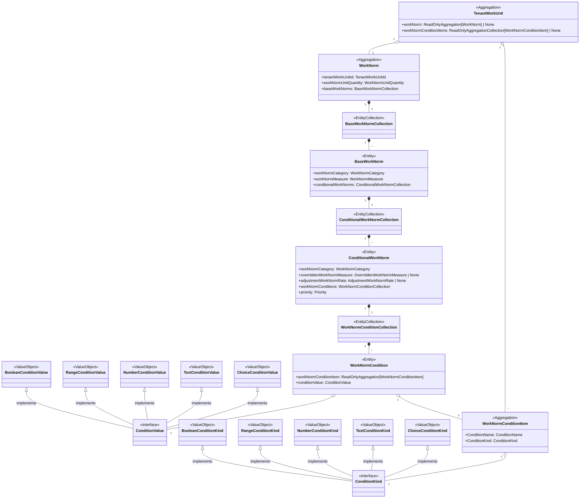

  
  

各 WorkUnit（細別）に対して、「基準の歩掛（固定）」と「条件で上書き／補正される歩掛（条件付）」を歩掛項目ごとに持ち、

入力された現場条件から「最終的に使う歩掛」が一意に決まる。（今は工程生成のみをターゲットにしているが、将来的には責務が増える想定。）
### 主要クラスの役割

**TenantWorkUnit**

- その細別の歩掛の入り口。
- 歩掛ロジックは WorkNorm に委譲。
- 条件に使える項目（地質、気温）の定義リスト（WorkNormConditionItem）もここで握る。

**WorkNorm**

- 計算カーネル。
- 「歩掛単位数量（例: 100 m³）」と、カテゴリ別の BaseWorkNorm 群を持つ。
- 入力条件を受けてカテゴリごとの最終歩掛を返す。


**BaseWorkNorm**

- そのカテゴリ（労務/機械/材料…）の“基準値”を持ち、合わせて条件付ルール（ConditionalWorkNorm）を複数保持。
- 入力条件に合うルールがあれば上書き or 係数補正を適用する。

**ConditionalWorkNorm**

- 「地質=砂質」「気温≤5℃」など複数条件のANDで構成。
- 合致したときの上書き値（overriddenWorkNormMeasure）か補正率（adjustmentWorkNormRate）を持つ。
- priorityで競合時の優先度を制御。

**WorkNormConditionItem** / **ConditionKind** / **ConditionValue**

- 条件の“型と値”の統制を担当。
- 例: 地質: Choice(砂/粘土/礫), 気温: Number, 気温帯: Range など。
## テーブル定義

  

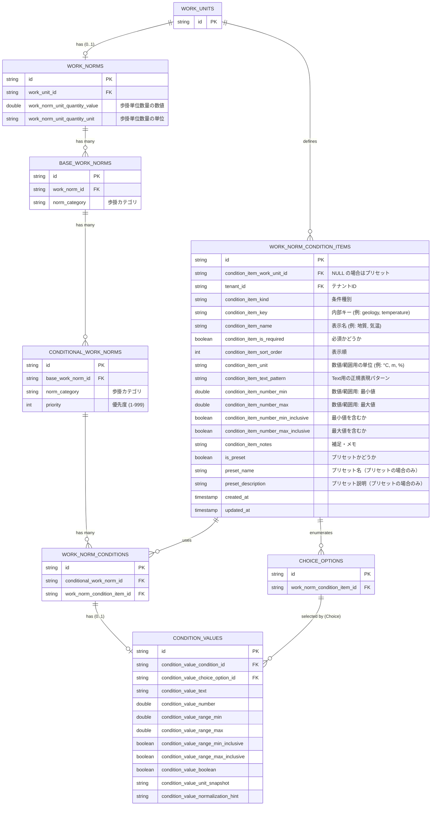


one-of制約はDomain Modelで実現する。

## 画面レイアウト

### コンセプト

### 画面構成

### 1. マスターデータ管理画面（メイン画面）
[工程マスターデータ機能](工程マスターデータ機能.md#画面レイアウト)

### 2. 細別詳細情報パネル

#### 2.1 細別情報エリア
上記リンクの内容のため割愛

#### 2.2 歩掛データエリア
- 単位基準エリア：単位基準の数値と単位を入力・選択できる
- 基本歩掛エリア：条件が存在しない・当てはまらない場合に使用される歩掛を設定できる
	- 種別・値・単位を入力・選択できる
	- 歩掛は複数作成できる
	- 各歩掛は無効化・有効化・削除ができる
	- 基本歩掛の設定は必須
- 詳細歩掛エリア：特定の条件で適用される歩掛を設定できる
	- 条件項目エリア：歩掛を決定するための条件を設定できる
		- 作成・編集はモーダルから行える
		- 条件名・条件タイプ・必須or任意を設定でき、条件タイプによって追加で入力項目が増える場合がある
		- プリセットから条件をフォームに反映できる、プリセットで反映された内容は変更できる
		- プリセット設定ボタンでプリセット管理モーダルを開ける
	- 条件組み合わせエリア：条件項目を組み合わせて対応する歩掛を設定できる
		- 作成・編集はモーダルから行える
			- 歩掛の項目は基本歩掛と同様の項目
			- 優先度を設定できる（UI上は上の方が高優先度、下の方が低優先度）
		- 条件付歩掛は優先度順で表示される（高優先度が上、低優先度が下）
		- 各条件歩掛は削除・複製ができる
		- 文字列検索を行うことができる
		- 条件名と歩掛種別でフィルタリングを行うことができる
		- **上記の文字列検索と条件名フィルタリングは同様のことをやっているので、条件名フィルタリングは不要かもしれない**

#### 3. プリセット管理モーダル
- 条件項目エリアのプリセット設定ボタンから開くことができる
- 作成済みのプリセット一覧が表示される
- プリセットの新規作成・編集・削除が行える
- 各プリセットは以下の項目を設定できる：
  - 条件名・条件タイプ・必須or任意
  - 条件タイプが選択式の場合は選択肢も設定可能
- 文字列検索でプリセットを絞り込める

## 技術要件（受け入れ条件）

### パフォーマンス要件

- **初期表示**: 条件付歩掛を含む画面表示を500ms以内
- **更新処理**:
  - 単位基準: リアルタイム更新、レスポンス500ms以内
  - 基本歩掛: 追加時はボタン式、更新はリアルタイム
  - 条件付歩掛: 追加・更新ともにボタン式
- **検索処理**:
  - 条件検索: 1000件のデータから500ms以内
- **データ取得**:
  - 単位・条件項目マスタ: キャッシュ利用で100ms以内

### 具体的な性能目標

| 処理内容 | 目標値 | 備考 |
|---------|------|------|
| 条件項目マスタ取得 | 100ms以内（キャッシュ利用） | パフォーマンス重視 |
| 条件付歩掛取得 | 50件まで500ms以内 | UI/UXの観点から |
| 優先度の並び替え | UI上でのドラッグ&ドロップ | リアルタイムで更新 |
| テンプレート取得 | 10件まで300ms以内 | 使用頻度が高いため |

### データ整合性要件

| 項目 | 要件 |
|------|------|
| バリデーション | 歩掛データ作成・更新時にバリデーションを実行すること |
| 楽観的ロック | 同時編集時のバージョン管理による競合制御 |
| 参照整合性 | 細別削除時の歩掛データカスケード処理 |

### ユーザビリティ要件

#### データ入力の利便性
- **自動保存**: リアルタイム更新項目は入力後500ms後に自動保存
- **更新通知**:
  - 成功時: トースト通知で保存完了を表示
  - 失敗時: エラーメッセージと再試行ボタンを表示
  - 競合時: 競合解決のためのダイアログ表示
- **入力補助**:
  - 数値入力: 適切な単位表示と入力範囲の制限
- **一括操作**:
  - 条件複製: 既存条件をベースに新規作成可能

#### UI操作の統一性
- ボタン配置やアイコンは他機能と統一
- キーボードショートカットの提供

### ブラウザ対応要件

- Chrome（最新版）
- Firefox（最新版）
- Safari（最新版）
- Edge（最新版）
※IE11は非対応

### セキュリティ要件

| 項目 | 要件 |
|------|------|
| データ分離 | テナントごとにデータは分離管理する |
| 操作制限 | 読み取りはテナントに所属していれば誰でも可能、作成・更新・削除はadminまたはmemberのみ可能 |
| サニタイズ | 入力データはサニタイズを行う |
| 監査ログ | 歩掛データの変更履歴を全て記録 |

## 制約事項

### 技術的制約

| 制約項目 | 内容 | 影響 |
|---------|------|------|
| 既存データ構造との互換性 | 工種・細別マスタの既存構造を維持する必要がある | 歩掛データは既存構造に追加する形で実装 |

# 機能詳細

## データ連携・整合性

### 工種・細別マスタとの連携詳細

#### 基本方針
- 細別単位での歩掛設定のみ可能（工種単位での設定は不可）
- 親マスタ側で細別がアーカイブされても、歩掛データは保持

#### アーカイブされた細別の扱い
- アーカイブ済み細別の歩掛は参照のみ可能
- 新規プロジェクトでは、アーカイブ済み細別は選択不可
- 既存プロジェクトでは、アーカイブ前の設定は継続利用可能

#### データ整合性の確保
- 細別IDの変更は禁止（マスタ側でも変更不可）
- 細別削除時は、関連する歩掛データも論理削除

## プリセット管理詳細

### プリセットデータ保持方式

#### 既存テーブル活用設計
- `WORK_NORM_CONDITION_ITEMS`テーブルをプリセットと実際の条件項目の両方で共用
- `is_preset = true`かつ`condition_item_work_unit_id = NULL`でプリセットを識別
- `is_preset = false`かつ`condition_item_work_unit_id`が設定された場合は実際の条件項目

#### テナント分離設計
- 各テナントが独自のプリセットを作成・管理可能
- `tenant_id`による完全分離（他テナントのプリセットは参照不可）
- システム標準プリセットは`tenant_id = 'system'`で管理

#### プリセットデータ構造

**プリセット識別**
- `is_preset = true`: プリセットレコードを識別
- `condition_item_work_unit_id = NULL`: 特定のWorkUnitに紐付けない
- `preset_name`: 「標準地質分類」「施工気温条件」などの識別名
- `preset_description`: プリセットの用途や適用場面の説明

**条件設定**
- `condition_item_name`: UI表示用の条件名（「地質」「気温」など）
- `condition_item_key`: システム内部での一意キー（「geology」「temperature」など）
- `condition_item_kind_id`: 条件タイプ（選択式、数値、範囲、真偽値、文字列）

**条件タイプ別設定**
- **選択式**: 既存の`CHOICE_OPTIONS`テーブルで選択肢を管理
- **数値/範囲**: `condition_item_number_min/max`、`condition_item_number_min/max_inclusive`で制限値設定
- **文字列**: `condition_item_text_pattern`で正規表現による入力制限
- **真偽値**: 追加設定なし（デフォルト値のみ）

#### プリセット利用フロー
1. **事前定義**: テナント管理者がよく使用する条件項目をプリセットとして登録（`is_preset = true`）
2. **選択適用**: 条件項目作成時にプリセット一覧から選択
3. **カスタマイズ**: プリセット内容をベースに個別調整が可能
4. **保存**: 調整後の内容を新レコードとして保存（`is_preset = false`、`condition_item_work_unit_id`指定）

### プリセットデータ例

#### 地質条件プリセット（テーブルレコード例）
```json
{
  "id": "condition-item-001",
  "conditionItemWorkUnitId": null,
  "conditionItemKindId": "choice",
  "tenantId": "tenant-kencopa",
  "conditionItemKey": "geology",
  "conditionItemName": "地質",
  "conditionItemIsRequired": true,
  "conditionItemSortOrder": 1,
  "isPreset": true,
  "presetName": "標準地質分類",
  "presetDescription": "一般的な土木工事で使用される地質分類",
  "choiceOptions": [
    {"optionValue": "sand", "optionLabel": "砂質土", "optionSortOrder": 1},
    {"optionValue": "clay", "optionLabel": "粘土", "optionSortOrder": 2},
    {"optionValue": "gravel", "optionLabel": "礫質土", "optionSortOrder": 3},
    {"optionValue": "rock", "optionLabel": "岩盤", "optionSortOrder": 4}
  ]
}
```

#### 気温条件プリセット（テーブルレコード例）
```json
{
  "id": "condition-item-002",
  "conditionItemWorkUnitId": null,
  "conditionItemKindId": "range",
  "tenantId": "tenant-kencopa",
  "conditionItemKey": "temperature",
  "conditionItemName": "気温",
  "conditionItemIsRequired": false,
  "conditionItemUnit": "℃",
  "conditionItemNumberMin": -10.0,
  "conditionItemNumberMax": 40.0,
  "conditionItemNumberMinInclusive": true,
  "conditionItemNumberMaxInclusive": true,
  "isPreset": true,
  "presetName": "施工気温",
  "presetDescription": "コンクリート施工時の気温条件"
}
```

### データ整合性とバリデーション

#### プリセット固有の制約
- 同一テナント内でプリセットの`condition_item_key`の重複禁止
- プリセットレコードは`is_preset = true`かつ`condition_item_work_unit_id IS NULL`
- 選択式プリセットは最低1つの選択肢が必須
- 数値/範囲プリセットは`condition_item_number_min ≤ condition_item_number_max`の制約
- プリセット削除時の参照整合性チェック（使用中プリセットは削除不可）

#### テナント分離の保証
- 全てのプリセット関連APIで`tenant_id`による自動フィルタリング
- 他テナントのプリセット参照を防ぐミドルウェア実装
- テナント削除時のプリセット一括削除（カスケード）

#### プリセットから条件項目への変換
プリセット適用時は以下の処理を行う：
1. プリセットレコード（`is_preset = true`）をコピー
2. `condition_item_work_unit_id`に対象WorkUnit IDを設定
3. `is_preset = false`に変更
4. `preset_name`、`preset_description`を`NULL`にクリア
5. 新しいIDで新規レコードとして保存
6. 選択式の場合は`CHOICE_OPTIONS`も同様にコピー

## 権限管理

### 権限マトリックス

| 機能 | admin | member | guest |
|------|-------|---------|--------|
| 歩掛データ参照 | ○ | ○ | ○ |
| 単位基準設定 | ○ | ○ | × |
| 基本歩掛作成 | ○ | ○ | × |
| 基本歩掛更新 | ○ | ○ | × |
| 基本歩掛削除 | ○ | ○ | × |
| 条件付歩掛管理 | ○ | ○ | × |
| 条件項目マスタ管理 | ○ | ○ | × |
| プリセット管理 | ○ | ○ | × |
| テンプレート作成 | ○ | ○ | × |
| 監査ログ参照 | ○ | × | × |

※viewer権限は参照のみ
※監査ログ参照はadminのみが過去の変更履歴を確認可能

## バリデーション機能

### 条件競合検出の詳細

#### 競合パターン
1. **完全一致**: 全ての条件が完全に一致する場合
2. **包含関係**: ある条件が別の条件を完全に包含する場合

#### 検出アルゴリズム
```pseudocode
function detectConflict(newCondition, existingConditions):
    for each existing in existingConditions:
        // 完全一致の検出
        if isExactMatch(newCondition, existing):
            return CONFLICT_EXACT_MATCH
        
        // 包含関係の検出
        if isSubset(newCondition, existing) or isSubset(existing, newCondition):
            // 優先度が異なれば競合なし
            if newCondition.priority != existing.priority:
                continue
            else:
                return CONFLICT_SUBSET_WITH_SAME_PRIORITY
    
    return NO_CONFLICT
```

#### 優先度の扱い
- 全ての条件には優先度が必須
- 優先度は1〜999の範囲
- 数値が小さいほど優先度が高い（1が最高優先度）
- UI上の表示順序：数値の小さい順に上から表示（高優先度が上、低優先度が下）
- 「BaseWorkNorm」には優先度の概念なし

### 優先度管理の詳細

1. UI上での優先度管理（表示順序がそのまま優先度）
2. ドラッグ&ドロップによる並び替え機能
3. 条件の競合時は上位のものが優先される
4. 優先度の管理：
   - UI上の表示順序で優先度を管理（上が高優先度、下が低優先度）
   - 新規作成時は一覧の最下部に追加され、ユーザーが任意の位置に並び替え可能

## データ更新方針

### 各機能の更新タイミング

#### リアルタイム更新の対象：
- 単位基準: 入力値変更後の自動保存
- 基本歩掛の更新: 既存レコードの編集時
- 削除操作: 即座に反映 + 確認ダイアログ

#### ボタン保存方式の対象：
- 基本歩掛の新規作成（全項目入力後に保存）
- 条件付歩掛の作成・更新（複雑な入力のため）

## データフロー

### 初期表示フロー

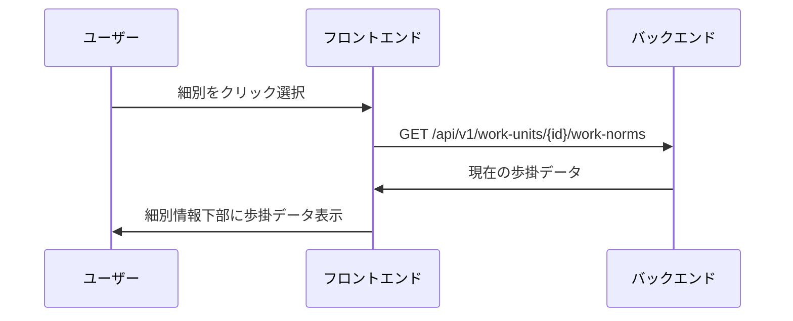

**詳細ステップ:**
1. 工種・細別一覧または工種詳細から対象の細別を選択
2. **API呼び出し**: `GET /api/v1/work-units/{id}/work-norms`で現在の歩掛データを取得
3. **レスポンス処理**: 歩掛データを受信
4. 細別詳細情報下部に歩掛データを表示

### 単位基準設定フロー

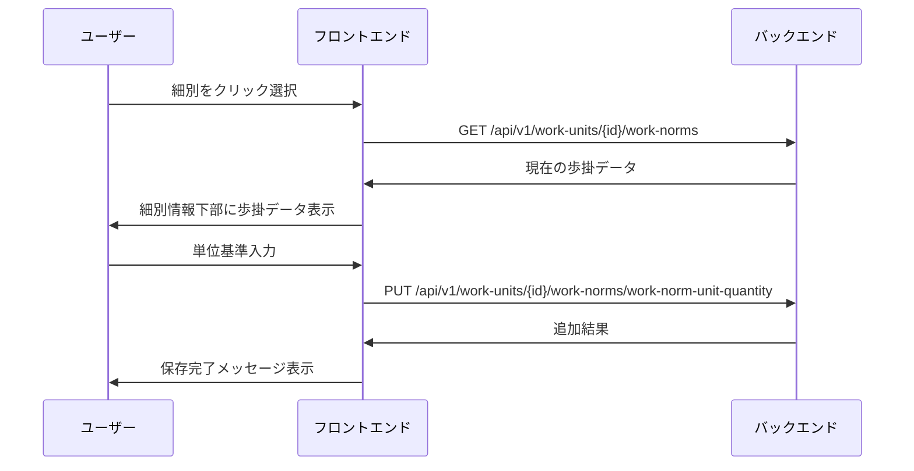

**詳細ステップ:**
1. 工種・細別一覧または工種詳細から対象の細別を選択
2. **API呼び出し**: `GET /api/v1/work-units/{id}/work-norms`で現在の歩掛データを取得
3. **レスポンス処理**: 歩掛データを受信
4. 細別詳細情報下部に歩掛データを表示
5. 単位基準を入力
6. **API呼び出し**: `PUT /api/v1/work-units/{id}/work-norms/work-norm-unit-quantity`


### 基本歩掛取得フロー

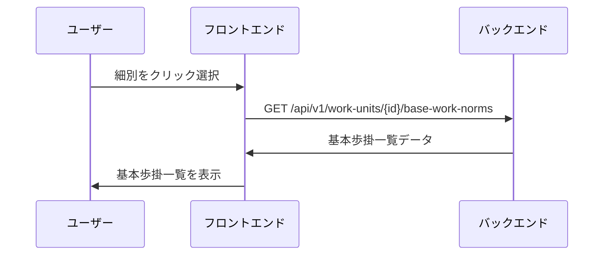

**詳細ステップ:**
1. 歩掛データエリアで基本歩掛タブを選択
2. **API呼び出し**: `GET /api/v1/work-units/{id}/base-work-norms`で基本歩掛一覧を取得
3. カテゴリ別の基本歩掛値を受信
4. 労務・機械・材料の各歩掛を一覧表示

### 基本歩掛作成フロー

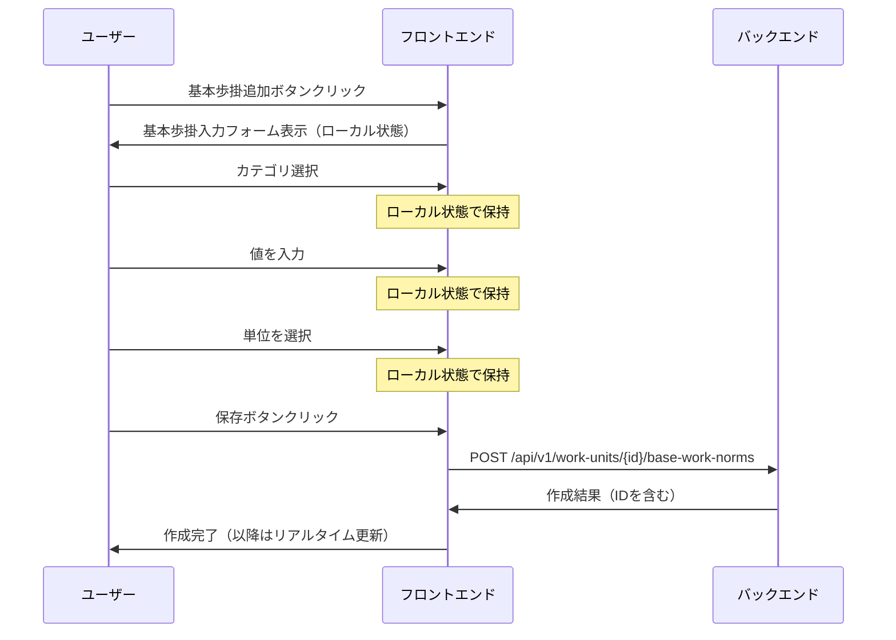

**詳細ステップ:**
1. 基本歩掛エリアで追加ボタンをクリック
2. UIに入力フォームを表示（この時点ではDBには未作成、ローカル状態で管理）
3. カテゴリ（労務/機械/材料）を選択 - ローカル状態で保持
4. 値を入力 - ローカル状態で保持、リアルタイムバリデーション実施
5. 単位を選択 - ローカル状態で保持
6. **保存ボタンクリックで保存処理を実行**
7. **API呼び出し**: `POST /api/v1/work-units/{id}/base-work-norms`でレコード作成
8. レスポンスでIDを受け取り、以降は更新モード（PUTでリアルタイム更新）に移行
9. 作成成功時はトースト通知で完了を表示

### 基本歩掛更新フロー

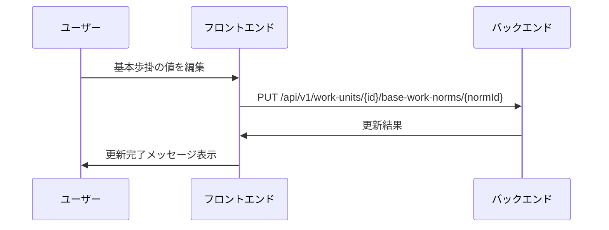

**詳細ステップ:**
1. 既存の基本歩掛の値を変更
2. **API呼び出し**: `PUT /api/v1/work-units/{id}/base-work-norms/{normId}`
3. 更新成功時に「基本歩掛を更新しました」メッセージを表示

### 基本歩掛削除フロー

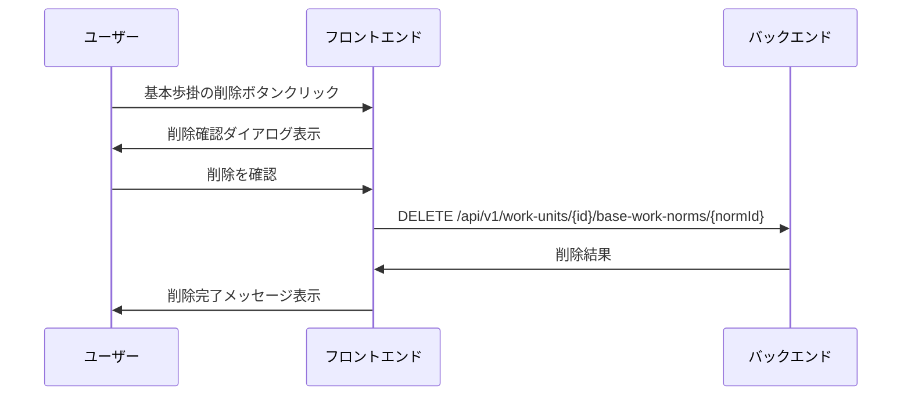

**詳細ステップ:**
1. 基本歩掛の削除アイコンをクリック
2. 削除確認ダイアログで影響範囲を表示
3. **API呼び出し**: `DELETE /api/v1/work-units/{id}/base-work-norms/{normId}`
4. 削除完了メッセージを表示

### プリセット管理フロー

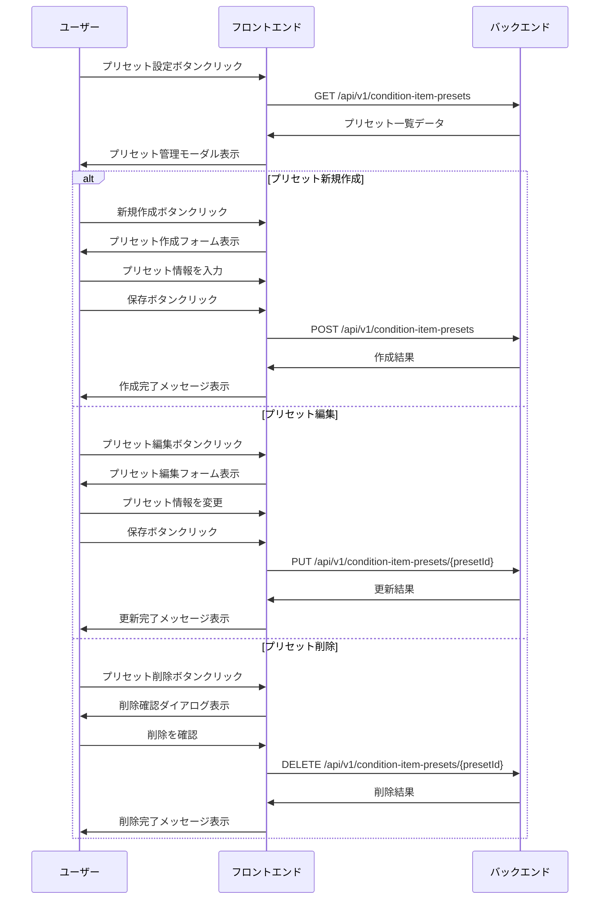

**詳細ステップ:**
1. 条件項目エリアでプリセット設定ボタンをクリック
2. **API呼び出し**: `GET /api/v1/condition-item-presets`でプリセット一覧取得
3. プリセット管理モーダルを表示
4. **新規作成の場合**:
   - 新規作成ボタンをクリック
   - 条件名、タイプ、必須/任意、選択肢等を入力
   - **API呼び出し**: `POST /api/v1/condition-item-presets`
5. **編集の場合**:
   - 編集ボタンをクリック
   - プリセット内容を変更
   - **API呼び出し**: `PUT /api/v1/condition-item-presets/{presetId}`
6. **削除の場合**:
   - 削除ボタンをクリック
   - 削除確認後、**API呼び出し**: `DELETE /api/v1/condition-item-presets/{presetId}`

### 条件項目プリセット取得フロー

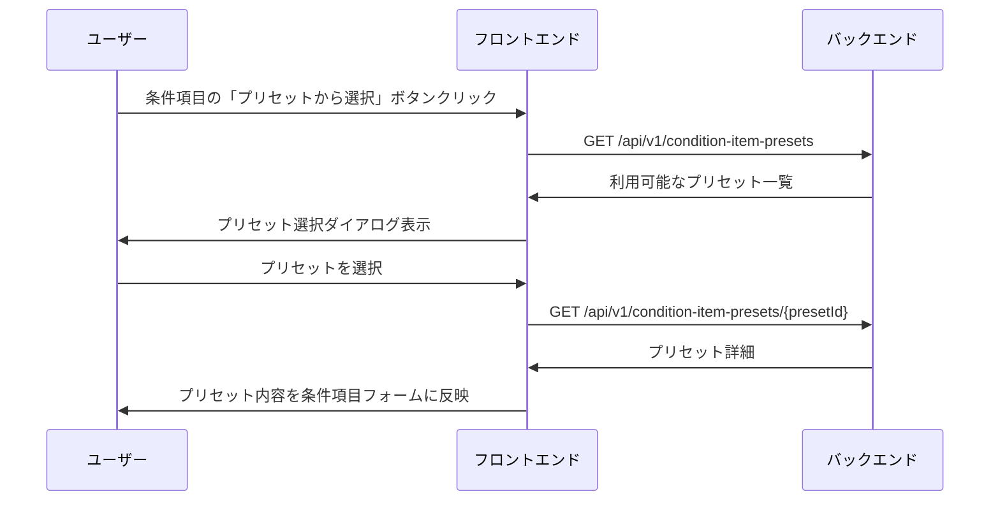

**詳細ステップ:**
1. 条件項目追加時に「プリセットから選択」ボタンをクリック
2. **API呼び出し**: `GET /api/v1/condition-item-presets`でプリセット一覧取得
3. プリセットを選択
4. **API呼び出し**: `GET /api/v1/condition-item-presets/{presetId}`で詳細取得
5. プリセットの内容（条件名、タイプ、選択肢等）をフォームに自動入力
6. 必要に応じて調整して保存

### 条件項目取得フロー

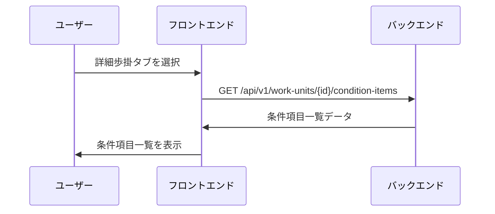

**詳細ステップ:**
1. 歩掛データエリアで詳細歩掛タブを選択
2. **API呼び出し**: `GET /api/v1/work-units/{id}/condition-items`で条件項目一覧を取得
3. 設定済みの条件項目とその設定内容を受信
4. 条件項目エリアに一覧表示

### 条件項目作成フロー

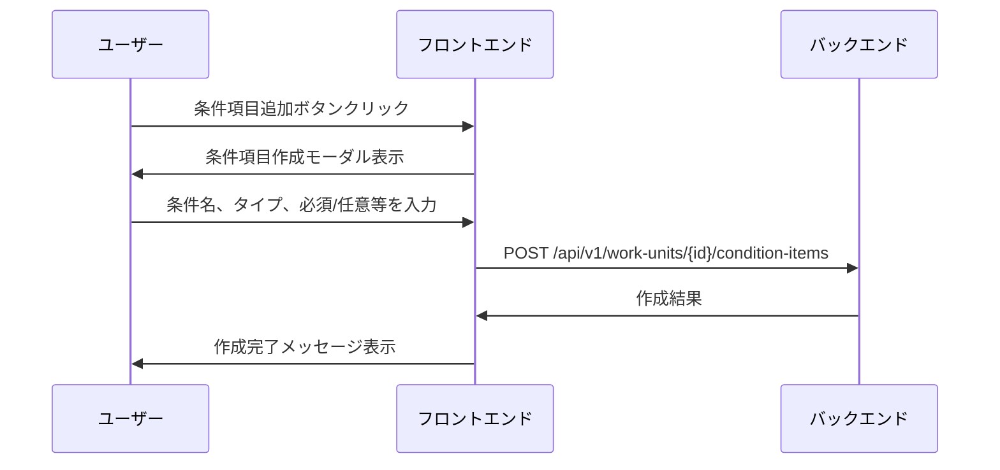

**詳細ステップ:**
1. 詳細歩掛タブで「＋条件を追加」ボタンクリック
2. 条件タイプ選択（選択式、数値、範囲、真偽値、文字列）
3. 条件名と設定値を入力
4. **API呼び出し**: `POST /api/v1/work-units/{id}/condition-items`
5. 作成成功時に条件項目を一覧に追加

### 条件項目更新・削除フロー

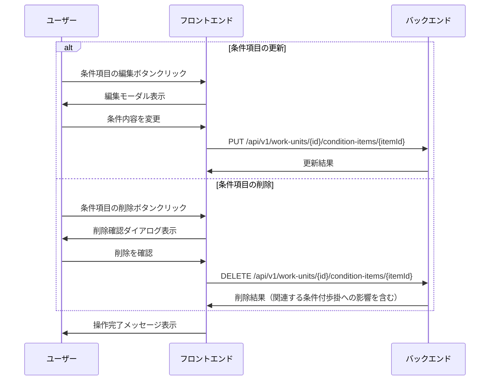

**詳細ステップ:**
1. **更新の場合**:
   - 条件項目の編集ボタンをクリック
   - モーダルで条件名、タイプ、必須/任意、その他設定を編集
   - **API呼び出し**: `PUT /api/v1/work-units/{id}/condition-items/{itemId}`
2. **削除の場合**:
   - 条件項目の削除ボタンをクリック
   - 関連する条件付歩掛への影響を確認ダイアログで表示
   - **API呼び出し**: `DELETE /api/v1/work-units/{id}/condition-items/{itemId}`
   - 関連する条件付歩掛から該当条件を自動削除

### 条件組み合わせ取得フロー

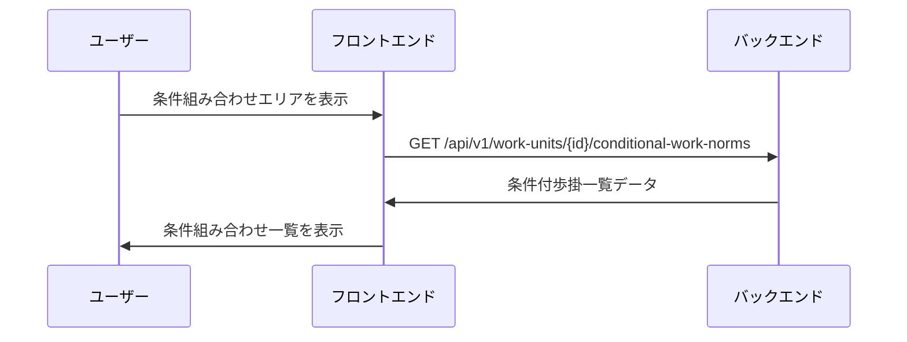

**詳細ステップ:**
1. 詳細歩掛タブの条件組み合わせエリアを表示
2. **API呼び出し**: `GET /api/v1/work-units/{id}/conditional-work-norms`で条件付歩掛一覧を取得
3. 条件の組み合わせと対応する歩掛値を受信
4. 条件組み合わせエリアに一覧表示

### 条件組み合わせ作成フロー

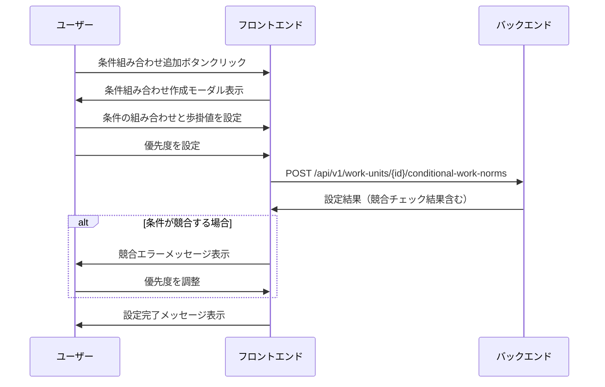

**詳細ステップ:**
1. 条件組み合わせエリアで「＋追加」ボタンクリック
2. 条件の組み合わせを選択（複数条件のAND結合）
3. 該当条件時の歩掛値を設定（上書きまたは補正率）
4. 優先度をUI上の表示順で設定（上が高優先度、下が低優先度）
5. **API呼び出し**: `POST /api/v1/work-units/{id}/conditional-work-norms`で条件付歩掛を保存
6. **競合チェック**: 条件の重複を検証
7. エラーがある場合は修正を促し、成功時は完了メッセージを表示

### 条件組み合わせ更新フロー

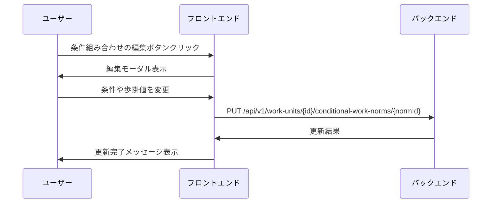

**詳細ステップ:**
1. 条件組み合わせの編集アイコンをクリック
2. 条件、歩掛値、優先度を編集
3. **API呼び出し**: `PUT /api/v1/work-units/{id}/conditional-work-norms/{normId}`
4. 更新成功時に「条件付歩掛を更新しました」メッセージを表示

### 条件組み合わせ複製フロー

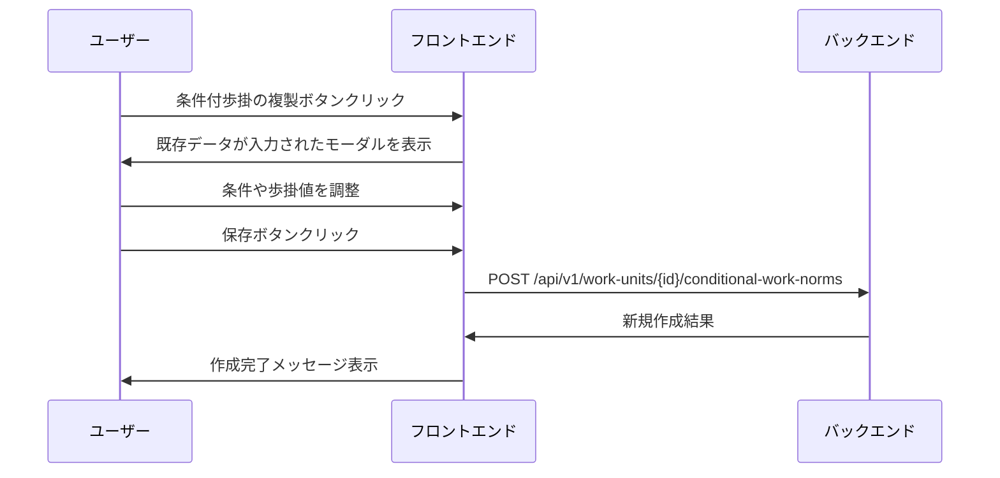

**詳細ステップ:**
1. 条件付歩掛の複製アイコンをクリック
2. 既存データが入力済みの条件組み合わせ作成モーダルを表示
3. 条件や歩掛値を調整
4. **API呼び出し**: `POST /api/v1/work-units/{id}/conditional-work-norms`で新規作成として保存

### 条件組み合わせ削除フロー

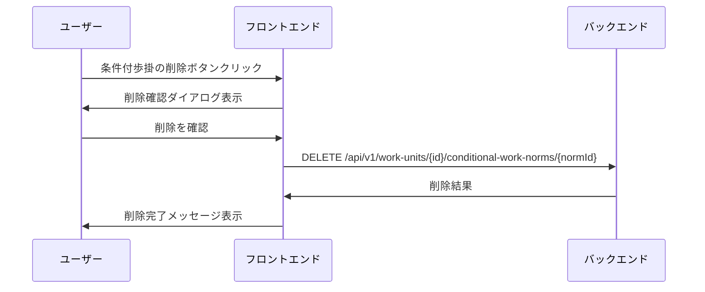

**詳細ステップ:**
1. 条件付歩掛の削除アイコンをクリック
2. 削除確認ダイアログ表示
3. **API呼び出し**: `DELETE /api/v1/work-units/{id}/conditional-work-norms/{normId}`
4. 削除完了メッセージを表示

## API設計（概要）

### RESTful API設計方針

- リソース指向のURL設計
- HTTPメソッドによる操作の明確化（GET: 取得、POST: 作成、PUT: 更新、DELETE: 削除）
- 一貫性のあるレスポンス形式（JSON）
- バージョニング対応（/api/v1/）

### 主要エンドポイント

#### 歩掛単位基準API

| エンドポイント                                                    | メソッド    | 説明             | リクエスト/レスポンス概要           |
| ---------------------------------------------------------- | ------- | -------------- | ----------------------- |
| ~~/api/v1/work-units/{id}/work-norms~~                     | ~~GET~~ | ~~細別の歩掛データ取得~~ | ~~単位基準、基本歩掛、詳細歩掛の全データ~~ |
| /api/v1/work-units/{id}/work-norms/work-norm-unit-quantity | GET     | 歩掛単位数量取得       | 単位と数量の取得                |
| /api/v1/work-units/{id}/work-norms/work-norm-unit-quantity | POST    | 歩掛単位数量作成       | 単位と数量の作成                |
| /api/v1/work-units/{id}/work-norms/work-norm-unit-quantity | PUT     | 歩掛単位数量設定       | 単位と数量の設定                |

#### 基本歩掛CRUD API

| エンドポイント                                          | メソッド   | 説明       | リクエスト/レスポンス概要  |
| ------------------------------------------------ | ------ | -------- | -------------- |
| /api/v1/work-units/{id}/base-work-norms          | GET    | 基本歩掛一覧取得 | カテゴリ別の基本歩掛値    |
| /api/v1/work-units/{id}/base-work-norms          | POST   | 基本歩掛作成   | 労務/機械/材料の歩掛値設定 |
| /api/v1/work-units/{id}/base-work-norms/{normId} | PUT    | 基本歩掛更新   | 特定カテゴリの歩掛値更新   |
| /api/v1/work-units/{id}/base-work-norms/{normId} | DELETE | 基本歩掛削除   | 不要な基本歩掛の削除     |

#### 条件項目CRUD API(プリセットは一旦見送り)

| エンドポイント | メソッド | 説明 | リクエスト/レスポンス概要 |
|-------------|---------|------|------------------------|
| /api/v1/condition-item-presets | GET | 条件項目プリセット一覧 | 利用可能なプリセットリスト |
| /api/v1/condition-item-presets | POST | 条件項目プリセット作成 | 新規プリセットの定義 |
| /api/v1/condition-item-presets/{presetId} | GET | 条件項目プリセット詳細 | プリセットの詳細情報 |
| /api/v1/condition-item-presets/{presetId} | PUT | 条件項目プリセット更新 | プリセット内容の変更 |
| /api/v1/condition-item-presets/{presetId} | DELETE | 条件項目プリセット削除 | プリセットの削除 |
| /api/v1/work-units/{id}/condition-items | GET | 条件項目一覧取得 | 設定済みの条件項目リスト |
| /api/v1/work-units/{id}/condition-items | POST | 条件項目作成 | 新規条件項目の定義 |
| /api/v1/work-units/{id}/condition-items/{itemId} | PUT | 条件項目更新 | 条件名、タイプ、設定の変更 |
| /api/v1/work-units/{id}/condition-items/{itemId} | DELETE | 条件項目削除 | 不要な条件項目の削除 |

#### 条件組み合わせCRUD API

| エンドポイント | メソッド | 説明 | リクエスト/レスポンス概要 |
|-------------|---------|------|------------------------|
| /api/v1/work-units/{id}/conditional-work-norms | GET | 条件付歩掛一覧取得 | 条件組み合わせと歩掛値 |
| /api/v1/work-units/{id}/conditional-work-norms | POST | 条件付歩掛作成 | 条件と歩掛値の設定 |
| /api/v1/work-units/{id}/conditional-work-norms/{normId} | PUT | 条件付歩掛更新 | 条件や優先度の変更 |
| /api/v1/work-units/{id}/conditional-work-norms/{normId} | DELETE | 条件付歩掛削除 | 不要な条件の削除 |

### リクエスト/レスポンス例

#### 歩掛データ取得レスポンス例
```json
{
  "tenantWorkUnitId": "unit-123",
  "baseUnit": {
    "quantity": 100,
    "unit": "m³",
    "timeUnit": "日"
  },
  "baseWorkNorms": [
    {
      "id": "norm-1",
      "category": "労務",
      "value": 2.5,
      "unit": "人日"
    },
    {
      "id": "norm-2", 
      "category": "機械",
      "value": 1.0,
      "unit": "台日"
    }
  ],
  "conditionalWorkNorms": [
    {
      "id": "cond-1",
      "conditions": [
        {"itemId": "geology", "value": "砂質土"}
      ],
      "category": "労務",
      "overrideValue": 3.0,
      "priority": 1
    }
  ]
}
```

#### 条件付歩掛設定リクエスト例
```json
{
  "conditions": [
    {
      "itemId": "geology",
      "type": "choice",
      "value": "砂質土"
    },
    {
      "itemId": "temperature",
      "type": "range",
      "value": {"min": 0, "max": 5}
    }
  ],
  "category": "労務",
  "overrideValue": 3.5,
  "priority": 2
}
```

### エラーレスポンス

| HTTPステータス | エラーコード | 説明 |
|--------------|------------|------|
| 400 | INVALID_CONDITION | 条件の組み合わせが不正 |
| 409 | CONDITION_OVERLAP | 条件の重複・競合 |
| 404 | WORK_UNIT_NOT_FOUND | 細別が存在しない |
| 409 | CONDITION_CONFLICT | 条件が競合 |

## 機能要件との対応表

### 概念設計書「歩掛データ設定機能」への技術的対応

#### 単位基準設定

| 機能要件 | 技術的実現方法 | 関連コンポーネント |
|---------|--------------|------------------|
| 細別に歩掛の単位基準を設定できる | WorkNormUnitQuantityエンティティで単位と数量を管理 | TenantWorkUnit Aggregate |
| | 単位マスタとの紐付けによる入力値検証 | WorkNormCondition Service |
| | UI上での単位選択と数量入力フォーム | 歩掛データ設定UI |

#### 基本歩掛管理

| 機能要件 | 技術的実現方法 | 関連コンポーネント |
|---------|--------------|------------------|
| 細別に基本歩掛を設定できる | BaseWorkNormエンティティで労務・機械・材料の基準値を保持 | TenantWorkUnit Aggregate |
| | カテゴリ別の歩掛値入力と検証 | WorkNormCondition Service |
| | トランザクション管理による一括更新 | kunai-core-backend |
| 基本歩掛のテンプレートを利用できる | テンプレートマスタからの一括コピー機能 | Template Service |
| | テンプレート選択UIとプレビュー機能 | 歩掛データ設定UI |

#### 詳細歩掛管理

| 機能要件 | 技術的実現方法 | 関連コンポーネント |
|---------|--------------|------------------|
| 細別に詳細歩掛の条件を設定できる | WorkNormConditionItemで条件項目を定義 | WorkNormCondition Service |
| | ConditionKindインターフェースによる条件タイプの拡張性確保 | Domain Layer |
| | 条件タイプ別の入力UIコンポーネント | 歩掛データ設定UI |
| 詳細歩掛の条件のプリセットを利用できる | プリセット条件のテンプレート管理 | Template Service |
| | よく使う条件の保存・呼び出し機能 | PostgreSQL |
| 細別に詳細歩掛を条件を組み合わせて設定できる | ConditionalWorkNormで複数条件のAND結合を実現 | TenantWorkUnit Aggregate |
| | 優先度(Priority)による競合解決 | WorkNormCondition Service |
| | 条件組み合わせビルダーUI | 歩掛データ設定UI |

### 条件タイプの技術実装

| 条件タイプ | ValueObjectクラス | データベース格納方式 | UI実装 |
|-----------|-----------------|-------------------|--------|
| 選択式 | ChoiceConditionValue | choice_option_idで参照 | ドロップダウン |
| 複数選択 | ChoiceConditionValue[] | JSON配列で格納 | チェックボックス |
| 数値 | NumberConditionValue | condition_value_number | 数値入力 |
| 真偽値 | BooleanConditionValue | condition_value_boolean | トグルスイッチ |
| 文字列 | TextConditionValue | condition_value_text | テキスト入力 |
| 範囲 | RangeConditionValue | range_min/max + inclusive | 範囲スライダー |

### データ整合性の保証

| 要件 | 実装方法 |
|------|---------|
| 条件の重複チェック | 条件組み合わせのハッシュ値による一意性制約 |
| 優先度の一意性 | 同一BaseWorkNorm内でのユニーク制約 |
| カスケード削除 | 細別削除時の歩掛データ自動削除（FK制約） |
| 楽観的ロック | versionカラムによる同時編集制御 |


