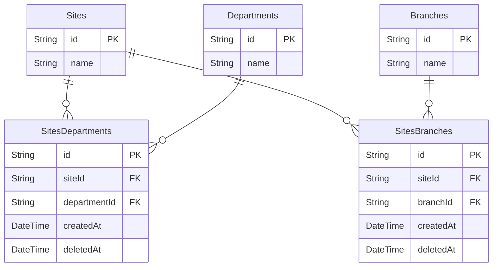
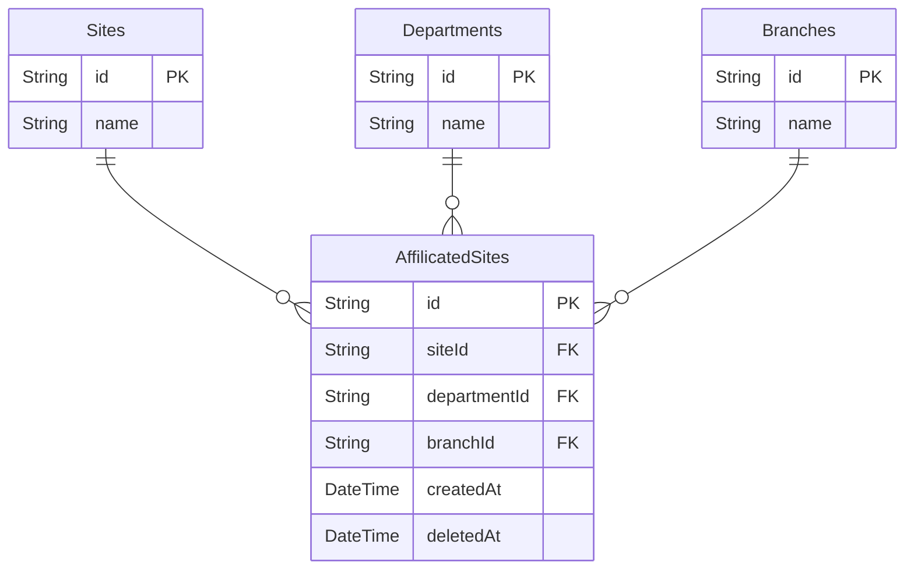
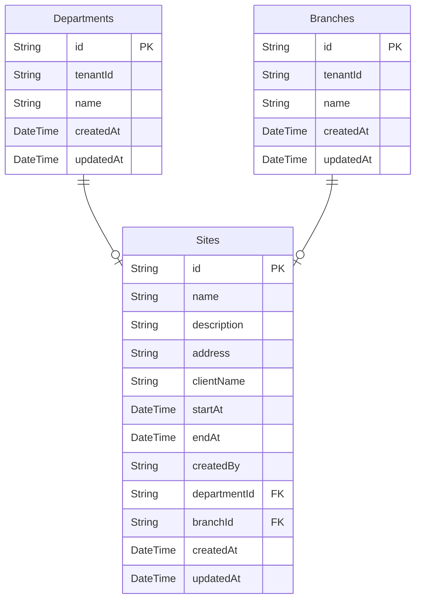

> [!info] 必要なセクションを選択して使用してください！

# 📜 文脈・背景

安全管理機能で工事現場に所属している元請けユーザーが工事現場に部署・支店を割り当てできるようにしたい。現時点では、工事現場への部署・支店の割り当ては任意であり、1つの工事現場につき部署・支店が1つ所属することを想定している。
これらの要求を満たすテーブル設計の案は3つあり、ベストな設計案を決めたい。

# 🎨 対応案

## 意思決定の観点
- [テーブル設計指針](https://www.notion.so/33b8ed435a51441696c3b50e401b35dc?pvs=21) に基づいているか（正規化されているか、nullableなカラムがないかなど）
- 将来的な拡張性が考慮されているか（工事現場に所属する部署・支店のメタデータの追加や複数の部署・支店が所属することが可能か）
- 保守性が高い実装を実現できるか（複数のリソースを参照することでusecase層が肥大化しないかなど）

## 1. 部署と支店を別々の中間テーブルで管理する案

- Pros
    - 工事現場の所属先を部署・支店、それぞれ独立したドメインルールを持たせることができる（拡張性の観点）
    - 正規化できるのでnullableなカラムが発生しない（テーブル）
- Cons
    - 工事現場の所属先を参照する場合、2つのrepositoryから参照する必要がありusecase層の実装が複雑になるかもしれない（保守性の観点）
## 2. 部署と支店を1つの中間テーブルに管理する案
    

    
- Pros
    - 工事現場の所属先として扱うのであれば、1つテーブルにまとめることがドメインルールを表現できる
- Cons
    - null許容のカラムが発生するので、状態管理が煩雑になる（テーブル設計指針を満たしていない）
    - 工事現場に所属する支店・部署にメタデータや１工事現場に対して複数の部署・支店が所属することになった場合、要件を満たせる設計ではない（拡張性の観点）

## 3. 所属先の部署と支店をSitesテーブルで管理する案

    

Pros
- 中間テーブルが存在しないため、クエリ時の結合処理が不要となり、データアクセスが高速である（保守性の観点）
Cons
- 工事現場に所属する支店・部署にメタデータや１工事現場に対して複数の部署・支店が所属することになった場合、要件を満たせる設計ではない（拡張性の観点）
# 🚀 決定

1. 部署と支店を別々の中間テーブルで管理する案　を採用する
- [テーブル設計指針](https://www.notion.so/33b8ed435a51441696c3b50e401b35dc?pvs=21) に基づき、正規化を優先する
- 部署は工事現場によって複数所属する可能性があるので、そのことを考慮した設計にしておきたい
# 🪞 結果・影響
**プラスの結果**
- 工事現場に所属する支店・部署にメタデータの追加や１工事現場に対して複数の部署・支店が所属するなどの要求が発生した場合にも耐える設計である。
**マイナスの結果**
- 工事現場の所属先を参照する場合、2つのrepositoryから参照する必要がありusecase層の実装が複雑になるかもしれないが、その際はCQRSの導入を検討する

# 🍜 今後の検討事項
【決定】を踏まえて、今後検討すべき事項を記載します。

