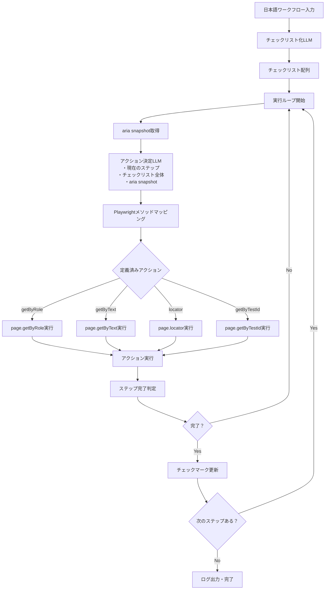

# ADR-000024: Playwright×LLM 適応型 UI 自動化システム

## 📜 文脈・背景

小規模 LLM と Playwright を組み合わせ、各ステップをゼロショットで意思決定 → 実行 → 検証する軽量ループを構築する。対象は自社外含む多様な Web アプリであり、`data-testid`等のテスト用属性が存在しない前提で堅牢に動作させる必要がある。

### 現状の課題

- UI の複雑化（仮想リスト、Canvas、Shadow DOM）への対応困難（Phase2）
- 多言語 UI / 頻繁な UI 変更によるテキスト揺れで単純なテキスト一致が機能しない
- 失敗時の脆弱性（要素不在や UI 変更で簡単に停止）
- 自然言語での簡潔な指示に対応できない
- 同じサイトで同じ失敗を繰り返す（学習機能の欠如）

### 制約条件

- LLM は基本単発ゼロショット（なるべく few-shot や長期メモリを使わない）
- 並列実行や分岐探索は行わず、順次フォールバックを試行
- Accessibility Tree 全体を送る（DOM 全体の 1/10 以下のサイズ）

## 🎯 決定事項

### 基本アーキテクチャの決定

#### 1. Accessibility Tree ベースの要素抽出

- **決定**: DOM 全体ではなく Accessibility Tree 全体を使用
- **理由**: 操作可能な要素を網羅しつつ、サイズを 1/10 以下に削減可能
- **効果**: トークン使用量を抑えつつ、要素の完全性を保証

#### 2. セレクタ戦略の優先順位

**Accessibility Tree ベース（基本戦略）:**

```
1. getByRole(name指定)
2. getByText
3. getByTestId（DOM補完情報から取得時のみ）
```

**軽量 DOM 送信時（拡張戦略）:**

```
1. getByRole(name指定)
2. getByLabel
3. getByPlaceholder
4. getByText（正規化・近似含む）
5. locator(css)
6. 近接/祖先（:has, label:has-text()）
```

#### 3. Step メタ生成ポリシー

- **決定**: チェックリスト文字列は静的なゴール管理に限定し、実行ループでは毎回 `deriveNextStep` により Step メタを再生成する。
- **理由**: 画面遷移や予期せぬ DOM 変化に対応し、同じチェックリスト項目でも複数 Step を柔軟に記録できるようにするため。
- **効果**: `ActionDecisionInput.currentStepMeta` と `WorkflowContext.stepHistory` を通じて LLM・ログ・再実行ロジックの同期が保たれ、再試行時に stale な Step 情報を再送しない。
- **2025-09-17 更新**: intent / target / value 等のヒューリスティック生成を廃止し、`deriveNextStep` は `id`/`originalInstruction`/`attempt` のみに縮退させた。LLM がターゲットを確定できない場合は `{ "error": "TARGET_NOT_FOUND" }` を返し、`fallbackDecision` は即 `DecisionError('LLM fallback unavailable')` を返して手動ヒューリスティックへ戻らない。

### 複雑 UI 対応方針(Phase2 以降に対応)

#### 1. 仮想リスト

- 容器スクロールの段階探索を実装
- 最大ステップ数とタイムアウト設定
- ループ防止機構（同一位置検知）
- 検出条件:
  - `overflow-y` が `auto|scroll` かつ `scrollHeight / clientHeight >= 2.0`、または `role` が `list|listbox|grid|table|tree` のいずれか。
- 探索規約:
  - スクロール刻みは `0.8 * clientHeight`。
  - 試行上限は 10 回で打ち切り。
- ループ防止:
  - 直近 3 回の `scrollTop` を保持し、差分 < 5px が 2 回続いたら中断。
- 失敗時:
  - エラーコード `VLIST_NOT_REACHED` を返し、下記をログ保存。
- ログ項目:
  - `containerSelector`, `clientHeight`, `scrollHeight`, `ratio`, `attemptCount`, `scrollPositions[]`, `viewportMatchCounts[]`。

#### 2. Canvas（非対応）

- 方針: Canvas 内部の論理オブジェクト操作はサポートしない。
- 禁止事項: 座標クリックによる代替操作、画像認識ベースの操作。
- 失敗時: Canvas 内部オブジェクトが唯一の対象の場合は即座に `CANVAS_UNSUPPORTED` を返す。

#### 3. Shadow DOM

- オープンのみ対応、クローズドは非対応
- 通常セレクタ →Shadow 内探索の順で試行

### 拡張機能の決定

#### 1. エマージェンシーモード

- **発動条件**: 連続 3 回失敗、30 秒停滞、直近 5 件の平均信頼度 < 0.3
- **動作**:
  - 小規模 → 大規模 LLM 切替
  - Accessibility Tree → body 配下の軽量 DOM（CSS/JS 削除済み）送信へ拡張
- **処理内容**: より多くのセレクタ戦略が使用可能になり、要素特定精度が向上

#### 2. ワークフロー履歴システム

- サイトごとの成功フロー記録
- 失敗パターンの原因分析
- 90 日以上古い履歴は自動削除

#### 3. 自然言語インテント解析

- 単一の日本語文から操作意図を理解
- 例：「楽天で最安値の iPhone 15 を探してカートに入れて」
- サイト特定 → アクション分解 → 条件抽出 → ワークフロー生成

#### 4. 動的 DOM 処理戦略

- 通常時: Accessibility Tree のみで意思決定。
- 緊急時: 軽量 DOM（body 配下、CSS/JS 除去）を追加投入して分析。

#### 5. ターゲットサイトリスト（外部依存）

- 設定ファイルに依存せず、外部プロバイダから実行時に取得する。
- 取得関数（例）: `getTargetSites(ctx): Promise<SiteProfile[]>`（仕様は TBD、詳細設計を参照）。
- 失敗時は空配列で継続し、サイト固有最適化なしで動作する。

#### 5.1 Sitemap の取得方針（動的のみ）

- 実行時に初めて訪れるドメインについて、以下の順で sitemap を動的取得する。
  1. `https://{domain}/robots.txt` の `Sitemap:` 行を解析（複数可）
  2. 見つからない場合は `https://{domain}/sitemap.xml` を試行
- タイムアウト: 3 秒、最大受信サイズ: 2MB、画像/ニュース系は読み飛ばし。
- キャッシュ: 永続ストアは使わず、実行中のインメモリおよび `/tmp` のみ（コールドスタートで破棄）。HTTP の条件付き GET（ETag/Last-Modified）で帯域を節約。
- LLM へのプロンプトには、取得した sitemap の URL 一覧を注入する（要約やフィルタは行わない）。
- `important_paths`/`blocked_paths` は使用しない（スキーマから除外）。

##### プロンプト投入の上限

- 上限: 最大 300 URL または 10,000 文字のいずれか小さい方。
- 抽出順: 取得した sitemap の列挙順（要約・フィルタなし）。
- 実行中メモリでの一時保持上限: 1 ドメインあたり最大 50,000 URL（プロセス終了で破棄）。

#### 6. 信頼度

- 由来: LLM に各提案アクションの自信度を 0.00–1.00 で出力させ、根拠を 1 行で付与。
- 監視: 直近 5 件の移動平均を用い、平均 < 0.3 が継続した場合にエマージェンシー判定の一要因とする。
- 事前チェック: セレクタ解決が 0 件/複数件の場合は LLM へ出さず即フォールバックし、当該試行は失敗としてカウント（attempt を 1 増やす）。ログ上は confidence=0 を直近 5 件窓へ記録。

#### 6. セキュアな認証情報管理

- 環境変数（.env）
- OS キーチェーン統合
- 暗号化ローカルストレージ

#### 7. 実行モード切り替え

- **開発**: headless:false、DevTools 自動、slowMo:500ms
- **本番**: headless:true、最速実行、ERROR 以上のログ

## 🔄 システム統合フロー



### ワークフロー処理方式

#### 入力例

```
Amazonで「プログラミング本」を検索して、
評価が4以上で価格が3000円以下の本を探して、
最初の該当商品をカートに入れる
```

#### チェックリスト化

```typescript
[
  "[] Amazonで「プログラミング本」を検索する",
  "[] 評価が4以上で価格が3000円以下の本を探す",
  "[] 最初の該当商品をカートに入れる",
];
```

#### 実行時のコンテキスト管理

- 各ステップ実行時にチェックリスト全体と進捗状況を LLM に渡す
- 完了したステップは `[x]` マークに更新
- 現在のステップを明示的に示す

## 📊 期待される効果

### 成功率

- 初回: 60% → 80%
- エマージェンシー含む: 95%

### 効率性

- ワークフロー記述: 70%削減
- デバッグ時間: 50%削減
- 実行時間: 30%短縮（履歴活用）

### コスト

- 通常時: 小規模 LLM（800 トークン/ステップ以下）
- 緊急時のみ: 大規模 LLM

## 🚨 リスクと対策

| リスク         | 対策                           |
| -------------- | ------------------------------ |
| 履歴の肥大化   | 90 日自動削除、頻度ベース管理  |
| サイト仕様変更 | 週次検証、失敗率アラート       |
| 認証情報漏洩   | 暗号化、アクセス制限、監査ログ |

## 🎯 成功の判断基準

- エマージェンシーモードで 70%以上が回復
- 自然言語入力の 90%以上を正しく解釈
- 2 回目以降の実行時間 50%以上短縮
- 開発者の手動介入 80%削減

## 🔧 トレードオフ

### 採用したアプローチ

- Accessibility Tree 全体送信（完全性優先）
- ゼロショット単発 LLM（シンプルさ優先）
- 順次フォールバック（確実性優先）

### 採用しなかったアプローチ

- DOM 要素の Top-N 絞り込み（要素漏れリスク）
- few-shot/長期メモリ（複雑性増大）
- 並列探索（制御困難）
- 画像認識（将来の拡張候補）

---

関連ドキュメント:

- [[🗒️ playwright-llm-detailed-design.md]]（詳細設計）
- [[🗒️ 000023-Playwright×LLMのUI複雑性とi18n対応ポリシー.md]]（初期検討）
